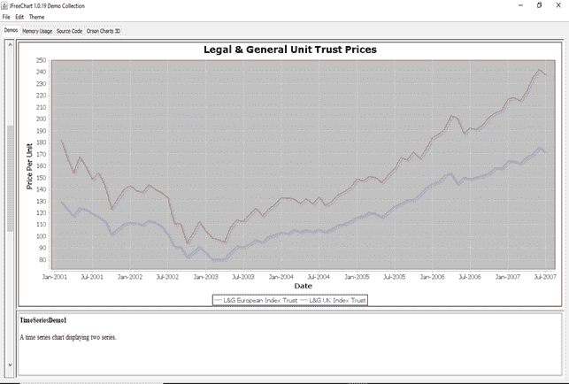
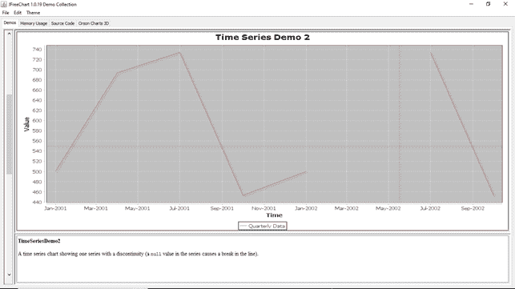
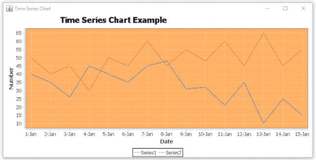

# 时间序列图表

> 原文：<https://www.javatpoint.com/jfreechart-timeseries-chart>

时间序列图表示一系列数字数据，这些数据以相等的时间间隔变化。

下图显示了 JFreeChart 库中包含的时间序列图表的一些演示版本:

**时间序列图演示 1:**



**时间序列图演示 2:**



**时间序列图演示 3:**


**时间序列图演示 4:**


**时间序列图演示 5:**


## 时间序列图表示例:

让我们考虑以下时间序列图表的示例数据。

| 日期 | 系列 1 | 系列 2 |
| 2017-01-01 | Fifty | Forty |
| 2017-01-02 | Forty | Thirty-five |
| 2017-01-03 | Forty-five | Twenty-six |
| 2017-01-04 | Thirty | Forty-five |
| 2017-01-05 | Fifty | Forty |
| 2017-01-06 | Forty-five | Thirty-five |
| 2017-01-07 | Sixty | Forty-five |
| 2017-01-08 | Forty-five | Forty-eight |
| 2017-01-09 | Fifty-five | Thirty-one |
| 2017-01-10 | Forty-eight | Thirty-two |
| 2017-01-11 | Sixty | Twenty-one |
| 2017-01-12 | Forty-five | Thirty-five |
| 2017-01-13 | Sixty-five | Ten |
| 2017-01-14 | Forty-five | Twenty-five |
| 2017-01-15 | Fifty-five | Fifteen |

以下代码根据上述示例数据创建气泡图:

## TimeSeriesChartExample.java

```java

import java.awt.Color;
import javax.swing.JFrame;
import javax.swing.SwingUtilities;
import javax.swing.WindowConstants;
import org.jfree.chart.ChartFactory;
import org.jfree.chart.ChartPanel;
import org.jfree.chart.JFreeChart;
import org.jfree.chart.plot.XYPlot;
import org.jfree.data.time.Day;
import org.jfree.data.time.TimeSeries;
import org.jfree.data.time.TimeSeriesCollection;
import org.jfree.data.xy.XYDataset;

public class TimeSeriesChartExample extends JFrame {

  private static final long serialVersionUID = 1L;

  public TimeSeriesChartExample(String title) {
    super(title);
    // Create dataset
    XYDataset dataset = createDataset();
    // Create chart
    JFreeChart chart = ChartFactory.createTimeSeriesChart(
        "Time Series Chart Example", // Chart
        "Date", // X-Axis Label
        "Number", // Y-Axis Label
        dataset);

    //Changes background color
    XYPlot plot = (XYPlot)chart.getPlot();
    plot.setBackgroundPaint(new Color(255,228,196));

    ChartPanel panel = new ChartPanel(chart);
    setContentPane(panel);
  }

  private XYDataset createDataset() {
    TimeSeriesCollection dataset = new TimeSeriesCollection();

    TimeSeries series1 = new TimeSeries("Series1");
    series1.add(new Day(1, 1, 2017), 50);
    series1.add(new Day(2, 1, 2017), 40);
    series1.add(new Day(3, 1, 2017), 45);
    series1.add(new Day(4, 1, 2017), 30);
    series1.add(new Day(5, 1, 2017), 50);
    series1.add(new Day(6, 1, 2017), 45);
    series1.add(new Day(7, 1, 2017), 60);
    series1.add(new Day(8, 1, 2017), 45);
    series1.add(new Day(9, 1, 2017), 55);
    series1.add(new Day(10, 1, 2017), 48);
    series1.add(new Day(11, 1, 2017), 60);
    series1.add(new Day(12, 1, 2017), 45);
    series1.add(new Day(13, 1, 2017), 65);
    series1.add(new Day(14, 1, 2017), 45);
    series1.add(new Day(15, 1, 2017), 55);
    dataset.addSeries(series1);

    TimeSeries series2 = new TimeSeries("Series2");
    series2.add(new Day(1, 1, 2017), 40);
    series2.add(new Day(2, 1, 2017), 35);
    series2.add(new Day(3, 1, 2017), 26);
    series2.add(new Day(4, 1, 2017), 45);
    series2.add(new Day(5, 1, 2017), 40);
    series2.add(new Day(6, 1, 2017), 35);
    series2.add(new Day(7, 1, 2017), 45);
    series2.add(new Day(8, 1, 2017), 48);
    series2.add(new Day(9, 1, 2017), 31);
    series2.add(new Day(10, 1, 2017), 32);
    series2.add(new Day(11, 1, 2017), 21);
    series2.add(new Day(12, 1, 2017), 35);
    series2.add(new Day(13, 1, 2017), 10);
    series2.add(new Day(14, 1, 2017), 25);
    series2.add(new Day(15, 1, 2017), 15);
    dataset.addSeries(series2);

    return dataset;
  }

  public static void main(String[] args) {
    SwingUtilities.invokeLater(() -> {
      TimeSeriesChartExample example = new TimeSeriesChartExample("Time Series Chart");
      example.setSize(800, 400);
      example.setLocationRelativeTo(null);
      example.setVisible(true);
      example.setDefaultCloseOperation(WindowConstants.EXIT_ON_CLOSE);
    });
  }
}

```

**输出:**

