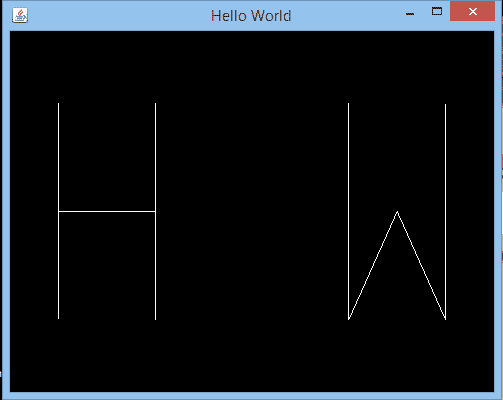

# JOGL 你好世界

> 原文：<https://www.javatpoint.com/jogl-hello-world>

我们已经学会了如何在 JOGL 画一条简单的线。通过改变这样一条线的坐标，我们也可以写出字母单词。

## JOGL 你好世界范例

在这个例子中，我们将绘制 Hello World 的第一个角色(即 H . W)。

**HelloWorld.java**

```java
package com.javatpoint.jogl;

import javax.media.opengl.*;  
import javax.media.opengl.awt.GLCanvas;  
import javax.swing.JFrame;  

public class HelloWorld implements GLEventListener {  

    @Override  
public void init(GLAutoDrawable arg0)   
  {  

  }  

   @Override  
public void display(GLAutoDrawable drawable) {  
final GL2 gl = drawable.getGL().getGL2();  
  //Draw H
gl.glBegin(GL2.GL_LINES); 
gl.glVertex2d(-0.8, 0.6);
gl.glVertex2d(-0.8, -0.6);
gl.glVertex2d(-0.8, 0.0);
gl.glVertex2d(-0.4, 0.0);
gl.glVertex2d(-0.4, 0.6);
gl.glVertex2d(-0.4, -0.6);
gl.glEnd();
//Draw W
gl.glBegin(GL2.GL_LINES);
gl.glVertex2d(0.4,0.6);
gl.glVertex2d(0.4,-0.6);
gl.glVertex2d(0.4,-0.6);
gl.glVertex2d(0.6,0);
gl.glVertex2d(0.6,0);
gl.glVertex2d(0.8,-0.6);
gl.glVertex2d(0.8,-0.6);
gl.glVertex2d(0.8,0.6);
gl.glEnd();
   }        
   @Override  
public void reshape(GLAutoDrawable arg0, int arg1, int arg2, int arg3, int arg4)   
   {      

   }  
   @Override  
public void dispose(GLAutoDrawable arg0)   
   {  

   }  

public static void main(String[] args) {  

final GLProfile gp = GLProfile.get(GLProfile.GL2);  
GLCapabilities cap = new GLCapabilities(gp);  

final GLCanvas gc = new GLCanvas(cap);  
HelloWorld sq = new HelloWorld();  
gc.addGLEventListener(sq);  
gc.setSize(400, 400);  

final JFrame frame = new JFrame("Hello World");  
frame.add(gc);  
frame.setSize(500,400);  
frame.setVisible(true);    
   }      
}  

```

**输出:**

