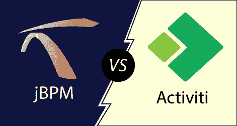

# jBPM 和 Activiti 的区别

> 原文：<https://www.javatpoint.com/jbpm-vs-activiti>

## jBPM

jBPM 代表 Java 业务流程管理。它是一个完全开源、轻量级和灵活的业务流程管理套件，用 Java 语言编写。它允许我们在业务流程的整个生命周期中创建、部署、执行和监控业务流程。它是业务流程应用的工具包，填补了业务分析师和开发人员之间的空白。它是根据 Apache 许可证分发的，并由 JBoss 公司根据美国手语发布。

## jBPM 特性

*   jBPM 是轻量级、开源的，并且是用 Java 语言编写的。
*   它支持 BPMN 2.0 规范，这是过程建模的全球标准。
*   它支持基于 JPA 和 JTA 的持久性和事务。
*   它有一个规则引擎，提供一种声明性语言来评估可用的信息。
*   它可以在基于 Eclipse 和基于 Web 的编辑器上工作，这为业务流程的图形创建和模拟提供了拖放支持。

## 活动 I

像 jBPM 一样，activiti 是一个围绕状态机概念设计的业务流程框架。它是用 Java 编写的轻量级开源工作流引擎，可以执行 BPMN 2.0 中描述的业务流程。Activiti 是 Alfresco 的 APS (Alfresco 过程服务)的基础，Alfresco 公司是 Activiti 项目的主要赞助商。

## 活动特征

*   它可以在任何 Java 环境下运行，如 Spring、JTA 等。
*   使用安装实用程序很容易启动和运行。
*   速度极快。
*   它能够在简单的单元测试中独立测试流程执行。
*   它是为支持云可扩展性而构建的。

## jBPM vs .活动

jBPM 和 Activiti 的区别如下。

| 描述 | jBPM | 活动 I |
| 社区成员 | jBPM 有一个由 JBoss 公司员工组成的基础团队。此外，还有致力于 jBPM 项目的个人开发人员。 | 它有一个由 Alfresco 公司员工组成的基础团队。此外，像 SpringSource、FuseSource 这样的公司提供特定组件的资源。此外，还有一些开源开发人员致力于 Activiti 项目。 |
| Spring 架 | jBPM 不提供本机 Spring 支持，但是您可以在额外的开发工作中使用它。 | 它提供了本机 Spring 支持。这使得在您的过程中使用 Spring beans 变得非常容易。您也可以将 Spring 用于 JPA 和事务管理。 |
| 业务规则支持 | jBPM 和 Drools 是在项目级别上集成的。因此，我们可以在一个项目的不同层次上集成 Drools。 | 它提供了与 Drools 规则引擎的基本集成，用于支持 BPMN 2.0 业务规则任务。 |
| 附加工具 | jBPM 提供了建模器和 Eclipse 设计器工具来创建过程定义。它提供有限的表单支持。 | Eclipse 提供了建模工具和设计工具来创建新的过程定义。它还提供了一个 Activiti 浏览器，该浏览器提供了一个简单的 web 界面来启动新的进程和管理正在运行的进程。它提供完整的表单支持。 |
| 表单生成器 | jBPM 提供了一个基本的表单生成器，可以从过程变量自动生成。 | 它还支持表单生成器，但仅在企业版中可用。 |

* * *