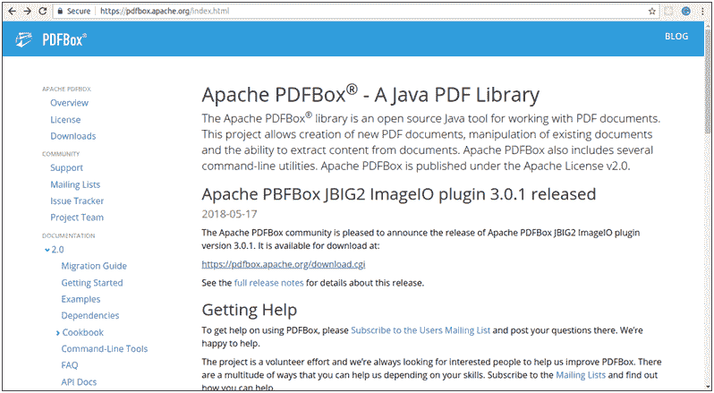
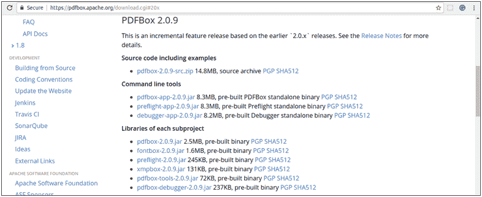
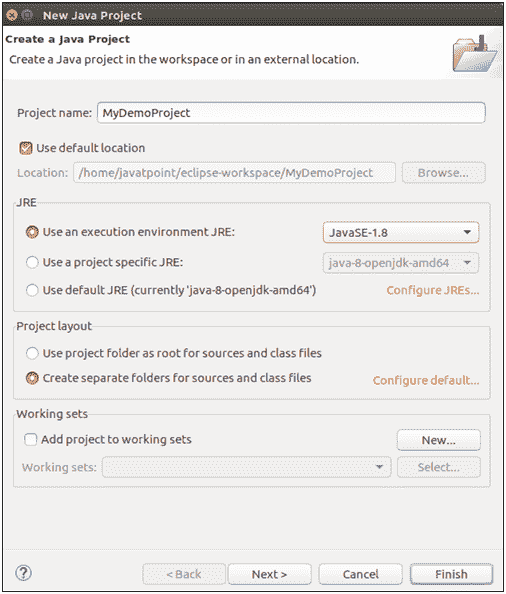
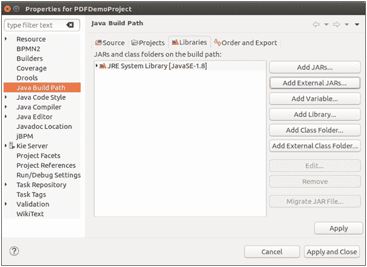
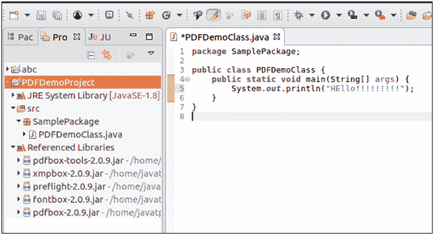

# PDFBox 环境设置

> 原文：<https://www.javatpoint.com/pdfbox-environment-setup>

## PDFBox 安装

要安装 PDFBox，请执行以下步骤-

**第一步。**打开**Apache PDFBox** 主页。

[**https://pdfbox.apache.org/**](https://pdfbox.apache.org/)


**第二步。**点击**下载**链接。PDFBox 下载页面如下截图所示。


**第三步。**在下载页面，点击**最新发布**。比如我们选择 **PDFBox 2.0.9** 。点击此版本，我们将被指引到所需的 **JAR** 文件，如下图截图所示。



**第四步。**下载以下 **JAR** 文件 **pdfbox-app-2.0.9.jar** 、 **pdfbox-2.0.9.jar** 、 **fontbox-2.0.9.jar** 、**预检-2.0.9.jar** 、 **xmpbox-2.0.9.jar** 、**pdfbox-tools-2 . 0 . 9 . 0**

## Eclipse 中的 PDFBox 安装

下载的 **JAR** 文件需要嵌入到 Eclipse 环境中。我们可以通过设置**构建路径**和使用 **pom.xml** 文件来做到这一点。

按照以下步骤在 Eclipse 中安装 PDFBox

**第一步。**打开**月食 IDE** 。转到**文件- >新建- > Java 项目**。

**第二步。**一个新的 **Java 项目向导**将会打开。填写详细信息**点击下一步**。



**第三步。**一个新的 Java 项目被创建。**右键点击本项目**，选择**构建路径- >配置**构建路径。将打开以下屏幕。



**第四步。**点击**添加外部罐子**。选择上面我们下载的 **JAR** 文件，点击**确定**。


**第五步。**点击**确定**按钮后， **JAR** 文件将被添加到我们的**库**中，如下图截图所示。


**第六步。**一旦我们点击**确定**， **JAR** 文件在当前项目中成功添加。我们可以通过展开**引用库**来验证这些库，如下图所示。



## 使用 pom.xml

1.将 Java 项目转换成 **Maven 项目**。为此，**右键单击**项目- >子菜单配置- >转换为 Maven 项目**。**


2.将以下组件添加到其 **pom.xml** 中。

```java
<projectxmlns:xsi="http://www.w3.org/2001/XMLSchema-instance"xsi:schemaLocation="http://maven.apache.org/POM/4.0.0 http://maven.apache.org/xsd/maven-4.0.0.xsd">
<modelVersion>4.0.0</modelVersion>
<groupId>PDFDemoProject</groupId>
<artifactId>PDFDemoProject</artifactId>
<version>0.0.1-SNAPSHOT</version>
<build>
<sourceDirectory>src</sourceDirectory>
<plugins>
<plugin>
<artifactId>maven-compiler-plugin</artifactId>
<version>3.7.0</version>
<configuration>
<source>1.8</source>
<target>1.8</target>
</configuration>
</plugin>
</plugins>
</build>

<dependencies>
<dependency>
<groupId>org.apache.pdfbox</groupId>
<artifactId>pdfbox</artifactId>
<version>2.0.9</version>
</dependency>

<dependency>
<groupId>org.apache.pdfbox</groupId>
<artifactId>fontbox</artifactId>
<version>2.0.9</version>
</dependency>

<dependency>
<groupId>org.apache.pdfbox</groupId>
<artifactId>jempbox</artifactId>
<version>1.8.14</version>
</dependency>

<dependency>
<groupId>org.apache.pdfbox</groupId>
<artifactId>xmpbox</artifactId>
<version>2.0.9</version>
</dependency>

<dependency>
<groupId>org.apache.pdfbox</groupId>
<artifactId>preflight</artifactId>
<version>2.0.9</version>
</dependency>

<dependency>
<groupId>org.apache.pdfbox</groupId>
<artifactId>pdfbox-tools</artifactId>
<version>2.0.9</version>
</dependency>

</dependencies>

</project>

```