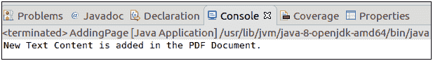

# 添加文本

> 原文：<https://www.javatpoint.com/pdfbox-adding-text>

我们可以在现有的 PDF 文档中添加文本内容。本节介绍如何向现有的 PDF 文档添加新的文本内容。PDFBox 库提供了一个 **PDPageContentStream** 类。此类包含在 PDF 文档的页面中插入文本、图像和其他类型内容所需的方法。

按照以下步骤在现有的 PDF 文档中添加文本内容-

## 加载现有文档

我们可以使用静态 **load()** 方法加载现有的 PDF 文档。该方法接受一个**文件对象**作为**参数**。我们也可以使用 PDFBox 的类名 **PDDocument** 来调用它。

```java

File file = new File("PATH"); 
PDDocument doc = PDDocument.load(file); 

```

## 获取所需页面

获取我们想要在 PDF 文档中添加文本内容的所需页面。 **getPage()** 方法用于从 PDF 文档中检索页面。 **getPage()** 方法接受页面的一个**索引**作为参数。

```java

PDPage page = doc.getPage(Page Index);

```

## 准备内容流

**PDPageContentStream** 类用于在文档中插入数据。在这个类中，我们需要传递**文档对象**和**页面对象**作为其插入数据的参数。

```java

PDPageContentStream contentStream = new PDPageContentStream(doc, page);

```

## 开始文本

当我们在 PDF 文档中插入文本时，我们也可以提供文本的开始位置。 **beginText()** 方法的 **PDPageContentStream** 类用于启动文本内容。

```java

contentStream.beginText();

```

## 设置文本的位置

我们可以使用 **PDPageContentStream** 类的 **newLineAtOffset()** 方法来设置文本的位置，如下代码所示。

```java

contentStream.newLineAtOffset(20, 450);

```

## 设置文本字体

我们可以使用 **PDPageContentStream** 类的 **setFont()** 方法设置文本的**字体样式**和**字体大小**。

```java

contentStream.setFont(Font_Type, Font_Size);

```

## 编写文本内容

我们可以使用 **PDPageContentStream** 类的 **showText()** 方法在 PDF 文档中插入文本内容。

```java

contentStream.showText(text);

```

## 结束 txt

当我们在 PDF 文档中插入文本时，我们必须提供文本的结束点。 **endText()** 方法的 **PDPageContentStream** 类用于结束文本内容。

```java

contentStream.endText();

```

## 关闭内容流

我们可以使用 **close()** 方法关闭 **PDPageContentStream** 类。

```java

contentStream.close();

```

## 保存文档

添加所需文档后，我们必须将其保存到所需位置。 **save()** 方法用于保存文档。 **save()** 方法接受一个**字符串值**，并传递文档的路径作为参数。

```java

doc.save("Path of Document");

```

## 关闭文档

完成任务后，我们需要使用 **close()** 方法关闭 **PDDocument** 类对象。

```java

doc.close();

```

### 示例-

```java

import java.io.File; 
import java.io.IOException;

import org.apache.pdfbox.pdmodel.PDDocument; 
import org.apache.pdfbox.pdmodel.PDPage; 
import org.apache.pdfbox.pdmodel.PDPageContentStream; 
import org.apache.pdfbox.pdmodel.font.PDType1Font;

public class AddingText {

	public static void main(String[] args)throws IOException {

		//Loading an existing document
	      File file = new File("/eclipse-workspace/blank.pdf");
	      PDDocument doc = PDDocument.load(file);

	//Retrieving the pages of the document 
	      PDPage page = doc.getPage(2);
	      PDPageContentStream contentStream = new PDPageContentStream(doc, page);

	//Begin the Content stream 
	contentStream.beginText(); 

	//Setting the font to the Content stream  
	contentStream.setFont(PDType1Font.TIMES_BOLD_ITALIC, 14);

	//Setting the position for the line 
	contentStream.newLineAtOffset(20, 450);

	      String text = "Hi!!! This is the first sample PDF document.";

	//Adding text in the form of string 
	contentStream.showText(text);      

	//Ending the content stream
	contentStream.endText();

	      System.out.println("New Text Content is added in the PDF Document.");

	//Closing the content stream
	contentStream.close();

	//Saving the document
	doc.save(new File("/eclipse-workspace/blank.pdf"));

	//Closing the document
	doc.close();
	}
}

```

**输出:**

成功执行上述程序后，我们将看到以下消息。



现在，打开 PDF 文档，我们可以观察到文本内容被添加到 PDF 文档的页面中。

