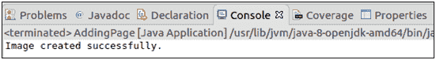

# 提取图像

> 原文：<https://www.javatpoint.com/pdfbox-extracting-image>

在本节中，我们将学习如何从现有的 PDF 文档中提取图像。 **PDFBox 库**提供了一个**PDF frender 类**，它将一个 PDF 文档渲染到一个 **AWT 缓冲区**中。

按照以下步骤从现有的 PDF 文档中提取图像-

## 加载现有的 PDF 文档

我们可以使用静态 **load ()** 方法加载现有的 PDF 文档。该方法接受一个**文件对象**作为**参数**。我们也可以使用 PDFBox 的类名 **PDDocument** 来调用它。

```java

File file = new File("Path of Document"); 
PDDocument doc = PDDocument.load(file); 

```

## 实例化 PDFRender 类

**PDFRenderer** 类将一个 PDF 文档渲染到一个 **AWT 缓冲页面**中。这个类的实例需要一个**文档对象**作为它的参数。这可以在下面的代码中显示。

```java

PDFRenderer renderer = new PDFRenderer(doc);

```

## 渲染图像

renderImage 类的 **renderImage()** 方法可以用来渲染特定页面中的图像。这个方法需要传递页面的索引，在那里我们有要渲染的图像。

```java

BufferedImage image = renderer.renderImage(Page Index);

```

## 将图像写入文件

我们可以使用 **write ()** 方法将渲染图像写入文件。在这个方法中，我们需要传递三个参数-

1.  呈现的图像对象。
2.  表示图像类型的字符串(jpg 或 png)。
3.  我们需要将提取的图像保存到的文件对象。

这可以在以下代码中显示:

```java

ImageIO.write(image, "JPEG", new File("Path of Image"));

```

## 关闭文档

完成任务后，我们需要使用 **close ()** 方法关闭 **PDDocument** 类对象。

```java

doc.close();

```

### 示例-

这是一个 PDF 文档，我们将使用 Java 程序的 PDFBox 库将其页面提取为图像。


### Java 程序

```java

import java.awt.image.BufferedImage;
import java.io.File;
import java.io.IOException;
import javax.imageio.ImageIO;
import org.apache.pdfbox.pdmodel.PDDocument;
import org.apache.pdfbox.rendering.PDFRenderer;

public class ExtractImage {

public static void main(String[] args)throws IOException {

		//Loading an existing document 
	      File file = new File("/eclipse-workspace/blank.pdf");
	      PDDocument doc = PDDocument.load(file);

	//Instantiating the PDFRenderer class
	      PDFRenderer renderer = new PDFRenderer(doc);

	//Rendering an image from the PDF document
	      BufferedImage image = renderer.renderImage(2);

	//Writing the image to a file
     ImageIO.write(image, "JPEG", new File("/eclipse-workspace/my_image.jpeg"));

	      System.out.println("Image created successfully.");

	//Closing the document
	doc.close();
	}
}

```

**输出:**

成功执行后，上述程序显示以下输出。



现在进行验证，如下图所示打开图像-

