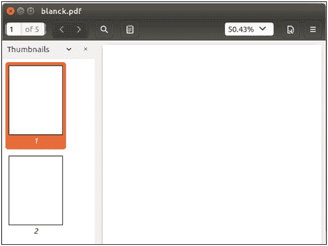
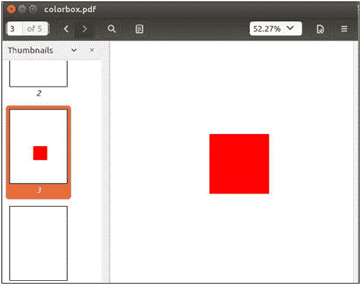

# 添加矩形

> 原文：<https://www.javatpoint.com/pdfbox-adding-rectangles>

使用 PDFBox 库，我们可以在 PDF 页面中添加矩形形状。PDFbox 库提供了一个**的 **addRect()** 方法来在 PDF 页面中添加矩形。**

要在 PDF 文档中添加矩形形状，请执行以下操作-

## 加载现有的 PDF 文档

我们可以使用静态 **load()** 方法加载现有的 PDF 文档。该方法接受一个**文件对象**作为**参数**。我们也可以使用 PDFBox 的类名 **PDDocument** 来调用它。

```java

File file = new File("Path of Document"); 
PDDocument doc = PDDocument.load(file); 

```

## 检索页面

在这种情况下，我们必须选择一个矩形形状将被插入的页面。 **getPage()** 方法用于从 PDF 文档中检索页面。这个方法需要一个页码作为我们想要检索的页面的参数。这可以在下面的代码中显示。

```java

PDPage page = doc.getPage(PageIndex);

```

## 准备内容流

**PDPageContentStream** 类用于创建插入各种数据元素的对象。这个类的构造函数包含**文档对象**和**页面对象**作为参数。这可以在下面的代码中显示。

```java

PDPageContentStream contents = new PDPageContentStream(doc, page);

```

## 设置颜色

我们可以使用 **PDPageContentStream 类**的**setnonrockingcolor()**方法将颜色设置为矩形。这个方法需要传递所需的颜色作为参数。这可以在下面的代码中显示。

```java

contentStream.setNonStrokingColor(Color.RED);

```

## 添加矩形

使用 **addRect()** 方法绘制所需尺寸的矩形。该方法需要通过矩形的**尺寸**作为参数。这可以在下面的代码中显示。

```java

contentStream.addRect(250, 250, 150, 150);

```

**addRect()** 方法接受以下参数:

*   **X** -矩形的 X 坐标
*   **Y** -矩形的 Y 坐标
*   **宽度** -矩形的宽度。
*   **高度** -矩形的高度。

## 填充矩形

**PDPageContentStream** 类的 **fill()** 方法用所需的颜色填充指定尺寸之间的路径。这可以在下面的代码中显示。

```java

contentStream.fill();

```

## 关闭文档

完成任务后，我们需要使用 **close()** 方法关闭 **PDDocument** 类对象。

```java

doc.close();

```

### 示例-

这是一个空白的 PDF 文档。在本文档中，我们将使用 Java 程序的 PDFBox 库添加**矩形**。



### Java 程序

```java

import java.io.File;
import java.io.IOException;
import java.awt.Color;
import org.apache.pdfbox.pdmodel.PDDocument;
import org.apache.pdfbox.pdmodel.PDPage;
import org.apache.pdfbox.pdmodel.PDPageContentStream;

public class AddingPage {

	public static void main(String[] args)throws IOException {

		//Loading an existing document 
	      File file = new File("/eclipse-workspace/blank.pdf");
	      PDDocument doc = PDDocument.load(file);

	//Retrieving a page of the PDF Document
	      PDPage page = doc.getPage(2);

	//Instantiating the PDPageContentStream class
	     PDPageContentStream contentStream = new PDPageContentStream(doc, page);

	//Setting the non stroking color
	contentStream.setNonStrokingColor(Color.RED);

	//Drawing a rectangle 
	contentStream.addRect(250, 250, 150, 150);

	//Drawing a rectangle
	contentStream.fill();

	      System.out.println("Rectangle added successfully in a PDF document.");

	//Closing the ContentStream object
	contentStream.close();

	//Saving the document
	      File file1 = new File("eclipse-workspace/RectangleShape.pdf");
	doc.save(file1);

	//Closing the document
	doc.close();
	}
}

```

**输出:**

成功执行后，上述程序显示以下输出。


现在进行验证，打开名为矩形的 PDF 文档，如下图所示-

