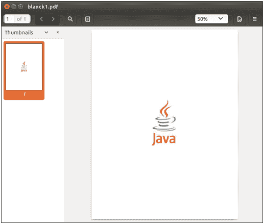
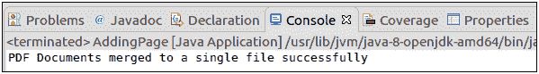

# 合并 PDF 文档

> 原文：<https://www.javatpoint.com/pdfbox-merging-pdf-document>

我们可以将**多个** PDF 文档合并成一个**单个** PDF 文件。使用 PDFBox 合并 PDF 文档并不简单。我们可以使用**类合并 PDF 文档。这门课提供了我们获取多个或多页 PDF 文档并将它们合并成一个 PDF 文档所需的一切。我们可以根据需要合并任意数量的文件。**

以下是一个循序渐进的过程，用于合并位于一个目录中的所有 PDF 文件，而不必将每个文件作为参数传递。

## 加载现有文档

我们可以使用静态 **load()** 方法加载现有的 PDF 文档。该方法接受一个**文件对象**作为**参数**。我们也可以使用 PDFBox 的类名 **PDDocument** 来调用它。

```java
File file = new File("PATH"); 
PDDocument doc = PDDocument.load(file); 

```

## 创建项目合并能力类对象

实例化 **PDFMergeUtility** 类。这个类包含合并 PdF 的例程。这可以在以下代码中显示:

```java
PDFMergerUtility PDFmerger = new PDFMergerUtility();

```

## 设置目标

使用 **setDestinationFileName()** 方法设置目标文件的路径。这可以在以下代码中显示:

```java
PDFmerger.setDestinationFileName("Path/merged.pdf");

```

## 设置源文件

按照我们希望在最终合并的 PDF 文件中找到的顺序添加所有源 PDF 文件。 **addSource()** 方法用于设置源文件，如下图所示。

```java
PDFmerger.addSource(SourceFileName);

```

## 合并 PdF

添加所有要合并的源 PDF 文件。使用 **PDFmerger** 类的 **mergeDocuments()** 方法合并文档，如下代码所示。

```java
PDFmerger.mergeDocuments(null);

```

## 关闭文档

完成任务后，我们需要使用 **close()** 方法关闭 **PDDocument 类对象**。

```java
doc.close();

```

### 示例-

在这里，我们得到**三个** PDF 文档文件，我们将通过一个 **Java 程序**的 PDFBox 库把它们合并成一个单独的 PDF 文件。




## Java 程序

```java
import org.apache.pdfbox.pdmodel.PDDocument;
import org.apache.pdfbox.multipdf.PDFMergerUtility;
import java.io.File; 
import java.io.IOException; 

public class MergePdfDocuments {
		public static void main(String[] args)throws IOException {

		//Loading an existing PDF document
	      File file1 = new File("/eclipse-workspace/blank1.pdf");
	      PDDocument document1 = PDDocument.load(file1); 
	      File file2 = new File("/eclipse-workspace/blank2.pdf");
	      PDDocument document2 = PDDocument.load(file2);  
	      File file3 = new File("/eclipse-workspace/blank3.pdf");
	      PDDocument document3 = PDDocument.load(file3); 

	//Create PDFMergerUtility class object
	      PDFMergerUtility PDFmerger = new PDFMergerUtility();

	//Setting the destination file path
	PDFmerger.setDestinationFileName("/eclipse-workspace/merged.pdf");

	//adding the source files
	PDFmerger.addSource(file1);
	PDFmerger.addSource(file2);
	PDFmerger.addSource(file3);

	//Merging the documents
	PDFmerger.mergeDocuments(null);

	 System.out.println("PDF Documents merged to a single file successfully");

//Close documents
	document1.close();
	document2.close();
	document3.close();
	}
}

```

**输出:**

成功执行上述程序后，下面将显示以下消息。



为了验证给定的路径，我们可以观察到创建了一个名为**merged.pdf**的 PDF 文档。该文档包含如下所示提供的源文档文件的所有页面。

