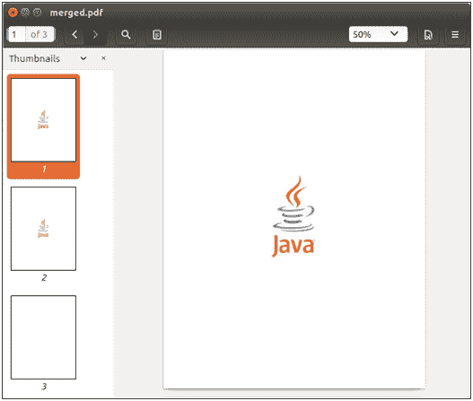
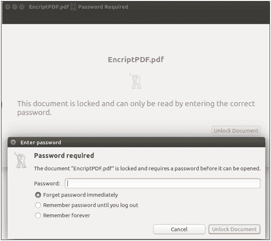

# 加密 pdf 文档

> 原文：<https://www.javatpoint.com/pdfbox-encrypting-pdf-document>

PDF 文档是纸质文档的流行替代品。它们在每个平台上都有相同的外观和感觉。与纸质文档一样，有些 PDF 文档是保密的。我们可以用密码保护 PDF 文档。我们还可以在 PDF 文档中指定权限和加密类型。在本节中，我们将介绍如何使用 PDFBox 库对受密码保护的 PDF 文档进行加密和解密。

可以使用**标准保护策略**和**访问权限**类提供的方法对 PDF 文档进行加密。

**访问权限**类提供访问权限来保护 PDF 文档。这些权限在 PDF 格式规范中指定，以限制用户执行以下操作:

*   打印文档
*   修改文档的内容
*   复制或提取文档内容
*   添加或修改注释
*   填写交互式表单字段
*   提取文本和图形，方便视障人士使用
*   汇编文件
*   打印质量下降

PDF 文档需要 ***两种*** 类型的密码加密:


**1。所有者密码** -也称为**“权限密码”**。此密码用于访问具有所有权限的文件。

**2。用户密码** -也称为**“开启密码”**。此密码允许以受限权限打开和查看文件。

按照以下步骤加密现有的 PDF 文档-

## 加载现有文档

我们可以使用静态 **load()** 方法加载现有的 PDF 文档。该方法接受一个**文件对象**作为**参数**。我们也可以使用 PDFBox 的类名 **PDDocument** 来调用它。

```java
File file = new File("PATH"); 
PDDocument doc = PDDocument.load(file); 

```

## 创建访问权限对象

我们实例化 **AccessPermission** 类来创建一个对象，如下所示。

```java
AccessPermission ap = new AccessPermission();  

```

## 创建标准保护策略对象

我们实例化**标准保护策略**类来创建一个对象。在这个类中，我们需要提供 ***车主密码*** 和 ***用户密码*** 作为参数，可以在下面的代码中显示。

```java
StandardProtectionPolicy spp = new StandardProtectionPolicy
("owner password", "user password", AccessPermissionObject);

```

## 设置加密密钥的长度

我们可以使用 **setEncryptionKeyLength()** 方法设置加密密钥的**长度**，如下代码所示。

```java
spp.setEncryptionKeyLength(128);

```

## 设置访问权限

我们可以使用 **setPermissions()** 方法设置权限。该方法接受一个**访问权限**对象作为参数。

```java
spp.setPermissions(ap);

```

## 保护文档

我们可以使用 **protect()** 方法来保护我们的文档。该方法接受**标准保护策略**对象作为参数。

```java
document.protect(spp);

```

## 保存文档

添加所需内容后，我们需要将文档保存到我们想要的位置。使用 **save()** 方法保存文档。 **save()** 方法接受一个**字符串值**，并传递文档的路径作为参数。

```java
doc.save("Path of Document");

```

## 关闭文档

最后，完成任务后，我们需要使用 **close()** 方法关闭 **PDDocument 类对象**。

```java
doc.close();

```

### 示例-

假设这是一个名为**Merged.pdf**的 PDF 文档文件。我们可以通过 **Java 程序**的 PDFBox 库对 PDF 文件进行加密。



## Java 程序

```java
import org.apache.pdfbox.pdmodel.PDDocument;
import org.apache.pdfbox.pdmodel.encryption.AccessPermission;
import org.apache.pdfbox.pdmodel.encryption.StandardProtectionPolicy;
import java.io.File; 
import java.io.IOException; 

public class EncryptPDF {

		public static void main(String[] args)throws IOException {

		//Loading an existing PDF document
	      File file = new File("eclipse-workspace/Merge.pdf");
	      PDDocument document = PDDocument.load(file); 

	//Creating access permission object
	      AccessPermission ap = new AccessPermission();         

	//Creating StandardProtectionPolicy object
  StandardProtectionPolicy spp = new StandardProtectionPolicy("1234", "abcd", ap);

	//Setting the length of the encryption key
	spp.setEncryptionKeyLength(128);

	//Setting the access permissions
	spp.setPermissions(ap);

	//Protecting the document
	document.protect(spp);

	      System.out.println("PDF Document encrypted Successfully.");

	//Saving the document
	document.save("/eclipse-workspace/EncriptPDF.pdf");
	//Closing the document
	document.close();
	}
}

```

**输出:**

成功执行上述程序后，我们将看到以下输出消息。


为了验证给定的路径，我们可以观察到创建了一个名为**EncryptPDF.pdf**的 PDF 文档。本文档包含 ***密码*** 为 ***所有者*** 和 ***用户*** 两者。要打开此 PDF 文档，它需要密码，可在以下输出中显示。

