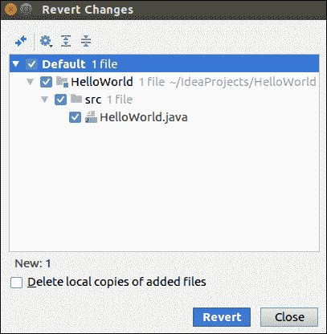
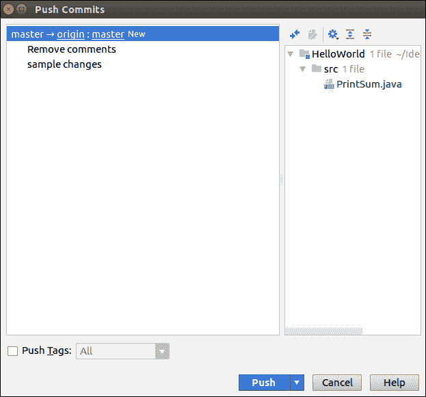
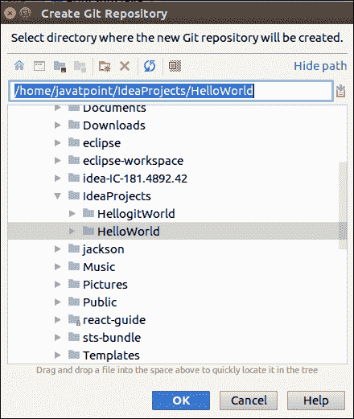
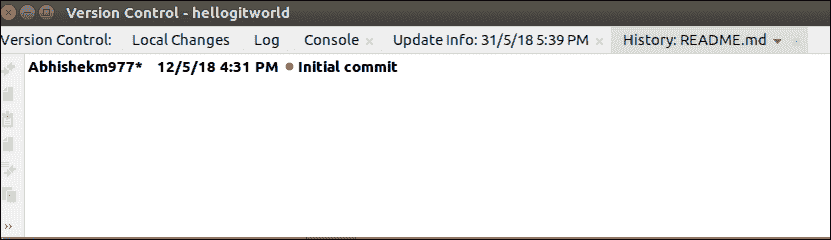

# IntelliJ IDEA 版本控制

> 原文：<https://www.javatpoint.com/intellij-idea-version-control>

版本控制是一个系统，它记录了一个文件或一组文件随时间的每一次修改，以便我们以后可以调用特定的版本。它允许我们将选定的文件恢复到以前的状态，将整个项目恢复到以前的状态，比较随时间的变化等等。它还可以帮助我们轻松找回丢失的文件。

IntelliJ IDEA IDE 支持 Git、CVS、TFS、GitHub、Subversion、Mercurial 等多种版本控制。在这一节中，我们将讨论最重要的版本控制，即 Git。

## Git 集成

Git 集成可以通过以下方法执行:

1.  在 GitHub 上制作标识并创建新的存储库。
2.  启动 IntelliJ IDE。转到 VCS->启用版本控制集成。对话框将会打开。
3.  选择要与项目根关联的版本控制系统，并在下拉菜单中选择 Git。
4.  Git 存储库创建消息显示给我们。

现在，我们将了解和学习 Git 工具的工作原理及其术语。

### 1.克隆

*   为此，请从版本控制- > Git 转到**文件- >新建- >项目。将打开以下对话框。**

*   输入存储库网址和目录名，然后单击克隆按钮。
*   成功运行后，存储库将被克隆。

### 2.将文件添加到存储库

转到 **VCS- >吉特- >添加**选项

### 3.还原本地更改

它将删除我们所做的本地更改。为此:

*   去 VCS->吉特->复原。
*   对话框将会打开。单击恢复按钮。

### 4.本地提交更改

提交操作涉及在项目历史中本地记录我们的存储库的快照。要将更改提交到本地存储库，请执行以下操作:

*   选择 Git 版本控制下的**修改文件**。
*   转到 **VCS- >提交更改**或 **VCS- > Git- >提交文件**。将打开以下对话框。

*   在“已更改文件”区域，我们可以看到自上次提交以来文件已更改。选中要提交的文件的复选框。
*   进入**提交消息**，点击**提交**按钮。

### 5.将更改推送到远程存储库

它会将本地更改发送到远程存储库，以便其他人可以使用。要执行推送操作，请执行以下步骤:

*   去 **VCS- >吉特- >推**。显示对话框。

*   我们可以看到要推送的提交，选择提交并点击**推送**按钮。

### 6.将现有项目导入 Git

要在 Git 存储库中添加我们现有的项目，请执行以下操作:

*   转到 **VCS- >导入到版本控制- >创建 Git 存储库**。对话框打开。

*   选择项目。单击确定按钮。

### 7.获取更新

要从存储库中获取更新，请执行以下操作-

*   去 VCS->吉特->拉
*   选择所需选项。
*   点击拉动按钮。

### 8.显示历史记录或日志

要查看历史记录，请执行以下操作-

*   前往 **VCS- >吉特- >展示历史**选项
*   将出现历史窗口屏幕。

