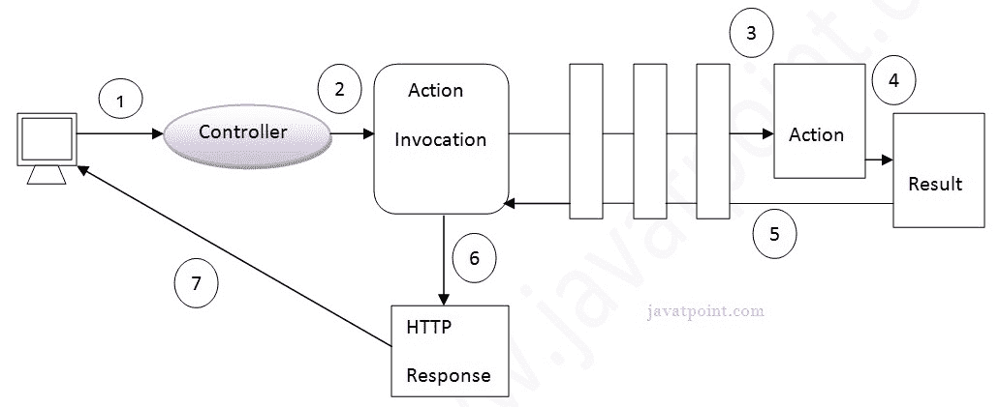
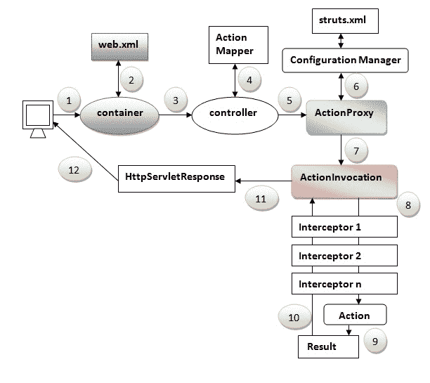

# Struts 2 架构和流程

> 原文:[https://www.javatpoint.com/struts-2-architecture-and-flow](https://www.javatpoint.com/struts-2-architecture-and-flow)

1.  [Struts 2 架构](#)
2.  [Struts 2 基本架构](#)
3.  [Struts 2 标准架构](#)

struts 2 应用程序的**架构和流程结合了许多组件，如控制器、动作代理、动作映射器、配置管理器、动作调用、接口、动作、结果等。**

在这里，我们将通过两种方式来理解 struts 流:

1.  struts 2 基本流程
2.  apache struts 提供的 struts 2 标准架构和流程

#### Struts 2 基本流程

让我们通过这个简单的图来理解 struts 2 应用程序的基本流程:

1.  用户发送操作请求
2.  控制器调用程序 actioninvocation
3.  动作调用调用每个拦截器和动作
4.  生成一个结果
5.  结果被发送回动作调用
6.  将生成一个 HttpServletResponse
7.  响应被发送给用户

* * *

#### Struts 2 标准流程(Struts 2 架构)

让我们通过这个简单的图来理解 struts 2 应用程序的标准体系结构:

1.  用户发送操作请求
2.  容器映射 web.xml 文件中的请求，并获取控制器的类名。
3.  容器调用控制器(StrutsPrepareAndExecuteFilter 或 FilterDispatcher)。从 struts2.1 开始，它就是 StrutsPrepareAndExecuteFilter。2.1 之前是 FilterDispatcher。
4.  控制器从动作映射器获取动作的信息
5.  actionproxy 的控制器调用程序
6.  ActionProxy 从配置管理器获取操作和拦截器堆栈的信息，配置管理器从 struts.xml 文件获取信息。
7.  动作代理将请求转发给动作调用
8.  动作调用调用每个拦截器和动作
9.  生成一个结果
10.  结果被发送回动作调用
11.  将生成一个 HttpServletResponse
12.  响应被发送给用户