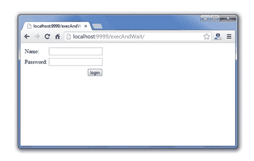
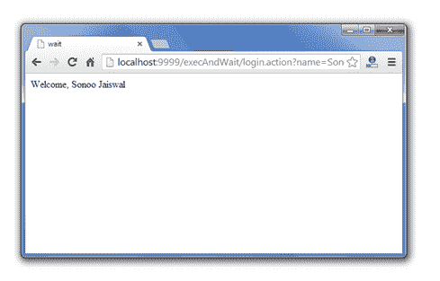

# Struts 2 execAndWait 拦截器示例

> 原文:[https://www . javatpoint . com/struts-2-execandwait-interceptor-示例](https://www.javatpoint.com/struts-2-execandwait-interceptor-example)

1.  [ExecAndWait 拦截器](#)
2.  [execAndWait 拦截器参数](#)
3.  [execAndWait 拦截器示例](#)

**执行等待拦截器**也称为执行等待拦截器，用于显示中间结果。

建议用于长时间运行动作。

默认情况下，在默认堆栈中找不到它。所以你需要明确说明。

如果您没有指定**“等待”**结果，struts 框架会显示一个中间结果，直到您的请求完成。

对于定制的中间结果，您需要在 struts.xml 文件中定义“等待”结果。在您的页面中，您可以显示处理图像等。所以，最好指定自定义结果。

#### execAndWait 拦截器的参数

为 execAndWait 拦截器定义了 3 个参数。

| 参数 | 描述 |
| **延迟** | 指定初始延迟时间。默认情况下，不设置初始延迟。 |
| **delaySleepInterval** | 仅用于延迟。它以毫秒为单位指定检查后台进程是否完成的时间间隔。默认设置为 100 毫秒。 |
| **线程优先级** | 指定线程的优先级。默认值为线程。NORM_PRIORITY。 |

#### 没有等待结果的 execAndWait 拦截器示例

让我们看看没有等待结果的 execAndWait 拦截器的简单例子。在这种情况下，struts 框架提供了一个中间结果。

```java
<action name="login" class="com.javatpoint.Login">
    <interceptor-ref name="params"/>
    <interceptor-ref name="execAndWait"/>
    <result name="success">login-success.jsp</result>
</action>

```

#### 带有等待结果的 execAndWait 拦截器示例

让我们看看带有等待结果的 execAndWait 拦截器的简单例子。在这种情况下，您的中间页面被调用。

```java
<action name="login" class="com.javatpoint.Login">
    <interceptor-ref name="params"/>
    <interceptor-ref name="execAndWait"/>
    <result name="success">login-success.jsp</result>
    <result name="wait">myintermediatepage.jsp</result>
</action>

```

* * *

#### myintermediatepage.jsp

让我们为中间结果编写代码。s:url 标记将把请求转发到指定的 url。

```java
<%@ taglib uri="/struts-tags" prefix="s" %>
<html>
<head>
<title>wait</title>

<meta http-equiv="refresh" content="0.5;url='<s:url includeParams="all" />'">
</head>
<body>

<p>your request is processing...</p>


</body>
</html>

```

0.5 秒刷新一次。

[download the full example (developed in eclipse ide)](https://static.javatpoint.com/src/st/eclipse/execandwait.zip)

#### 输出

   