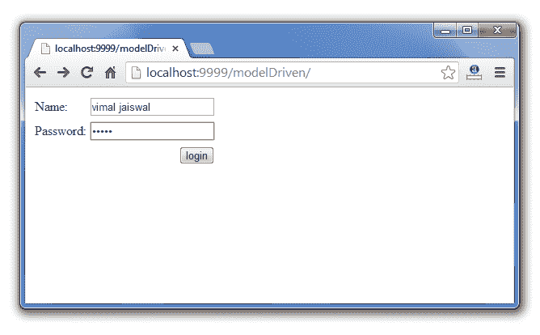
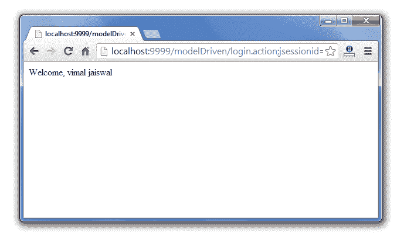

# Struts 2 模型驱动拦截器示例

> 原文:[https://www . javatpoint . com/struts-2-模型驱动-拦截器-示例](https://www.javatpoint.com/struts-2-modeldriven-interceptor-example)

1.  [模型驱动拦截器](#)
2.  [模型驱动拦截器参数](#)
3.  [模型驱动拦截器示例](#)

**模型驱动拦截器**将其他模型对象作为 valuestack 的默认对象。

默认情况下，操作对象是 valuestack 的默认对象。

要使用模型驱动拦截器，需要在动作类中实现**模型驱动接口**，并覆盖其方法 getModel()。

默认情况下，它位于默认堆栈中。所以你不需要明确说明。

#### 模型驱动拦截器的参数

没有为模型驱动拦截器定义参数。

#### 模型驱动拦截器示例

```java
<action name="login" class="com.javatpoint.LoginAction">
    <interceptor-ref name="params"/>
    <interceptor-ref name="modelDriven"/>
    <result name="success">login-success.jsp</result>
</action>

```

* * *

### 模型驱动拦截器的完整示例

让我们看看模型驱动拦截器的完整示例。

File: index.jsp

```java
<%@ taglib uri="/struts-tags" prefix="s" %>

<s:form action="login">
<s:textfield name="name" label="Name"></s:textfield>
<s:password name="password" label="Password"></s:password>
<s:submit value="login"></s:submit>
</s:form>

```

File: struts.xml

```java
<?xml version="1.0" encoding="UTF-8" ?>
<!DOCTYPE struts PUBLIC "-//Apache Software Foundation//DTD Struts Configuration 2.1//EN" "http://struts.apache.org/dtds/struts-2.1.dtd">
<struts>

<package name="abc" extends="struts-default" >

<action name="login" class="com.javatpoint.Login">
<result name="success" >/login-success.jsp</result>
<result name="error">/login-error.jsp</result>
</action>

</package>
</struts>    

```

File: Login.java

```java
package com.javatpoint;
import com.opensymphony.xwork2.ModelDriven;

public class Login implements ModelDriven<User>{
private User user;

public User getUser() {
	return user;
}

public void setUser(User user) {
	this.user = user;
}
public User getModel(){
	user=new User();
	return user;
}
public String execute(){
if(user.getPassword().equals("admin")){
	return "success";
}
else{
	return "error";
}
}

}

```

File: User.java

```java
package com.javatpoint;

public class User {
private String name,password;
//getters and setters
}

```

File: login-success.jsp

```java
<%@ taglib uri="/struts-tags" prefix="s" %>

Welcome, <s:property value="name"/>

```

File: login-error.jsp

```java
Sorry, username or password error!
<jsp:include page="index.jsp"></jsp:include>

```

[download the full example (developed in Eclipse ide without jar)](https://static.javatpoint.com/src/st/eclipse/modelDriven.zip)[download the full example (developed in Myeclipse ide)](https://static.javatpoint.com/src/st/modelDriven.zip)

#### 输出

 

#### 如果您没有实现模型驱动接口，您需要在 index.jsp 文件中使用用户名和密码字段名称，否则将不会设置给定值。