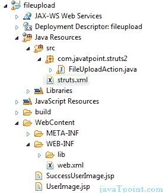

# 结构 2 文件上传示例

> 原文:[https://www.javatpoint.com/struts-2-file-upload-example](https://www.javatpoint.com/struts-2-file-upload-example)

1.  [文件上传拦截器](#)
2.  [文件上传拦截器参数](#)
3.  [文件上传拦截器示例](#)

**文件上传**拦截器自动处理所有包含文件的请求。

我们可以使用这个拦截器来控制文件上传的工作，比如定义允许的类型、最大文件大小等。

#### fileupload 拦截器的参数

为 fileupload 拦截器定义了 2 个参数。

| 参数 | 描述 |
| 最大化 | 指定要上传的文件的最大大小。 |
| 允许类型 | 指定允许的类型。可以是 image/png、image/jpg 等。 |

#### 自动添加的参数

它会在请求中自动添加 2 个参数:

1.  **字符串文件名**代表文件的文件名。
2.  **字符串内容类型**指定文件的内容类型。

#### 文件名和内容类型名称取决于文件的请求参数。如果文件名是文件，您需要使用文件文件名和文件内容类型。如果文件名是用户图像，则需要在操作类中使用用户图像文件名和用户图像内容类型。

* * *

## 使用 struts 2 的图像上传示例

来看看文件上传应用的**目录结构**。



### 1)创建 UserImage.jsp

这个 jsp 页面使用 struts UI 标签创建了一个表单。它从用户那里接收文件。

**index.jsp**

```java
<%@ page contentType="text/html; charset=UTF-8"%>
<%@ taglib prefix="s" uri="/struts-tags"%>
<html>
	<head>
		<title>Upload User Image</title>
	</head>
	<body>
		<h2>
			Struts2 File Upload & Save Example without Database
		</h2>
		<s:actionerror />
		<s:form action="userImage" method="post" enctype="multipart/form-data">
			<s:file name="userImage" label="Image" />
			<s:submit value="Upload" align="center" />
		</s:form>
	</body>
</html>

```

### 2)创建 SuccessUserImage.jsp

这个 jsp 页面使用 struts UI 标签创建了一个表单。它接收来自用户的姓名、密码和电子邮件 id。

**SuccessUserImage.jsp**

```java
<%@ page contentType="text/html; charset=UTF-8"%><%@ taglib prefix="s"
	uri="/struts-tags"%>
<html>
	<head>
		<title>Success: Upload User Image</title>
	</head>
	<body>
		<h2>
			Struts2 File Upload Example
		</h2>
		User Image:	<s:property value="userImage" /><br/>
		Content Type:<s:property value="userImageContentType" /><br/>
		File Name:	<s:property value="userImageFileName" /><br/>
		Uploaded Image:	" 
                                                     width="100" height="100" />
	</body>
</html>

```

### 3)创建动作类

此操作类继承了 ActionSupport 类，并重写了 execute 方法。

**RegisterAction.java**

```java
package com.javatpoint;
import java.io.File;
import javax.servlet.http.HttpServletRequest;
import org.apache.commons.io.FileUtils;
import com.opensymphony.xwork2.ActionSupport;

public class FileUploadAction extends ActionSupport{
	private File userImage;
	private String userImageContentType;
	private String userImageFileName;

	public String execute() {
		try {
String filePath = ServletActionContext.getServletContext().getRealPath("/").concat("userimages");

		System.out.println("Image Location:" + filePath);//see the server console for actual location
		File fileToCreate = new File(filePath,userImageFileName);
		FileUtils.copyFile(userImage, fileToCreate);//copying source file to new file

		return SUCCESS;
	}
	public File getUserImage() {
		return userImage;
	}
	public void setUserImage(File userImage) {
		this.userImage = userImage;
	}
	public String getUserImageContentType() {
		return userImageContentType;
	}

	public void setUserImageContentType(String userImageContentType) {
		this.userImageContentType = userImageContentType;
	}
	public String getUserImageFileName() {
		return userImageFileName;
	}
	public void setUserImageFileName(String userImageFileName) {
		this.userImageFileName = userImageFileName;
	}
}

```

### 4)创建 struts.xml

这个 xml 文件通过名称输入定义了一个额外的结果，以及一个拦截器 jsonValidatorWorkflowStack。

**struts.xml**

```java

<!DOCTYPE struts PUBLIC
"-//Apache Software Foundation//DTD Struts Configuration 2.0//EN"
"http://struts.apache.org/dtds/struts-2.0.dtd">

<struts>
	<package name="fileUploadPackage" extends="struts-default">
		<action name="userImage" class="com.javatpoint.FileUploadAction">
			<interceptor-ref name="fileUpload">
				<param name="maximumSize">2097152</param>

				<param name="allowedTypes">
					image/png,image/gif,image/jpeg,image/pjpeg
                                </param>
			</interceptor-ref>
			<interceptor-ref name="defaultStack"></interceptor-ref>
			<result name="success">SuccessUserImage.jsp</result>
			<result name="input">UserImage.jsp</result>
		</action>
	</package>
</struts>

```

* * *

[download this example developed in eclipse ide (without jar)](https://static.javatpoint.com/src/st/eclipse/fileupload.zip)

* * *

#### 输出

 

#### 图像不会显示在当前项目中。访问打印在服务器控制台中的图像位置以查看图像。