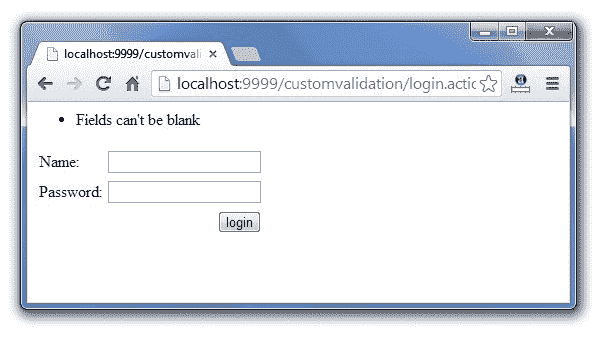

# Struts 2 自定义验证-工作流拦截器

> 原文:[https://www . javatpoint . com/struts-2-自定义-验证-工作流-拦截器](https://www.javatpoint.com/struts-2-custom-validation-workflow-interceptor)

1.  [Struts 2 自定义验证](#)
2.  [工作流拦截器](#)
3.  [可验证界面](#)
4.  [验证感知界面](#)
5.  [自定义验证示例](#)

通过在动作类中实现**validated**接口，我们可以在 struts 2 中定义自己的验证逻辑(自定义验证)。

**工作流拦截器**用于获取动作类中定义的错误消息的相关信息。

### 工作流拦截器

**工作流拦截器**检查是否有任何验证错误。它不执行任何验证。

当动作类实现 Validateable 接口时应用它。**输入**是该拦截器的默认参数，用于确定要为操作或字段错误调用的结果。

它在默认堆栈中找到，所以我们不需要显式定义它。

#### 工作流拦截器的参数

只为工作流拦截器定义了 1 个参数。

| 参数 | 描述 |
| **输入结果名称** | 指定在发现字段错误或操作错误时要返回的结果名称。默认设置为**输入**。 |

* * *

### Validateabale 接口

必须实现**可验证**接口，才能在动作类中执行验证逻辑。它只包含一个方法 **validate()** ，该方法必须在动作类中被覆盖以定义验证逻辑。验证方法的签名为:

```java
public void validate();

```

* * *

### 验证感知接口

**验证感知**界面可以接受**字段级**或**动作类级**错误信息。字段级消息保存在地图中，操作类级消息保存在集合中。它应该由 action 类实现，以添加任何错误消息。

### 验证软件接口的方法

验证感知接口的方法如下:

| 方法 | 描述 |
| **void addfield error(string field name，String errorMessage)** | 添加指定字段的错误消息。 |
| **void addactionerror(string error message)** | 为此操作添加操作级错误消息。 |
| **作废 addActionMessage(字符串消息)** | 为此操作添加操作级消息。 |
| **无效设置字段错误(地图<字符串，列表<字符串>T5【地图)** | 为字段设置错误消息集合。 |
| **void setationerers(集合<字符串>错误消息】** | 设置此操作的错误消息集合。 |
| **作废设置动作消息(集合<字符串>消息)** | 设置此操作的消息集合。 |
| **布尔 hasErrors()** | 检查是否有任何字段或操作错误。 |
| **布尔 hasFieldErrors()** | 检查是否有任何字段错误。 |
| **boolean hasaassionierors()** | 检查是否有任何操作级错误消息。 |
| **boolean hasionmessage()** | 检查是否有任何操作级别的消息。 |
| **地图<字符串，列表<字符串>T5】getfield errors()** | 返回所有字段级错误消息。 |
| **集合<字符串> getActionErrors()** | 返回所有操作级错误消息。 |
| **集合<字符串> getActionMessages()** | 返回所有操作级别的消息。 |

#### 注意:ActionSupport 类实现了 Validateable 和 ValidationAware 接口，所以我们可以继承 ActionSupport 类来定义验证逻辑和错误消息。

* * *

### 执行自定义验证的步骤

步骤如下:

1.  **创建表单以获得用户的输入**
2.  **通过扩展 ActionSupport 类和覆盖 validate 方法**来定义动作类中的验证逻辑
3.  **通过在 struts.xml 文件**中输入的名称定义错误消息的结果

* * *

### 执行自定义验证的示例

在本例中，我们创建了 4 个页面:

1.  **index.jsp**为用户输入。
2.  **RegisterAction.java**用于定义验证逻辑。
3.  **struts.xml** 用于定义结果和动作。
4.  **welcome.jsp**为视图组件。

### 1)创建用于输入的 index.jsp

这个 jsp 页面使用 struts UI 标签创建了一个表单。它接收来自用户的姓名、密码和电子邮件 id。

**index.jsp**

```java
<%@ taglib uri="/struts-tags" prefix="s" %>
<s:form action="register">
<s:textfield name="name" label="Name"></s:textfield>
<s:password name="password" label="Password"></s:password>
<s:submit value="register"></s:submit>
</s:form>

```

### 2)创建动作类

这个动作类继承了 ActionSupport 类，并重写了 validate 方法来定义验证逻辑。

**RegisterAction.java**

```java
package com.javatpoint;
import com.opensymphony.xwork2.ActionSupport;

public class RegisterAction extends ActionSupport{
private String name,password;
public void validate() {
	if(name.length()<1)
		addFieldError("name","Name can't be blank");
	if(password.length()<6)
		addFieldError("password","Password must be greater than 5");
}

//getters and setters

public String execute(){
//perform business logic here
	return "success";
}
}

```

### 3)在 struts.xml 中定义输入结果

这个 xml 文件通过名称输入定义了一个额外的结果，如果在操作类中发现任何错误消息，就会调用这个结果。

**struts.xml**

```java
<?xml version="1.0" encoding="UTF-8" ?>
<!DOCTYPE struts PUBLIC "-//Apache Software Foundation//DTD Struts
 Configuration 2.1//EN" "http://struts.apache.org/dtds/struts-2.1.dtd">
<struts>

<package name="default" extends="struts-default">
<action name="register" class="com.javatpoint.RegisterAction">
<result>welcome.jsp</result>
<result name="input">index.jsp</result>
</action>
</package>
</struts>    

```

### 4)创建视图组件

它是显示用户信息的简单 jsp 文件。

**welcome.jsp**

```java
<%@ taglib uri="/struts-tags" prefix="s" %>
Name:<s:property value="name"/><br/>
Password:<s:property value="password"/><br/>

```

[download this example (developed in Eclipse ide without jar)](https://static.javatpoint.com/src/st/eclipse/customvalidation.zip)[download this example (developed in Myeclipse ide)](https://static.javatpoint.com/src/st/customvalidation.zip)

#### 输出

 

* * *

### 定义操作级别错误消息

操作级错误消息适用于整个表单。我们可以在 validation()方法中通过 ValidationAware 接口的 **addActionError()** 方法定义动作级错误消息。例如:

```java
package com.javatpoint;
import com.opensymphony.xwork2.ActionSupport;
public class RegisterAction extends ActionSupport{
private String name,password,email;
public void validate() {
	if(name.trim().length()<1 || password.trim().length()<1){
		addActionError("Fields can't be blank");
	}
}

//getters and setters

public String execute(){
	return "success";
}
}

```

现在您需要使用 index.jsp 文件中的 **actionerror** 标记来显示操作级别错误消息。

**index.jsp**

```java
<%@ taglib uri="/struts-tags" prefix="s" %>
<s:actionerror/>
<s:form action="register">
<s:textfield name="name" label="Name"></s:textfield>
<s:password name="password" label="Password"></s:password>
<s:textfield name="email" label="Email Id"></s:textfield>
<s:submit value="register"></s:submit>
</s:form>

```

#### 输出

 [download this example (developed in Eclipse ide without jar)](https://static.javatpoint.com/src/st/eclipse/customvalidation.zip)[download this example (developed in Myeclipse ide)](https://static.javatpoint.com/src/st/customvalidation.zip)