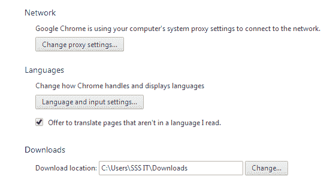
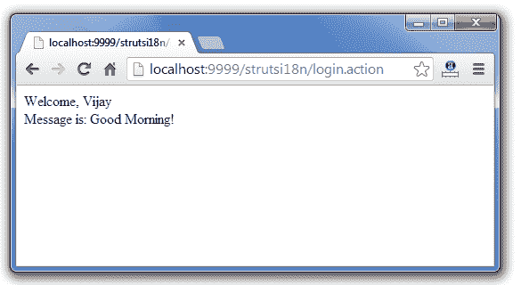

# 带有 i18n 示例教程的 Struts 2

> 原文：<https://www.javatpoint.com/struts-2-with-i18n-example-tutorial>

1.  [i18n 拦截器](#)
2.  [i18n 拦截器参数](#)
3.  [i18n 拦截器示例](#)

**i18n** 拦截器为您的应用程序提供多语言支持。

它处理操作的区域设置。如果用户想要设置他/她的区域设置并根据提供的区域设置获取数据，则可以使用它。

默认情况下，它在 defaultStack 中找到，因此您不必显式指定它。

* * *

#### i18n 拦截器参数

为 i18n 拦截器定义了 2 个参数。两者都是可选的。

| 参数 | 描述 |
| **参数名称** | 它指定了 HTTP 请求参数的名称。默认设置为 **request_locale** 。 |
| **属性名** | 指定存储区域设置的会话密钥的名称。默认为 **WW_TRANS_I18N_LOCALE** 。 |

* * *

### i18n 拦截器示例

在本例中，我们将创建以下页面:

1.  **Login.java**
2.  **登录属性和登录属性**
3.  **struts.xml**
4.  **index.jsp**
5.  **login-success.jsp**

* * *

### 1)创建动作类

要使用 i18n 拦截器，需要扩展实现 TextProvider 的 ActionSupport 类。

**Login.java**

```java
package com.javatpoint;
import com.opensymphony.xwork2.ActionSupport;

public class Login extends ActionSupport{
private String name;
public String getName() {
	return name;
}
public void setName(String name) {
	this.name = name;
}
public String execute(){
		return SUCCESS;
}
}

```

* * *

### 2)创建属性文件

现在在包中创建两个属性文件。它的名称应该是 action name _ language code . properties。

**Login_en.properties**

```java
login.msg=Good Morning!

```

**Login_hi.properties**

```java
login.msg=Suprabhat!

```

* * *

### 3)创建用于输入的 index.jsp

这个 jsp 页面使用 struts UI 标签创建了一个表单。它接收来自用户的名称。

**index.jsp**

```java
<%@ taglib prefix="s" uri="/struts-tags" %>

<s:form action="login">
<s:textfield name="name" label="Name"></s:textfield>
<!-- 
<s:textfield name="request_locale" label="Language Code"></s:textfield>
 -->
<s:submit></s:submit>
</s:form>

```

* * *

### 在 struts.xml 中定义动作

**struts.xml**

```java
<?xml version="1.0" encoding="UTF-8" ?>
<!DOCTYPE struts PUBLIC "-//Apache Software Foundation//DTD Struts Configuration 2.1//EN" "http://struts.apache.org/dtds/struts-2.1.dtd">
<struts>
<package name="abc" extends="struts-default" >

<action name="login" class="com.javatpoint.Login" method="execute">
<result name="success">/login-success.jsp</result>
</action>

</package>
</struts>    

```

* * *

### 4)创建视图组件

现在使用**文本**标签获取数据。它用于 i18n。

**login-success.jsp**

```java
<%@ taglib uri="/struts-tags" prefix="s" %>
Welcome, <s:property value="name"/>
<br>
Message is: <s:text name="login.msg"></s:text>

```

* * *

### Eclipse 集成开发环境中的目录结构


* * *

[download this example developed in Eclipse IDE (without jar)](https://static.javatpoint.com/src/st/eclipse/strutsi18n.zip)[download this example developed in Myeclipse IDE](https://static.javatpoint.com/src/st/i18n.zip)

* * *

#### 输出

 

* * *

现在让我们更改语言代码。这里，我们使用的是 chrome 浏览器。

点击设置。


* * *

现在，点击显示高级设置。


* * *

现在，点击语言和输入设置。



* * *

现在，添加印地语并将其移动到顶部，然后单击完成。


* * *

如果再次运行该应用程序，它将显示印地语消息。

 

* * *

如果在 index.jsp 文件中使用 **request_locale** 属性名，将根据给定的语言代码显示消息。

```java
<%@ taglib prefix="s" uri="/struts-tags" %>

<s:form action="login">
<s:textfield name="name" label="Name"></s:textfield>
<s:textfield name="request_locale" label="Language Code"></s:textfield>
<s:submit></s:submit>
</s:form>

```

让我们看看输出。

 

* * *

 