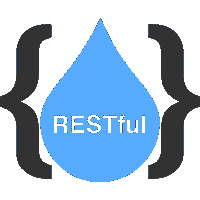

# RESTful 网络服务教程

> 原文:[https://www.javatpoint.com/restful-web-services-tutorial](https://www.javatpoint.com/restful-web-services-tutorial)

RESTful 网络服务是通过万维网进行通信的客户端和服务器应用程序。RESTful 网络服务是基于 REST 架构的网络服务。在 REST 架构中，一切都是资源。RESTful Web Services 提供了运行在不同平台和框架上的软件应用程序之间的通信。我们可以将 web 服务视为按需代码。RESTful Web Service 是一个可以通过向 URL 发送 HTTP 请求来调用的函数或方法，服务返回结果作为响应。在本教程中，您将通过合适的示例和项目学习 RSETful 网络服务的基础知识。

## 观众

我们的 RESTful 网络服务教程是为软件专业人士和初学者设计的，他们想简单地学习 RESTful 网络服务。本教程将为您提供 RESTful 网络服务概念的深入知识。完成本教程后，您可以开发 RSESTful 服务。

## 先决条件

在继续学习本教程之前，您应该对 Java、Spring 和 Spring Boot 框架有一个基本的了解。因为我们将使用 Spring Boot 开发 RESTful 网络服务。

## 问题

我们向您保证，您不会发现这个 Spring Cloud 教程有任何问题。如果有任何错误，请在联系表格中发布问题。

* * *