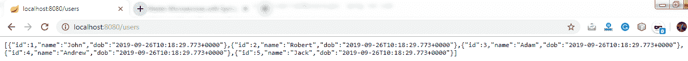

# 使用路径变量增强 Hello World 服务

> 原文:[https://www . javatpoint . com/restful-web-services-path-variable](https://www.javatpoint.com/restful-web-services-path-variable)

**@路径变量**注释用于从 URI 提取值。它最适合 RESTful web 服务，其中 URL 包含一些值。Spring MVC 允许我们在同一个方法中使用多个@PathVariable 注释。路径变量是创建 rest 资源的关键部分。

我们将创建另一个带有路径参数的 hello-world-bean 请求。

**步骤 1:** 打开**HelloWorldController.java**文件，添加另一个 helloWorldBean()服务。

**hello world 控制器. java**

```java

package com.javatpoint.server.main;
import org.springframework.web.bind.annotation.GetMapping;
import org.springframework.web.bind.annotation.PathVariable;
import org.springframework.web.bind.annotation.RestController;
import org.springframework.context.annotation.Configuration;
@Configuration
//Controller
@RestController
public class HelloWorldController 
{
//using get method and hello-world URI
@GetMapping(path="/hello-world")
public String helloWorld()
{
return "Hello World";
}
@GetMapping(path="/hello-world-bean")
//method- which returns "Hello World"
public HelloWorldBean helloWorldBean()
{
return new HelloWorldBean("Hello World");//constructor of HelloWorldBean
}
//passing a path variable
@GetMapping(path="/hello-world/path-variable/{name}")
public HelloWorldBean helloWorldPathVariable(@PathVariable String name)
{
return new HelloWorldBean(String.format("Hello World, %s", name)); //%s replace the name
}
}

```

我们将传递给路径变量的任何值都将被控制器拾取并返回到响应中。

**第二步:**键入 URL http://localhost:8080///hello-world/path-variable/javatpoint

**第三步:**运行**HelloWorldController.java**文件。我们在浏览器上得到如下响应。


让我们再次更改路径变量:http://localhost:8080/hello-world/path-variable/Anubhav


我们可以看到，无论我们在 path 变量中写什么，都会返回到响应中。

## 创建用户 Bean 和用户服务

在这一部分，我们将创建真正的资源用户和帖子。我们将使用静态数组列表来表示数据。

**步骤 1:** 创建一个名为**的新包。**

**步骤 2:** 创建一个 bean 类(User)来存储用户详细信息。

右键点击套餐**用户- >新增- >类- >提供名称->T1】完成。这里，我们提供了类名 User。**

**第三步:**定义三个私有变量 **id、名称、**和 **dob** 。

**步骤 4:** 生成**吸气剂**和**设置剂**。

右键单击文件- >来源- >生成获取器和设置器...- >全选- >生成。

**第五步:**生成**到字符串**。

右键单击文件- >来源- >生成字符串...- >全选- >生成。

**第 6 步:**生成**构造函数**。

右键单击文件- >来源- >使用字段生成构造函数...- >生成。

**User.java**

```java

package com.javatpoint.server.main.user;
import java.util.Date;
public class User 
{
public User(Integer id, String name, Date dob) 
{
super();
this.id = id;
this.name = name;
this.dob = dob;
}
private Integer id;
private String name;
private Date dob;
public Integer getId() 
{
return id;
}
public void setId(Integer id) 
{
this.id = id;
}
public String getName() 
{
return name;
}
public void setName(String name) 
{
this.name = name;
}
public Date getDob() 
{
return dob;
}
public void setDob(Date dob) 
{
this.dob = dob;
}
@Override
public String toString() 
{
//return "User [id=" + id + ", name=" + name + ", dob=" + dob + "]";
return String.format("User [id=%s, name=%s, dob=%s]", id, name, dob);
}
}

```

在进入下一步之前，首先移动包**中的**HelloWorldBean.java**和**HelloWorldController.java**。**

**第 7 步:**在包**中创建一个名为 **UserDaoService** 的类。**

**user daservice . Java**

```java

package com.javatpoint.server.main.user;
import java.util.ArrayList;
import java.util.Date;
import java.util.List;
import org.springframework.stereotype.Component;
@Component
public class UserDaoService 
{
public static int usersCount=5;
//creating an instance of ArrayList
private static List users=new ArrayList<>();
//static block 
static
{
//adding users to the list
users.add(new User(1, "John", new Date()));
users.add(new User(2, "Robert", new Date()));
users.add(new User(3, "Adam", new Date()));
users.add(new User(4, "Andrew", new Date()));
users.add(new User(5, "Jack", new Date()));
}
//method that retrieve all users from the list
public List <user>findAll()
{
return users;
}
//method that add the user in the list 
public User save(User user)
{
if(user.getId()==null)
{
//increments the user id
user.setId(++usersCount);
}
users.add(user);
return user;
}
//method that find a particular user from the list
public User findOne(int id)
{
for(User user:users)
{
if(user.getId()==id)
return user;
}
return null;
}
}</user> 
```

## 实现用户资源的获取方法

**第 8 步:**现在创建一个名为**的用户控制器类**。

**UserResource.java**

```java

package com.javatpoint.server.main.user;
import java.util.List;
import org.springframework.beans.factory.annotation.Autowired;
import org.springframework.web.bind.annotation.GetMapping;
import org.springframework.web.bind.annotation.RestController;
@RestController
public class UserResource 
{
@Autowired
private UserDaoService service;
@GetMapping("/users")
public List retriveAllUsers()
{
return service.findAll();
}
} 
```

**第九步:**运行应用程序，在浏览器地址栏输入**本地主机:8080/用户**。它以 **JSON** 格式返回用户列表。



如果日期以默认时间戳格式显示为:

**“DOB”:“1500370250075”**

我们需要设置合适的日期格式。

打开**应用程序.属性**文件。删除调试配置并添加以下配置:

```java

spring.jackson.serialization.write-dates-as-timestamps=false

```

上面的语句告诉杰克逊框架，序列化时不要把日期当作时间戳。

**步骤 10:** 如果我们想在浏览器上显示特定的用户详细信息，添加映射“**/用户/{id}** ”并在 UserResource 中创建方法**retrieveuser()**。

**UserResource.java**

```java

package com.javatpoint.server.main.user;
import java.util.List;
import org.springframework.beans.factory.annotation.Autowired;
import org.springframework.web.bind.annotation.GetMapping;
import org.springframework.web.bind.annotation.PathVariable;
import org.springframework.web.bind.annotation.RestController;
@RestController
public class UserResource 
{
@Autowired
private UserDaoService service;
@GetMapping("/users")
public List retriveAllUsers()
{
return service.findAll();
}
//retrieves a specific user detail
@GetMapping("/users/{id}")
public User retriveUser(@PathVariable int id)
{
return service.findOne(id);
}
} 
```

**第 11 步:**运行应用程序，在浏览器中键入**localhost:8080/users/{ id }**。它返回我们在 path 变量中传递的特定用户 id 的详细信息。

在下图中，我们检索到了 id 为 **4** 的用户的详细信息。


[Click here to download Enhancing the Hello World Service with a Path Variable project](https://static.javatpoint.com/tutorial/restful-web-services/download/Enhancing the Hello World Service with a Path Variable.zip)
[Click here to download Implementing Get Method for User Resource-Display All Users project](https://static.javatpoint.com/tutorial/restful-web-services/download/Implementing Get Method for User Resource-Display All Users.zip)

* * *