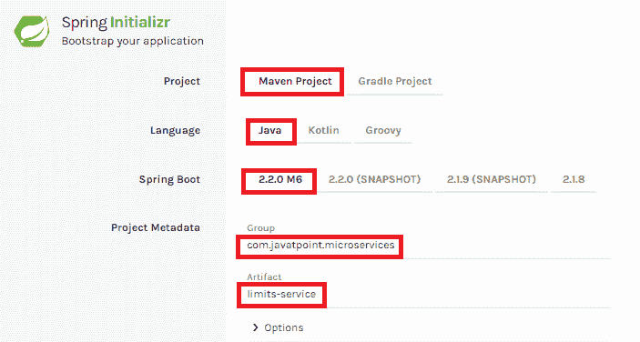
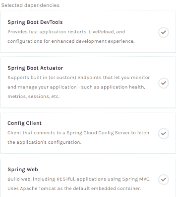
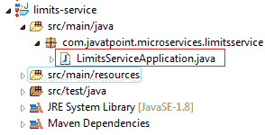

# 创建简单的微服务

> 原文：<https://www.javatpoint.com/creating-a-simple-microservice>

**步骤 1** :使用 Spring Initializr[https://start.spring.io/](https://start.spring.io)创建一个 Maven 项目

**第二步**:选择 Spring Boot 版 **2.2.0 M6** 或更高版本。不要选择快照版本。

**第三步**:提供**集团**名称。在我们的例子中 **om.javatpoint**

**第四步**:提供**神器 id** 。我们提供了**限额服务**。



**步骤 5** :添加以下依赖项: **Spring Web，Spring Boot DevTools，Spring Boot 执行器，配置客户端**。



**第 6 步**:点击【生成项目】按钮上的**。一个 **zip** 文件会下载下来，把它解压到硬盘里。**

**第七步**:现在，打开**月食**。导入创建的 maven 项目。下载所需文件需要一些时间。

**第八步**:项目下载完成后，进入 **src/main/java** 。打开**限制服务应用程序**。



**第 9 步**:现在运行**LimitsServiceApplication.java**作为 Java 应用程序。

**它在端口 8080 (http)上启动了 Tomcat。**

现在我们将在上面的项目中添加一些服务。为此，我们必须遵循以下步骤:

**第一步**:打开**应用程序.属性**文件，编写以下代码:

```java
spring.application.name=limits-service		//name of application

```

**第二步**:在包**下的文件夹 src/main/java 中创建一个名为**LimitsConfigurationController.java**的类文件，并编写以下代码:**

```java
package com.javatpoint.microservices.limitsservice;
import org.springframework.web.bind.annotation.GetMapping;
import org.springframework.web.bind.annotation.RestController;
import com.javatpoint.microservices.limitsservice.bean.LimitConfiguration;
@RestController
public class LimitsConfigurationController 
{
@GetMapping("/limits")
public LimitConfiguration retriveLimitsFromConfigurations()
{
return new LimitConfiguration(1000, 1);
}
}

```

**第三步**:在包**com . javatpoint . microservice . limit service . bean**下的 **src/main/java** 文件夹中创建一个名为**LimitConfiguration.java**的类文件，并编写以下代码:

```java
package com.javatpoint.microservices.limitsservice.bean;
public class LimitConfiguration 
{
private int maximum;
private int minimum;
//no-argument constructor
protected LimitConfiguration()
{
}
//generating getters
public int getMaximum() 
{
return maximum;
}
public int getMinimum() 
{
return minimum;
}
//genetrating constructor using fields
public LimitConfiguration(int maximum, int minimum) 
{
super();
this.maximum = maximum;
this.minimum = minimum;
}
}

```

在浏览器中输入**localhost:8080/limites**，按回车键，我们得到 JSON 响应作为输出。

**输出**

```java
{
maximum: 1000,
minimum: 1
}

```

## 向应用程序添加服务。属性

在之前的程序中，我们会根据需求修改代码。

现在我们从**应用程序.属性**文件中调用**限制服务**。在这个文件中，我们配置了几个值。

```java
limits-service.minimum=99
limits-service.maximum=9999

```

在 Spring Boot，有一种更好的方法可以使用注释 **@ConfigurationProperties** 从配置中读取值。

**第一步**:在**包下的 **src/main/java** 文件夹中创建一个名为**Configuration.java**的类。**

**第二步**:添加批注**@组件**和**@配置属性**。

**第三步**:声明两个变量**最小值**和**最大值**。

**第四步**:如果使用的是配置文件，需要生成 getters 和 setters。

Configuration.java 档案是这样的。

```java
package com.javatpoint.microservices.limitsservice;
import org.springframework.boot.context.properties.ConfigurationProperties;
import org.springframework.stereotype.Component;
@Component
@ConfigurationProperties("limits-service")
public class Configuration 
{
private int maximum;
private int minimum;
public void setMaximum(int maximum) 
{
this.maximum = maximum;
}
public void setMinimum(int minimum) 
{
this.minimum = minimum;
}
public int getMaximum() 
{
return maximum;
}
public int getMinimum() 
{
return minimum;
}
}

```

**第五步**:现在转到**LimitsConfigurationController.java**文件，修改代码。在本文中，我们将使用配置。

```java
package com.javatpoint.microservices.limitsservice;
import org.springframework.beans.factory.annotation.Autowired;
import org.springframework.web.bind.annotation.GetMapping;
import org.springframework.web.bind.annotation.RestController;
import com.javatpoint.microservices.limitsservice.bean.LimitConfiguration;
@RestController
public class LimitsConfigurationController 
{
@Autowired	
private Configuration configuration;	
@GetMapping("/limits")
public LimitConfiguration retriveLimitsFromConfigurations()
{
//getting values from the properties file
return new LimitConfiguration(configuration.getMaximum(), configuration.getMinimum());
}
}

```

现在刷新浏览器页面。它显示了在**应用程序中配置的更新值的 JSON 格式。属性**文件。

**输出**

```java
{
maximum: 999,
minimum: 99
}

```

[Click here to download limits-service](https://static.javatpoint.com/tutorial/microservices/download/limits-service.zip)

* * *