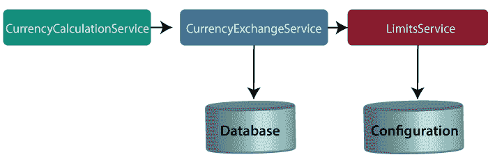
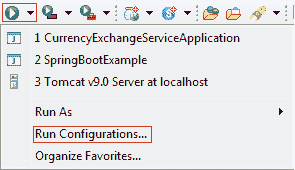
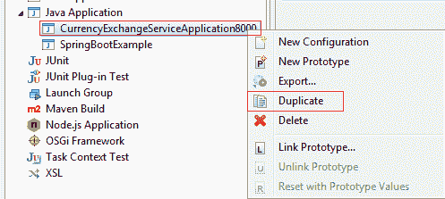
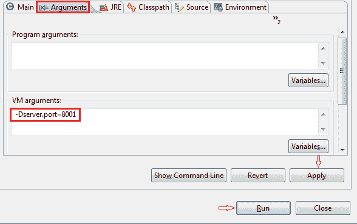

# 货币兑换和货币兑换服务介绍

> 原文:[https://www . javatpoint . com/货币兑换和货币兑换服务简介](https://www.javatpoint.com/introduction-to-currency-conversion-and-currency-exchange-service)

在本节中，我们将创建几个微服务:**current exchangeservice**和**current exchangeservice**。



#### 注:在本教程中，我们引用了货币兑换服务作为货币计算服务。这两种服务都有相同的含义，所以不要混淆。

让我们了解这些服务的功能。

在上图中，CurrencyExchangeService 使用 JPA 与数据库对话，并返回特定货币的交换值。例如，美元对印度卢比的转换。

当我们调用 CurrencyExchangeService 时，我们需要传递两个参数:**从**(转换为)，以及**到**(转换为)。例如，如果我们想将货币从**美元**转换为**印度卢比**。

考虑网址**http://localhost:8000/货币兑换/from/USD/to/INR** 。它返回以下响应:

```java

{
id: 101,
from: "USD",
to: "INR",
conversionMultiple: 72,
port: 8000
}

```

货币兑换服务将返回换算倍数。换算倍数表示 **1 美元**等于 **72 印度卢比**。货币兑换服务使用货币兑换服务。假设货币兑换服务想要将 100 美元兑换成印度卢比。因此，它将调用货币兑换服务，并将转换我们在 path 参数中提供的指定金额。例如:

**http://localhost:8100/货币转换器/from/USD/to/INR/quantity/100**

```java

{
Id: 101,
from: "USD",
to: "INR",
conversionMultiple: 72,
quantity: 100
totalCalculatedAmount: 7200,
port: 8000
}

```

在我们的示例中，我们将使用 Spring Cloud 实现这两个服务。

## 建立货币兑换服务

**第一步:**打开弹簧初始化器[。](https://start.spring.io)

**第二步:**选择**项目**:马文项目、**语言:** Java、Spring Boot 版 **2.2.0 M6** 或以上。提供**组名**和**工件标识。**我们分别为组名和工件 id 提供了**com . javatpoint . microservice**和**货币兑换服务**。


**步骤 3:** 添加依赖项**网络、开发工具、执行器、**和**配置客户端**。

**第四步:**点击**生成项目**按钮。它将下载项目的 **zip** 文件。

**第五步:提取**在本地盘。

**第六步:导入**项目。

单击文件菜单->导入->现有 Maven 项目->下一步->浏览->选择项目->完成

导入需要一些时间。项目导入完成后，它会显示以下项目目录。不要考虑目录中的 data.sql 文件，因为我们稍后会创建它。


**步骤 7:** 打开**应用程序.属性**文件，配置**应用程序名称**和**端口**号。

**应用属性**

```java

spring.application.name=currency-exchange-service.
server.port=8000

```

当我们运行货币兑换服务时，它运行但不执行任何服务。下一步，我们将在货币兑换服务中实现代码。

## 对货币兑换服务进行硬编码

现在，我们将创建一项服务，将货币从美元转换为印度卢比。

**步骤 1:** 在包**中创建一个名为**的类文件(REST Controller)****

**货币兑换控制器. java**

```java

package com.javatpoint.microservices.currencyexchangeservice;
import java.math.BigDecimal;
import org.springframework.boot.SpringApplication;
import org.springframework.boot.autoconfigure.SpringBootApplication;
import org.springframework.web.bind.annotation.GetMapping;
import org.springframework.web.bind.annotation.PathVariable;
import org.springframework.web.bind.annotation.RestController;
@SpringBootApplication
@RestController 
public class CurrencyExchangeController 
{
@GetMapping("/currency-exchange/from/{from}/to/{to}")		//where {from} and {to} are path variable
public ExchangeValue retrieveExchangeValue(@PathVariable String from, @PathVariable String to)	//from map to USD and to map to INR
{	
return new  ExchangeValue(1000L, from, to, BigDecimal.valueOf(65));
}
}

```

**步骤 2:** 创建一个名为**ExchangeValuee 的类文件。**

**ExchangeValue.java**

```java

package com.javatpoint.microservices.currencyexchangeservice;
import java.math.BigDecimal;
public class ExchangeValue 
{
private Long id;
private String from;
private String to;
private BigDecimal conversionMultiple;

public ExchangeValue()
{	
}
//generating constructor using fields
public ExchangeValue(Long id, String from, String to, BigDecimal conversionMultiple) {
super();
this.id = id;
this.from = from;
this.to = to;
this.conversionMultiple = conversionMultiple;
}
//generating getters
public Long getId() 
{
return id;
}
public String getFrom() 
{
return from;
}
public String getTo() 
{
return to;
}
public BigDecimal getConversionMultiple() 
{
return conversionMultiple;
}
}

```

**第三步:**跑**CurrencyExchangeServiceApplication.java。**它运行在我们在 application.properties 文件中配置的端口 **8000** 上。

我们在浏览器上得到以下响应:

```java

{
id: 101,
from: "USD",
to: "INR",
conversionMultiple: 72,
port: 8000
}

```

## 在响应中设置动态端口

CurrencyExchangeService 决定货币的交换值。货币计算服务使用货币交换服务来确定一种货币在其他货币中的价值。我们将在下一个主题的后面创建多个 **CurrencyExchangeService** 的实例。

目前该服务正在端口 **8000** 上运行。稍后我们将在港口 **8001、8002、**等地运行。下一步，我们将为货币兑换服务设置一个端口。

**第一步:**打开**ExchangeValue.java**文件，添加一个**端口**变量。只为端口变量生成 getters 和 setters。

**ExchangeValue.java**

```java

package com.javatpoint.microservices.currencyexchangeservice;
import java.math.BigDecimal;
public class ExchangeValue 
{
private Long id;
private String from;
private String to;
private BigDecimal conversionMultiple;
private int port;
public ExchangeValue()
{	
}
//generating constructor using fields
public ExchangeValue(Long id, String from, String to, BigDecimal conversionMultiple) {
super();
this.id = id;
this.from = from;
this.to = to;
this.conversionMultiple = conversionMultiple;
}
//generating getters
public int getPort() {
return port;
}
public void setPort(int port) {
this.port = port;
}
public Long getId() 
{
return id;
}
public String getFrom() 
{
return from;
}
public String getTo() 
{
return to;
}
public BigDecimal getConversionMultiple() 
{
return conversionMultiple;
}
}

```

我们已经在 application.properties 文件中配置了应用程序名称和端口号，因此无需再次配置。

现在从环境中获取端口号。

**第三步**:打开**CurrencyExchangeController.java**获得环境属性。

**货币兑换控制器. java.**

```java

package com.javatpoint.microservices.currencyexchangeservice;
import java.math.BigDecimal;
import org.springframework.beans.factory.annotation.Autowired;
import org.springframework.boot.autoconfigure.SpringBootApplication;
import org.springframework.core.env.Environment;
import org.springframework.web.bind.annotation.GetMapping;
import org.springframework.web.bind.annotation.PathVariable;
import org.springframework.web.bind.annotation.RestController;
@SpringBootApplication
@RestController 
public class CurrencyExchangeController 
{
@Autowired
private Environment environment;
@GetMapping("/currency-exchange/from/{from}/to/{to}") //where {from} and {to} are path variable
public ExchangeValue retrieveExchangeValue(@PathVariable String from, @PathVariable String to)  //from map to USD and to map to INR
{	
//taking the exchange value
ExchangeValue exchangeValue= new ExchangeValue (1000L, from, to, BigDecimal.valueOf(65));
//picking port from the environment
exchangeValue.setPort(Integer.parseInt(environment.getProperty("local.server.port")));
return exchangeValue;
}
}

```

当我们刷新浏览器时，网址变为:**http://localhost:8000/货币兑换/from/USD/to/INR** 。

```java

{
id: 1000,
from: "USD",
to: "INR"
conversionMultiple: 65,
port: 8000
}

```

目前**currency exchangeserviceapplication**正在 **8000** 端口运行。

现在我们将在不同的端口号上运行**currency exchangeserviceapplication**。为此，我们必须将 **application.properties** 文件中的端口从 8000 更改为 8001、8002 等。无论我们想要哪个。

假设我们想要创建两个**currency exchangeserviceapplication**的实例。为此，我们必须在外部设置端口。

让我们创建一个运行在端口 **8001** 上的**currency Exchangeserviceapplication**的实例。

**步骤 1:** 右键单击项目- >运行方式- >运行配置。

或者单击突出显示的符号->运行配置。



**第二步:将**货币兑换服务**重命名为**货币兑换服务 8000** ，点击**应用**按钮。**


**第三步:**右键点击**货币兑换服务申请 8000** - >复制。



生成**currency exchangeserviceapplication 8000 的复制文件。**我们将在港口 **8001 运行。**

**第 4 步:**点击**参数**选项卡，在**虚拟机参数**文本框中写入**–dserver . port = 8001**。分别点击**应用**和**运行**按钮。

#### 注意:无论我们在虚拟机参数中传递什么值，它都会覆盖 application.properties 文件的配置。



点击**运行**按钮后，开始在端口 **8001** 上运行。

**第五步:**更改网址**中的端口号 http://localhost:8001/货币兑换/from/USD/to/INR** 并按回车键。我们得到以下回应:

```java

{
id: 1000,
from: "USD",
to: "INR",
conversionMultiple: 65,
port: 8001
}

```

现在我们有两个运行在两个不同端口 **8000** 和 **8001** 上的**currency Exchangeserviceapplication**实例。

[Click here to download currency-exchange-service](https://static.javatpoint.com/tutorial/microservices/download/currency-exchange-service.zip)

* * *