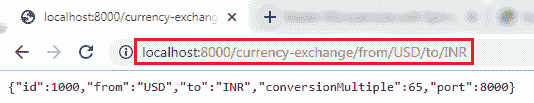
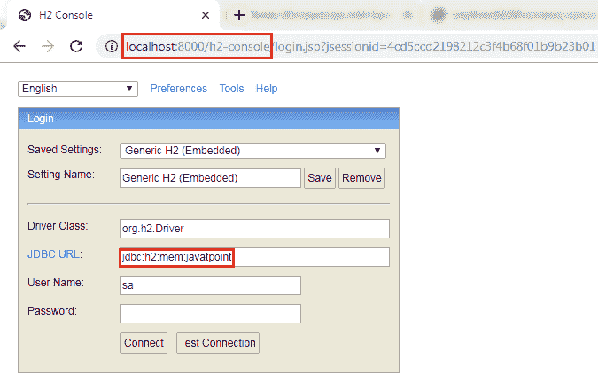
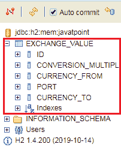

# 配置 JPA 和初始化数据

> 原文:[https://www . javatpoint . com/configure-JPA-and-initiated-data](https://www.javatpoint.com/configure-jpa-and-initialized-data)

在前一节中，我们已经对交换值的响应进行了硬编码。它来自数据库。在本节中，我们将创建一个到内存数据库的连接。

让我们看看如何将微服务连接到 H2 数据库。按照以下步骤将微服务连接到 JPA 内存数据库。

**第一步:**打开**货币兑换服务**的 **pom.xml** ，添加以下两个依赖项。

```java

<dependency>
<groupId>com.h2database</groupId>
<artifactId>h2</artifactId>
<version>1.4.197</version>
<scope>test</scope>
</dependency>
<dependency>
<groupId>org.springframework.boot</groupId>
<artifactId>spring-boot-starter-data-jpa</artifactId>
<version>2.1.3.RELEASE</version>
</dependency>

```

一旦我们添加了依赖项，现在我们必须定义**实体**。

**第二步:**打开**ExchangeValue.java**文件，执行以下操作:

*   在类级别添加**@实体**标注。
*   使用注释**@表**定义**表名**。
*   通过添加注释 **@Id，为实体定义一个 **Id** 。**
*   通过在每个字段上方添加注释 **@Column** 来定义列，并指定列名。

**ExchangeValue.java**

```java

package com.javatpoint.microservices.currencyexchangeservice;
import java.math.BigDecimal;
import javax.persistence.Column;
import javax.persistence.Entity;
import javax.persistence.Id;
import javax.persistence.Table;
@Entity
@Table(name="Exchange_Value")
public class ExchangeValue 
{
@Id
@Column(name="id")
private Long id;
@Column(name="currency_from")
private String from;
@Column(name="currency_to")
private String to;
@Column(name="conversion_multiple")
private BigDecimal conversionMultiple;
@Column(name="port")
private int port;
//default conatructor
public ExchangeValue()
{	
}
//generating constructor using fields
public ExchangeValue(Long id, String from, String to, BigDecimal conversionMultiple) 
{
super();
this.id = id;
this.from = from;
this.to = to;
this.conversionMultiple = conversionMultiple;
}
//generating getters and setters
public int getPort() 
{
return port;
}
public void setPort(int port) 
{
this.port = port;
}
public Long getId() 
{
return id;
}
public String getFrom() 
{
return from;
}
public String getTo() 
{
return to;
}
public BigDecimal getConversionMultiple() 
{
return conversionMultiple;
}
}

```

我们已经创建了实体，现在我们必须向数据库中插入一些数据。

**第三步:**创建一个 **data.sql** 文件，将数据插入数据库。

右键单击文件夹**src/main/resources**->New->File->提供名称 **data.sql** - >完成

**第四步:**将数据插入 data.sql 文件。我们插入了以下数据:

**data.sql**

```java

insert into exchange_value(id,currency_from,currency_to,conversion_multiple,port)
values(10001,'USD', 'INR' ,65,0);
insert into exchange_value(id,currency_from,currency_to,conversion_multiple,port)
values(10002,'EUR', 'INR' ,75,0);
insert into exchange_value(id,currency_from,currency_to,conversion_multiple,port)
values(10003,'AUD', 'INR' ,25,0);

```

**步骤 5:** 打开**应用程序.属性**文件并启用 **H2 控制台，**配置**网址**和**数据源**。默认的 JDBC 网址是**测试数据库**。我们可以指定自己的 JDBC 网址。

我们已经指定了 JDBS URL:**JDBC:H2:mem:javatpoint**

**应用属性**

```java

spring.application.name=currency-exchange-service
server.port=8000
spring.jpa.show-sql=true
spring.h2.console.enabled=true
spring.datasource.platform=h2
spring.datasource.url=jdbc:h2:mem:javatpoint

```

**第 6 步:**重启应用。

**第七步:**打开浏览器，输入 URI**http://localhost:8000/货币兑换/from/USD/to/INR** 。它返回响应，如下所示:



我们还可以看到数据库中的数据，这些数据已经插入到 **data.sql** 文件中。要打开 H2 控制台，我们必须执行以下操作:

*   在浏览器中键入[http://localhost:8000/H2-console](http://localhost:8000/h2-console)。它显示以下页面:



**请记住:****JDBC 网址**必须与您在**应用程序.属性**文件中指定的相同。不要在**用户名**和**密码**字段中写任何内容。默认用户名为 **sa。**

现在点击**测试连接**按钮**；**如果连接成功，显示信息**测试成功。**


**第 8 步:**点击**连接**按钮。它在页面的左侧显示创建的表格。



**第 9 步:**运行以下查询查看数据。

```java

SELECT *FROM EXCHANGE_VALUE;

```

它显示了我们已经插入到 **data.sql** 文件中的数据。


在本节中，我们创建了内存数据库，并在数据库中插入了一些值。

[Click here to download currency-exchange-service](https://static.javatpoint.com/tutorial/microservices/download/configure/currency-exchange-service.zip)

* * *