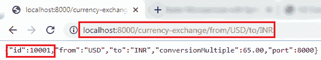
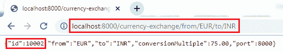

# 创建 JPA 存储库

> 原文:[https://www.javatpoint.com/creating-a-jpa-repository](https://www.javatpoint.com/creating-a-jpa-repository)

在前一节中，我们已经创建了一个内存中的表数据库，并看到所有的数据都被正确填充。在本节中，我们将创建一个返回服务响应的存储库。

**第一步:**创建一个名为**交易所评估仓库**的接口，扩展**交易所仓库**类。我们必须传递**两个**参数:它管理的实体的**类型和 Id** 字段的**类型。**

```java

public interface ExchangeValueRepository extends JpaRepository<ExchangeValue, Long>

```

**步骤 2:** 打开**CurrencyExchageController.java**文件，自动连线**交换值存储库**。

```java

@Autowired
private ExchangeValueRepository repository;

```

**步骤 3:** 在**ExcahngeValueRepository.java**文件中创建**查询方法**。

```java

ExchangeValue findByFromAndTo(String from, String to);

```

在上面的陈述中， **ExchangeValue** 是预期响应。从和**到**我们要找的**两个**纵队是**。**

如果我们想在单列的基础上查找数据，可以传递一个列名。例如:

```java

ExchangeValue findByFrom (String from);

```

**外汇储备. java**

```java

package com.javatpoint.microservices.currencyexchangeservice;
import org.springframework.data.jpa.repository.JpaRepository;
public interface ExchangeValueRepository extends JpaRepository {
//creating query method
ExchangeValue findByFromAndTo(String from, String to);
} 
```

**第四步:**在**CurrencyExchangeController.java**中使用以下语句:

```java

ExchangeValue exchangeValue=repository.findByFromAndTo(from,to);

```

不使用以下语句:

```java

ExchangeValue exchangeValue=new ExchangeValue(1000L, from, to, BigDecimal.valueOf(65));

```

**货币兑换控制器. java**

```java

package com.javatpoint.microservices.currencyexchangeservice;
import org.springframework.beans.factory.annotation.Autowired;
import org.springframework.boot.autoconfigure.SpringBootApplication;
import org.springframework.core.env.Environment;
import org.springframework.web.bind.annotation.GetMapping;
import org.springframework.web.bind.annotation.PathVariable;
import org.springframework.web.bind.annotation.RestController;
@SpringBootApplication
@RestController 
public class CurrencyExchangeController 
{
@Autowired
private Environment environment;
@Autowired
private ExchangeValueRepository repository;
@GetMapping("/currency-exchange/from/{from}/to/{to}")		//where {from} and {to} are path variable
public ExchangeValue retrieveExchangeValue(@PathVariable String from, @PathVariable String to)   //from map to USD and to map to INR
{		
ExchangeValue exchangeValue = repository.findByFromAndTo(from, to);
//setting the port
exchangeValue.setPort(Integer.parseInt(environment.getProperty("local.server.port")));
return exchangeValue;
}
}

```

**步骤 5:** 重新启动应用程序以获取更改。打开浏览器，输入 URI**http://localhost:8000/货币兑换/from/USD/to/INR** 。它返回以下响应:



我们也可以通过在 URI 将货币**美元**改为**欧元**来尝试不同的转换。

**http://localhost:8000/货币兑换/from/EUR/to/INR** 。

它返回以下响应:



在上面的这个响应中，我们正在从数据库中检索值。

当我们在 URI 传递货币(欧元/对/印度卢比)时，查询将被发送到数据库。要查看哪个查询被触发，我们可以在日志中看到该查询。

```java

Hibernate: select exchangeva0_.id as id1_0_, exchangeva0_.conversion_multiple as conversi2_0_, exchangeva0_.currency_from as currency3_0_, exchangeva0_.port as port4_0_, exchangeva0_.currency_to as currency5_0_ from exchange_value exchangeva0_ where exchangeva0_.currency_from=? and exchangeva0_.currency_to=?

```

[Click here to download currency-conversion-service](https://static.javatpoint.com/tutorial/microservices/download/repository/currency-conversion-service.zip)

* * *