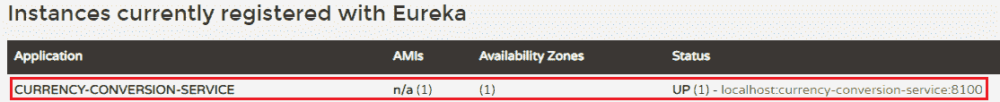

# 将微服务连接到尤里卡命名服务器

> 原文：<https://www.javatpoint.com/connecting-microservices-to-eureka-naming-server>

在这一部分，我们将把**货币兑换服务**和**货币兑换服务**连接到**尤里卡**命名服务器。

首先，我们将连接货币兑换服务。

**第一步:**选择**货币兑换服务**项目。

**步骤 2:** 打开 **pom.xml** 文件，添加**尤里卡-客户端**依赖项**。**

```java

<dependency>
<groupId>org.springframework.cloud</groupId>
<artifactId>spring-cloud-starter-netflix-eureka-client</artifactId>
</dependency>

```

**第三步:**打开**CurrencyConversionServiceApplication.java**文件，使用标注 **@EnableDiscoveryClient** 启用**发现客户端**。

**货币转换服务应用. java**

```java

package com.javatpoint.microservices.currencyconversionservice;
import org.springframework.boot.SpringApplication;
import org.springframework.boot.autoconfigure.SpringBootApplication;
import org.springframework.cloud.client.discovery.EnableDiscoveryClient;
import org.springframework.cloud.openfeign.EnableFeignClients;
@SpringBootApplication
@EnableFeignClients("com.javatpoint.microservices.currencyconversionservice")
@EnableDiscoveryClient
public class CurrencyConversionServiceApplication 
{
public static void main(String[] args) 
{
SpringApplication.run(CurrencyConversionServiceApplication.class, args);
}
}

```

启用发现客户端后，为尤里卡命名服务器配置**网址**。

**步骤 4:** 打开**应用程序.属性**文件，为尤里卡命名服务器配置网址。

**应用属性**

```java

spring.application.name=currency-conversion-service
server.port=8100
eureka.client.service-url.default-zone=http://localhost:8761/eureka
currency-exchange-service.ribbon.listOfServers=http://localhost:8000, http://localhost:8001

```

如果我们查看尤里卡用户界面，我们会发现没有实例注册到尤里卡服务器。

**第五步:**运行**CurrencyConversionServiceApplication.java**文件。

**第六步:**打开浏览器**刷新**尤里卡服务器页面。它显示了注册的微服务的实例。



我们看到货币兑换服务的一个实例在尤里卡命名服务器上注册，并在端口 **8100** 上运行。

让我们将**货币兑换服务**与尤里卡命名服务器连接起来。

**第一步:**选择**货币兑换服务**项目。

**步骤 2:** 打开 **pom.xml** 文件，添加**尤里卡-客户端**依赖项**。**

```java

<dependency>
<groupId>org.springframework.cloud</groupId>
<artifactId>spring-cloud-starter-netflix-eureka-client</artifactId>
</dependency>

```

**步骤 3:** 打开**CurrencyExchangeServiceApplication.java**文件，使用标注 **@EnableDiscoveryClient** 启用**发现客户端**。

**CurrencyExchangeServiceApplication.java**

```java

package com.javatpoint.microservices.currencyexchangeservice;
import org.springframework.boot.SpringApplication;
import org.springframework.boot.autoconfigure.SpringBootApplication;
import org.springframework.cloud.client.discovery.EnableDiscoveryClient;
@SpringBootApplication
@EnableDiscoveryClient
public class CurrencyExchangeServiceApplication 
{
public static void main(String[] args) 
{
SpringApplication.run(CurrencyExchangeServiceApplication.class, args);
}
}

```

**步骤 4:** 打开**应用程序.属性**文件，为尤里卡命名服务器配置**网址**。

**应用属性**

```java

spring.application.name=currency-exchange-service
server.port=8000
spring.jpa.show-sql=true
spring.h2.console.enabled=true
spring.datasource.platform=h2
spring.datasource.url=jdbc:h2:mem:javatpoint
eureka.client.service-url.default-zone=http://localhost:8761/eureka

```

**第五步:**运行**CurrencyExchangeServiceApplication.java 的两个实例。**港口一审 **8000** 港口二审 **8001** 。

**第六步:**打开浏览器**刷新**尤里卡服务器。它显示注册的微服务。


我们看到货币兑换服务的两个实例在尤里卡命名服务器上注册。这两个实例在端口 **8001** 和 **8000** 上运行。

在下图中，我们可以看到这两个微服务都已经向尤里卡命名服务器注册。

[Click here to download currency-conversion-service](https://static.javatpoint.com/tutorial/microservices/download/naming/currency-conversion-service.zip)
[Click here to download currency-exchange-service](https://static.javatpoint.com/tutorial/microservices/download/naming/currency-exchange-service.zip)

* * *