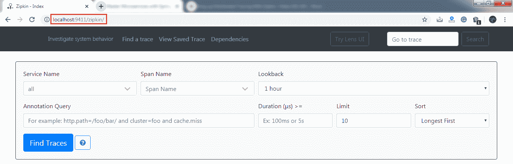

# 使用 Zipkin 的分布式跟踪

> 原文:[https://www.javatpoint.com/distributed-tracing-using-zipkin](https://www.javatpoint.com/distributed-tracing-using-zipkin)

## 什么是分布式跟踪？

分布式跟踪是一种用于**分析**和**监控**应用程序的技术，尤其是那些使用微服务架构构建的应用程序。分布式追踪，也称**分布式请求** **追踪**。IT 和 DevOps 团队可以使用分布式跟踪来监控应用程序。

当一个请求中有许多服务调用时，它识别失败的微服务或有 T2 性能问题的服务。当我们需要跟踪通过多个微服务的请求时，这非常有用。它还用于测量微服务的性能。

在前一节中，我们已经安装了作为中间件的 RabbitMQ。在本节中，我们将实现用于分布式跟踪的 Zipkin 服务器。


在上图中，ZipkinDistributedTracingServer 连接到内存数据库。所有的微服务都会把消息放在 RabbitMQ 服务器上。ZipkinDistributedTracingServer 使用来自 RabbitMQ 服务器的消息。

在这一节中，我们将重点介绍如何安装 ZipkinDistributedTracingServer，并将它与 RabbitMQ 服务器和内存数据库连接起来。

让我们看看如何将 Zipkin 服务器连接到其他服务器。

**第一步:**下载 Zipkin 服务器。

在谷歌上搜索 **Zipkin quickstart** 。点击链接**快速启动打开拉链**。我们得到了快速启动 Zipkin 的两个选项，一个是 Docker，另一个是 Java。但是我们将使用 Java 方法。

**第二步:**从[https://search.maven.org/remote_content?g=io.zipkin&a = zipckinserver&v = LATEST&c = exec](https://search.maven.org/remote_content?g=io.zipkin&a=zipkinserver&v=LATEST&c=exec)下载**zipckin-server-2 . 12 . 9-exec . jar**文件。

**第三步:**复制 JAR 文件，粘贴到任意文件夹或驱动器中。我们已经将 JAR 文件直接粘贴到了 **C 盘**中。

**第四步:**打开**命令提示符**，运行以下命令:

```java

C:\> java -jar zipkin-server-2.12.9-exec.jar

```

该命令启动 Zipkin 服务器。


让我们检查一下 Zipkin 服务器是否正在运行。

**第五步:**打开浏览器，输入[http://localhost:9411/zipkin/](http://localhost:9411/zipkin/)。它显示了 Zipkin 服务器的仪表板。这里 **9411** 端口是 Zipkin 服务器的默认端口。



在这里，最重要的是，Zipkin 服务器必须通过 RabbitMQ 服务器进行监听。所以我们必须在后台启动 RabbitMQ 服务器。

**第六步:**按下**Ctrl+c**键，杀死 Zipkin 服务器

**步骤 7:** 在命令提示符下运行以下命令:

```java

C:\>SET RABBIT_URI=amqp://localhost
C:\> java -jar zipkin-server-2.12.9-exec.jar

```

这些命令再次启动了 Zipkin 服务器和 RabbitMQ 服务器。


在这一节中，我们已经安装了 Zipkin 服务器。我们还启动了 RabbitMQ 服务器，并将其连接到 Zipkin 服务器。现在，Zipkin 服务器正在通过 RabbitMQ 服务器进行监听。但是微服务没有将跟踪消息放入 RabbitMQ。

在下一步中，我们将开始将跟踪消息放入 RabbitMQ。

[Click here to download currency-conversion-service](https://static.javatpoint.com/tutorial/microservices/download/tracing/currency-conversion-service.zip)
[Click here to download currency-exchange-service](https://static.javatpoint.com/tutorial/microservices/download/tracing/currency-exchange-service.zip)
[Click here to download netflix-eureka-naming-server](https://static.javatpoint.com/tutorial/microservices/download/tracing/netflix-eureka-naming-server.zip)
[Click here to download netflix-zuul-api-gateway-server](https://static.javatpoint.com/tutorial/microservices/download/tracing/netflix-zuul-api-gateway-server.zip)

* * *