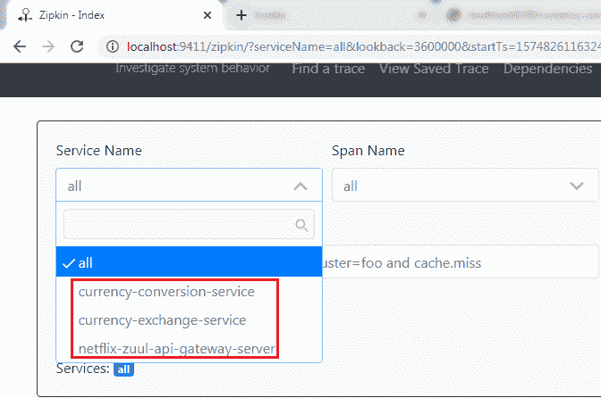

# 将微服务连接到 Zipkin

> 原文：<https://www.javatpoint.com/connecting-microservices-to-zipkin>

在本节中，我们将连接微服务，将它们的跟踪消息放在 RabbitMQ 上。一旦我们将消息放在 RabbitMQ 上，它就会被 Zipkin 服务器接收。

让我们将**货币兑换服务、**货币兑换服务和**网飞-zuul-API-网关服务器**连接到 RabbitMQ 服务器。

**第一步:**打开**货币兑换服务**和**网飞-zuul-API-网关-服务器**的 **pom.xml** 文件，并添加以下依赖项:

我们希望创建一个格式不同的消息。我们需要添加 **Zipkin** 依赖。

```java

<dependency>
<groupId>org.springframework.cloud</groupId>
<artifactId>spring-cloud-sleuth-zipkin</artifactId>
</dependency>

```

我们会将消息发送给使用 **amqp** 消息协议的 Zipkin。所以我们需要增加 **amqp** 依赖。加上 amqp 的依赖，我们得到 RabbitMQ 到**货币兑换服务、货币兑换服务、**和**网飞-zuul-API-网关-服务器**的连接。

```java

<dependency>
<groupId>org.springframework.cloud</groupId>
<artifactId>spring-cloud-starter-bus-amqp</artifactId>
</dependency>

```

现在，我们将尝试一起运行所有服务。

## 使用齐普金用户界面仪表板跟踪请求

在这一步中，我们将发出一个请求。但是在发出请求之前，请确保**五个**服务运行正常。我们必须按以下顺序运行这五项服务。否则，我们会得到错误或不正确的回答。

**步骤 1:** 按照我们列出的相同顺序运行以下服务。

*   **netflixeurekanminserverapplication . Java**
*   **ZipKindistributedTracingserverapplication**(从命令提示符运行)
*   **CurrencyExchangeServiceApplication.java**(在 8000 号港口)
*   **CurrencyConversionServiceApplication.java**(在 8100 端口)
*   **NetflixZuulApiGatewayServerApplication.java**

**记住:**确保所有五个应用程序都正确运行。

**第二步:**调用请求[http://localhost:8100/货币转换器-feign/自/欧元/至/印度卢比/数量/100](http://localhost:8100/currency-converter-feign/from/EUR/to/INR/quantity/100) 。它会正确地返回响应。

但是我们很想知道背景发生了什么。

**第三步:**打开 Zipkin UI。它显示了我们连接到 Zipkin 的所有三种服务。



**第 4 步:**从下拉列表中选择任意一个**服务，点击**查找踪迹**按钮。我们选择了**货币兑换服务。**显示**货币兑换服务的不同执行列表。****


**第五步:**选择其中任意一个。它显示了服务的全部痕迹。


在上图中，当我们调用**货币转换器-feign** 时，请求首先到达**应用编程接口网关**，应用编程接口网关将请求发送到**货币兑换服务。**

我们还可以看到服务的细节。在下图中，我们展示了**货币兑换服务的详细信息。**


微服务中最重要的挑战是带来可见性(后台发生的事情)。因此，Zipkin 服务器实现了服务的可见性。

[Click here to download currency-conversion-service](https://static.javatpoint.com/tutorial/microservices/download/zipkin/currency-conversion-service.zip)
[Click here to download currency-exchange-service](https://static.javatpoint.com/tutorial/microservices/download/zipkin/currency-exchange-service.zip)
[Click here to download netflix-eureka-naming-server](https://static.javatpoint.com/tutorial/microservices/download/zipkin/netflix-eureka-naming-server.zip)
[Click here to download netflix-zuul-api-gateway-server](https://static.javatpoint.com/tutorial/microservices/download/zipkin/netflix-zuul-api-gateway-server.zip)

* * *