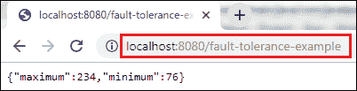

# 具有磁滞的容错

> 原文:[https://www.javatpoint.com/fault-tolerance-with-hystrix](https://www.javatpoint.com/fault-tolerance-with-hystrix)

微服务必须极其可靠，因为它们相互依赖。微服务架构包含大量小型微服务。这些微服务相互通信，以满足它们的需求。

微服务的实例可能频繁地上升和下降。**随着微服务之间交互次数的增加，系统中微服务发生故障的几率也随之增加。**

## 容错

考虑一个场景，其中六个微服务相互通信。**微服务-5** 在某个时刻变为关闭，其他所有微服务都直接或间接依赖于它，所以其他所有服务也都关闭。

这个问题的解决方案是在微服务出现故障时使用**回退**。微服务的这一方面被称为**容错**。


**容错**可以通过**断路器**来实现。这是一种将请求包装到外部服务并检测它们何时失败的模式。如果检测到故障，断路器将断开。所有后续请求都会立即返回一个错误，而不是向不健康的服务发出请求。它监视和检测服务是否停止运行以及其他服务是否有问题。它拒绝呼叫，直到它再次变得健康。

## 高起鳞癣

Hystrix 是一个库，它控制微服务之间的交互，以提供延迟和容错。此外，修改用户界面让用户知道某些事情可能没有像预期的那样工作或者需要更多的时间是有意义的。

**利用海斯特里克斯**实现容错

**步骤 1:** 打开**限制服务**的 **pom.xml** 文件，添加海斯特里克斯依赖项

```java

<dependency>
<groupId>org.springframework.cloud</groupId>
<artifactId>spring-cloud-starter-netflix-hystrix</artifactId>
</dependency>

```

**第二步:**打开**LimitsServicesApplication.java**文件，使用批注 **@EnableHystrix 启用 **Hystrix** 。**

**限制服务复制. java**

```java

package com.javatpoint.microservices.limitsservice;
import org.springframework.boot.SpringApplication;
import org.springframework.boot.autoconfigure.SpringBootApplication;
import org.springframework.cloud.netflix.hystrix.EnableHystrix;
@SpringBootApplication
@EnableHystrix
public class LimitsServiceApplication 
{
public static void main(String[] args) 
{
SpringApplication.run(LimitsServiceApplication.class, args);
}
}

```

**第三步:**打开**LimitsConfigurationController.java**文件，创建**获取**方法。

```java

@GetMapping("/fault-tolerance-example")
//configuring a fallback method
@HystrixCommand(fallbackMethod="fallbackRetrieveConfigurations")
public LimitConfiguration retrieveConfigurations()
{
throw new RuntimeException("Not Available"); 
}
//defining the fallback method
public LimitConfiguration fallbackRetrieveConfigurations()
{
//returning the default configuration	
return new LimitConfiguration(999, 9); 
}

```

让我们了解一下在上面的方法中发生了什么。

在上面的方法中，我们为容错创建了一个 Get 映射。在下一行中，我们使用了注释 **@HystrixCommand** 来配置**回退**方法。我们已经定义了一个名为**fallbackRetrieveConfigurations()**的方法，如果出现任何故障，该方法将返回默认值。

**回退方式**

回退方法是发生故障时调用的方法。Hystrix 允许我们为每个服务方法定义一个后备方法。这里出现了一个问题，如果方法抛出异常，应该向消费者返回什么？

所以答案是如果**retrieveconfigurations()**失败，调用方法**fallbackRetrieveConfigurations()**。回退方法返回硬编码的**限制配置**实例。

**第四步:**打开浏览器，调用[网址 http://localhost:8080/容错-示例](http://localhost:8080/fault-tolerance-example)。它返回我们在**方法中返回的值。**



* * *