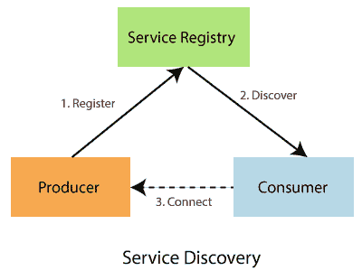
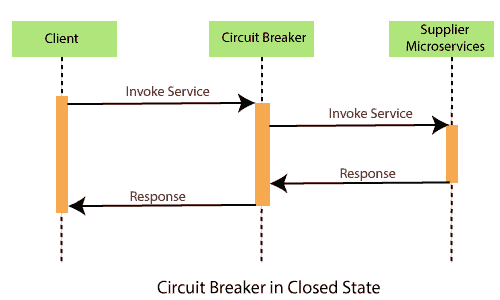
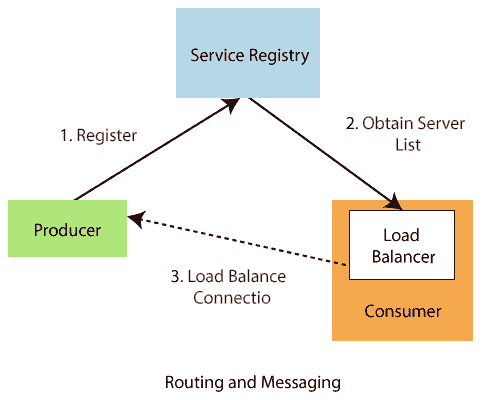
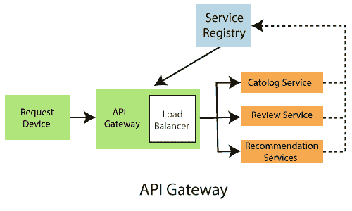

# 春云组件

> 原文:[https://www.javatpoint.com/components-of-spring-cloud](https://www.javatpoint.com/components-of-spring-cloud)

有以下组件:

*   配置
*   服务发现
*   断路器
*   路由和消息传递
*   应用编程接口网关
*   追踪
*   竞争情报管道和测试

## 配置

Spring Cloud 配置组件为分布式系统中的外部化配置提供服务器端和客户端支持。我们可以使用配置服务器管理所有环境中应用程序的外部属性。Spring Cloud 配置服务器可以使用 Git、SVN (Apache Subversion)、文件系统和 Vault 来存储配置。Config clients(微服务应用程序)在启动时从服务器检索配置客户端。

## 服务发现

服务发现是通过网络自动检测设备和服务。换句话说，服务发现是应用程序和微服务在分布式环境中的连接方式。服务发现实施包括以下两个方面:

*   维护地址全局视图的**中央服务器**。
*   连接到中央服务器的**客户端**可以更新和检索地址。

有两种**发现模式:**客户端发现**和**服务器端发现**。**

*   **客户端发现:**在客户端发现中，客户端负责确定可用服务的网络位置。客户端使用**负载平衡算法**选择可用服务之一并发出请求。**网飞 OSS** 是客户端发现模式的一个例子。
*   **服务器端发现:**在服务器端发现中，客户端通过负载均衡器向服务发出 HTTP 请求。负载平衡器联系服务注册表，并将每个请求路由到可用的服务实例。与客户端发现类似，服务实例在服务注册中心注册和注销。 **AWS ELB** (弹性负载平衡器)是服务器端发现的一个例子。ELB 平衡了来自互联网的外部流量。

在上图中，生产者是一个向消息代理(服务注册中心)发送消息的软件。消费者也是接收信息并对其进行处理的软件。

## 断路器

网飞创建了一个名为**海斯特里克斯**的图书馆。它实现了断路器模式。断路器计算何时打开和关闭电路，以及发生故障时该怎么办。当所有服务在某个时刻出现故障时，断路器会优雅地处理这些故障。断路器有三种状态:**打开、关闭、**和**半打开**状态。

**关闭状态:**如果断路器处于关闭状态，所有呼叫都传递到供应商微服务。它的反应没有任何延迟。

**打开状态:**断路器返回错误调用，不执行功能。

**半开状态:**当功能执行**超时**时，电路变为半开状态。它测试潜在问题是否仍然存在。是一个**监控**和**反馈机制**。它试着给供应商微服务打电话，检查它是否已经恢复。如果对供应商的呼叫超时，则电路保持在**打开**状态。如果呼叫返回成功，电路切换到**关闭**状态。在**半开**状态下，断路器错误地将所有外部呼叫返回服务。

## 路由和消息传递

云应用程序由许多微服务组成，因此通信至关重要。Spring Cloud 支持通过消息或 HTTP 请求进行通信。路由使用**网飞丝带**和**开放 Feign，而**消息使用卡夫卡或兔子 MQ。

## 应用编程接口网关

API 网关允许我们路由 API 请求(外部或内部)来连接服务。它还提供了一个库，用于在 Spring MVC 之上构建 API 网关。其目的是向他们提供跨领域的关注，例如**安全**和**监控**。

**API 网关的特性**

*   基于 Spring 框架 5、项目反应堆和 Spring Boot 2.0 构建
*   能够在任何请求的属性上匹配路由
*   谓词和过滤器是特定于路由的
*   磁滞断路器集成
*   Spring 云发现客户端集成
*   易于编写谓词和过滤器
*   请求速率限制
*   路径重写

## 追踪

Spring Cloud 的另一个功能是**分布式追踪**。跟踪是从应用程序获取数据的单个请求。跟踪导致对各种微服务的请求呈指数级增长。

我们可以在项目中添加**春云侦察**库来启用追踪。侦探负责记录**计时**，用于**延时分析**。我们可以把这个时间导出到齐普金。

Zipkin 是专门为**分析微服务架构内部延迟问题**而设计的分布式跟踪工具。它公开了用于收集输入数据的 HTTP 端点。如果我们需要在项目中添加追踪，我们应该添加**spring-cloud-starter-zipkin**依赖项。

在微服务中，输入流量非常大，因此我们不能只收集一定数量的数据。为此，春云侦探提供了一个**采样策略**。采样策略允许我们将多少输入流量发送到 Zipkin 进行分析。要启用此功能，我们必须添加**春云侦探流**依赖项。

## 氯管道和测试

Spring Cloud 管道是 Jenkins 和 Concourse 的一个固执己见(自以为是)的管道，它为应用程序自动创建管道。各种服务的构建、测试和部署对于成功的云原生应用程序至关重要。

Jenkins 管道提供了一套工具，用于将简单和更高级的交付管道建模为代码。管道的定义被写入一个名为 Jenkinsfile 的文本文件。

管道有**两个**语法:**声明性**和**脚本性**管道。这些语法分为两部分:步骤和阶段。**步骤**是管道的基本部分，因为它们告诉詹金斯服务器该做什么。**阶段**是管道的主要部分。阶段在逻辑上将显示在管道结果屏幕上的几个步骤分组。

* * *