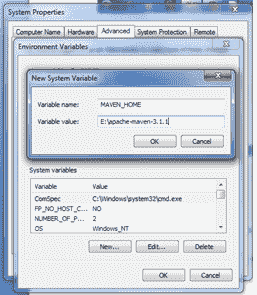

# 如何在 windows 上安装 Maven

> 原文:[https://www.javatpoint.com/how-to-install-maven](https://www.javatpoint.com/how-to-install-maven)

可以在 windows、linux、MAC OS 平台上下载安装 maven。在这里，我们将学习如何在 windows 操作系统上安装 maven。

要在 windows 上安装 maven，您需要执行以下步骤:

1.  下载 maven 并提取它
2.  在环境变量中添加 JAVA_HOME 和 MAVEN_HOME
3.  在环境变量中添加 maven 路径
4.  验证 Maven

* * *

## 1)下载 Maven

要在 windows 上安装 maven，需要先下载 apache maven。

从[下载 Maven 最新 Maven 软件下载最新版本的 Maven](https://maven.apache.org/download.cgi)

例如:**Apache-maven-3 . 1 . 1-bin . zip**

提取它。现在看起来是这样的:


* * *

## 2)在环境变量中添加 MAVEN_HOME

右键点击**我的电脑** - > **属性** - > **高级系统设置** - > **环境变量** - > **点击新建按钮**

现在**在变量名中加入 MAVEN_HOME** ，在变量值中加入 MAVEN 的路径。它必须是 maven 的主目录，即 bin 的外部目录。例如: **E:\apache-maven-3.1.1** 。它显示在下面:



现在点击**确定**按钮。

* * *

## 3)在环境变量中添加 Maven 路径

如果没有设置路径，点击新建选项卡，然后设置 maven 的路径。如果设置了，编辑路径并附加 maven 的路径。

这里，我们已经安装了 JDK，它的路径是默认设置的，所以我们将附加 maven 的路径。

maven 的路径应该是 **%maven home%/bin** 。例如**E:\ Apache-maven-3 . 1 . 1 \ bin**。


* * *

## 4)验证 maven

要验证是否安装了 maven，请打开命令提示符并写入:

```java
mvn −version

```

现在它将显示 maven 和 jdk 的版本，包括 maven 主页和 java 主页。

让我们看看输出:

