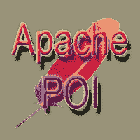

# 阿帕奇兴趣点教程

> 原文：<https://www.javatpoint.com/apache-poi-tutorial>

Apache POI 教程提供了 Apache POI 技术的基本概念和高级概念。我们的 Apache POI 教程是为初学者和专业人士设计的。

Apache POI 是一个用于处理微软办公文档的 Java 库。Apache POI 是开源的，可以被基于 JVM 的编程语言使用。

* * *

## 阿帕奇兴趣指数

* * *

**阿帕奇 POI 教程**

*   [然后教程](apache-poi-tutorial)
*   然后介绍
*   然后建筑
*   [兴趣点特征](apache-poi-features)
*   然后安装

**Excel 文档**

*   [Excel 文档处理](apache-poi-excel-document-handling)
*   [兴趣点创建工作簿](apache-poi-excel-workbook)
*   [兴趣点创建单元](apache-poi-excel-cell)
*   [兴趣点创建日期单元格](apache-poi-excel-date-cell)
*   [兴趣点对齐单元](apache-poi-excel-align-cell)
*   [兴趣点单元格边框](apache-poi-excel-cell-border)
*   [兴趣点单元格颜色](apache-poi-excel-cell-color)
*   [兴趣点合并单元格](apache-poi-merging-cells)
*   [然后 Excel 字体](apache-poi-excel-font)
*   [然后 Excel 标头](apache-poi-excel-header)
*   [兴趣点隐藏行](apache-poi-hiding-rows)
*   [兴趣点单元属性](apache-poi-excel-cell-properties)
*   [兴趣点绘制边框](apache-poi-drawing-border)
*   [兴趣点多样式](apache-poi-cell-multiple-styles)
*   [兴趣点 Excel 单元格类型](apache-poi-excel-cell-type)
*   [兴趣点绘制形状](apache-poi-draw-shape)
*   [然后形象](apache-poi-excel-image)
*   [兴趣点提取文本](apache-poi-extract-text)
*   [单元格中的 POI 新行](apache-poi-newline-in-cell)
*   [兴趣点概述](apache-poi-outlining)
*   [兴趣点页码](apache-poi-page-number)
*   [兴趣点读取单元格内容](apache-poi-reading-cell-content)
*   [兴趣点改写](apache-poi-rewriting)
*   [兴趣点移位行](apache-poi-shift-row)
*   [兴趣点造型形状](apache-poi-styling-shapes)
*   [然后 Comment](apache-poi-comment)
*   [兴趣点超链接](apache-poi-hyperlink)

**Word 文档**

*   [POI 微软 Word](apache-poi-microsoft-word)
*   [兴趣点创建 MS 单词](apache-poi-creating-ms-word)
*   [POI 词段](apache-poi-word-paragraph)
*   [兴趣点词表](apache-poi-word-table)
*   [POI 词风](apache-poi-word-style)
*   [兴趣点单词对齐](apache-poi-word-aligning)
*   然后提取文本
*   [兴趣点提取段落](apache-poi-word-extract-paragraph)

**Powerpoint 文档**

*   [然后 Powerpoint](apache-poi-powerpoint)
*   [POI 幻灯片](apache-poi-powerpoint-slide)
*   [兴趣点幻灯片布局](apache-poi-powerpoint-slide-layout)
*   [然后 Powerpoint 影像](apache-poi-powerpoint-image)
*   [兴趣点重新排序幻灯片](apache-poi-powerpoint-reorder-slide)
*   [然后页面大小](apache-poi-powerpoint-page-size)
*   [POI Powerpoint 超链接](apache-poi-powerpoint-hyperlink)
*   [POI Powerpoint 删除幻灯片](apache-poi-powerpoint-delete-slide)

* * *

## 先决条件

在学习 Apache POI 之前，必须具备核心 Java 的知识。您还必须熟悉 Eclipse 或 NetBeans。本教程中的所有示例都已经在 Eclipse IDE 上进行了测试。

## 观众

我们的 Apache POI 教程旨在帮助初学者和专业人士。

## 问题

我们向您保证，您在本教程中不会发现任何类型的问题。但是，如果你找到了，你可以发布到联系表。