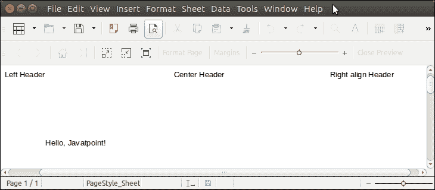

# 阿帕奇兴趣点 Excel 表头

> 原文:[https://www.javatpoint.com/apache-poi-excel-header](https://www.javatpoint.com/apache-poi-excel-header)

Apache POI 允许我们为 excel 文档设置标题。提供 Sheet 接口的 **getHeader()** 方法，返回 Header 类型的一个实例。

让我们看一个例子，在这个例子中，我们正在为我们的文档创建和设置标题。

## 阿帕奇兴趣点电子表格标题示例

```java

package poiexample;
import java.io.FileOutputStream;
import java.io.OutputStream;
import org.apache.poi.hssf.usermodel.HSSFWorkbook;
import org.apache.poi.ss.usermodel.Cell;
import org.apache.poi.ss.usermodel.Header;
import org.apache.poi.ss.usermodel.Row;
import org.apache.poi.ss.usermodel.Sheet;
import org.apache.poi.ss.usermodel.Workbook;
public class HeaderExample {
	public static void main(String[] args) {
		try (OutputStream fileOut = new FileOutputStream("Javatpoint.xls")) {
			Workbook wb = new HSSFWorkbook();
			Sheet sheet = wb.createSheet("Sheet");
			// Creating Header
			Header header = sheet.getHeader();
			header.setCenter("Center Header");
			header.setLeft  ("Left Header");
			header.setRight ("Right align Header");
			// Creating Row
			Row row = sheet.createRow(4); // Creating a row
			Cell cell = row.createCell(1); // Creating a cell
			cell.setCellValue("Hello, Javatpoint!");
	            wb.write(fileOut);
	    }catch(Exception e) {
	    	System.out.println(e.getMessage());
	    }
	}
}

```

**输出:**

该输出是文件的打印视图。

