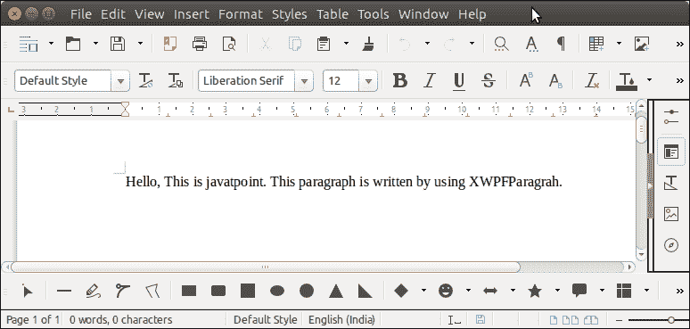

# 阿帕奇兴趣点单词段落

> 原文:[https://www.javatpoint.com/apache-poi-word-paragraph](https://www.javatpoint.com/apache-poi-word-paragraph)

为了在 MS word 文件中创建段落，Apache POI 提供了 **XWPFParagraph** 类。此类使用 XWPFRun 为段落设置 Text()方法。

让我们看一个例子，在这个例子中，我们正在创建一个段落，并将它写入一个 word 文件。

## 阿帕奇兴趣点单词段落示例

```java

package poiexample;
import java.io.FileOutputStream;
import java.io.OutputStream;
import org.apache.poi.xwpf.usermodel.XWPFDocument;
import org.apache.poi.xwpf.usermodel.XWPFParagraph;
import org.apache.poi.xwpf.usermodel.XWPFRun;
public class ParagraphExample {
	public static void main(String[] args) {
		XWPFDocument doc = new XWPFDocument();
	    try(OutputStream os = new FileOutputStream("Javatpoint.doc")) {
	    	XWPFParagraph paragraph = doc.createParagraph();
	        XWPFRun run = paragraph.createRun();
	        run.setText("Hello, This is javatpoint. This paragraph is written "+
	        "by using XWPFParagrah.");
	        doc.write(os);
	    }catch(Exception e) {
	    	System.out.println(e.getMessage());
	    }
	}
}

```

**输出:**

