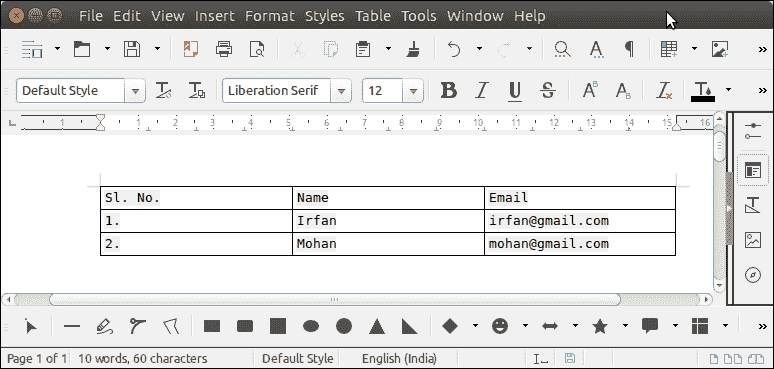

# 阿帕奇兴趣点单词表

> 原文：<https://www.javatpoint.com/apache-poi-word-table>

要在 Word 文档中创建表格，我们可以使用位于**包中的 **XWPFTable** 类。阿帕奇 POI 增加了一个类 **XWPFTableRow** 来创建 Row。**

看，下面我们用 Java 程序在 word 文档中创建了一个表格。

## Apache POI XWPFTable 方法

以下是处理文档中表格的常用方法。

| 方法 | 描述 |
| public see add new column() | 它为该表中的每一行添加一个新列。 |
| public void addRow(XWPFTableRow) | 它向表中添加一个新行。 |
| public XWPFTableRow createRow() | 它创建了一个新的 XWPFTableRow 对象，其单元格数量与在该时刻定义的列数一样多 |
| public java.lang.String getText() | 它用于提取单元格中的文本。 |
| 公共空白设置宽度(整数宽度) | 它用于设置宽度。 |
| public int getnumberofrows() | 它用于获取表中的行数。 |

## 阿帕奇兴趣点单词表示例

```java

package poiexample;
import java.io.File;
import java.io.FileOutputStream;
import org.apache.poi.xwpf.usermodel.XWPFDocument;
import org.apache.poi.xwpf.usermodel.XWPFTable;
import org.apache.poi.xwpf.usermodel.XWPFTableRow;
public class TableExample {
	public static void main(String[] args)throws Exception {
	      XWPFDocument document= new XWPFDocument();
	      try(FileOutputStream out = new FileOutputStream(new File("Javatpoint.docx"))){
	    	  // Creating Table
	    	  XWPFTable tab = document.createTable();
	    	  XWPFTableRow row = tab.getRow(0); // First row
	    	  // Columns
	    	  row.getCell(0).setText("Sl. No.");
	          row.addNewTableCell().setText("Name");
	          row.addNewTableCell().setText("Email");
	          row = tab.createRow(); // Second Row
	          row.getCell(0).setText("1.");
	          row.getCell(1).setText("Irfan");
	          row.getCell(2).setText("irfan@gmail.com");
	          row = tab.createRow(); // Third Row
	          row.getCell(0).setText("2.");
	          row.getCell(1).setText("Mohan");
	          row.getCell(2).setText("mohan@gmail.com");	  
	          document.write(out);
	      }catch(Exception e) {
	    	  System.out.println(e);
	      }
	   }
}

```

**输出:**

