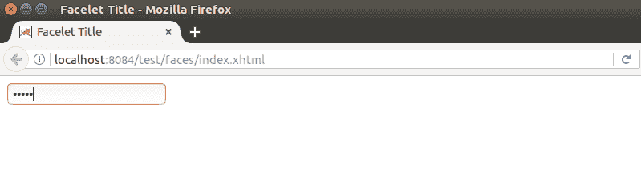

# JSF <inputsecret>标签</inputsecret>

> 哎哎哎:# t0]https://www . javatppoint . com/JSF-input secret

这是一个标准密码字段，接受一行不带空格的文本，并在输入时显示为一组星号。换句话说，我们说，它用于创建一个 HTML 密码字段，允许用户输入一个字符串，而实际的字符串不会出现在该字段中。

**示例:**

```java
<h:inputSecret value="#{user.password}" maxlength="10" size="15" 
required="true" requiredMessage="Password is required"></h:inputSecret>

```

* * *

## JSF 将其渲染为 HTML 下方

```java
<input name="user-password" value="" maxlength="10" size="15" type="password">

```

输出:



* * *

## JSF <inputsecret>标签属性</inputsecret>

| 属性 | 描述 |
| 编号 |  |
| 价值 | 它保存输入密码标签的当前值。 |
| 最大长度 | 它表示可以在此字段中输入的最大字符数。 |
| 只读的 | 它表示该组件禁止用户进行更改。通过将 readonly 作为该属性值传递，可以使组件成为只读的。例如，readonly =“readonly” |
| 提供 | 它用于呈现组件。此属性的默认值为真。 |
| 需要 | 它指示用户需要为此输入组件提供提交的值。 |
| 所需消息 | 如果“必需”属性设置为“真”，则“必需消息”中提供的消息描述将显示在网页上。 |
| 大小 | 用于确定该字段宽度的字符数。 |
| 风格 | 它用于为组件指定 CSS。 |
| 班级 | 此组件的 CSS 类名。 |
| 标签 | 它用于为您的命令按钮命名。 |
| 语言 | 它用于指定语言。它有助于使网页本地化。 |
| 访问密钥 | 它用于通过使用指定的密钥来访问组件。 |