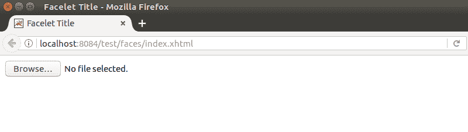

# JSF <inputfile>标签</inputfile>

> 原文：<https://www.javatpoint.com/jsf-inputfile>

JSF 将其呈现为文件类型的 HTML 元素。它用于获取文件作为输入。在 HTML 格式中，它允许用户上传文件。

**示例:**

```java
<h:inputFile  id="file-id"  value="#{user.fileName}" required="true" 
requiredMessage="Please upload a file" alt="upload file"></h:inputFile>

```

输出:



* * *

### 属性

| 属性 | 描述 |
| 编号 | 它是此组件的标识符。此 id 必须唯一。你可以用它来访问 CSS 和 JS 文件中的 HTML 元素。 |
| 价值 | 它保存该组件的当前值。 |
| 班级 | 此组件的 CSS 类名。 |
| 中高音 | 它用于设置组件的替代名称。 |
| 需要 | 它指示用户需要为此输入组件提供提交的值。 |
| 所需消息 | 如果“必需”属性设置为“真”，则“必需消息”中提供的消息描述将显示在网页上。 |
| 有缺陷的 | 它用于禁用组件。您可以通过分配真值来禁用它。 |
| 标签 | 它用于为此组件设置本地化名称。 |
| 语言 | 它用于为此组件设置语言。 |
| 单击事件 | 这是一个当用户点击这个组件时调用 JavaScript 代码的方法。 |
| onselect | 这是一个当用户选择这个组件时调用 JavaScript 代码的方法。 |
| 提供 | 它用于呈现此组件。默认情况下，它的值为真。 |
| 风格 | 用于设置 CSS 样式代码，提供这个组件更好的用户界面。 |