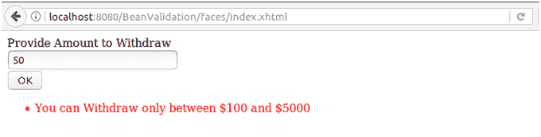

# JSF <validatelongrange>标签</validatelongrange>

> 原文:[https://www.javatpoint.com/jsf-validatelongrange](https://www.javatpoint.com/jsf-validatelongrange)

用于检查组件的局部值是否在一定范围内。该值必须是可以转换为长整型的任何数字类型或字符串。

### 属性

| 属性 | 描述 |
| 最低限度 | 它用于设置组件的最小长度。 |
| 最高的 | 它用于设置组件的最大长度。 |

* * *

## 验证输入标签示例

// index.xhtml

```java
<h:form id="user-form">
<h:outputLabel for="name">Provide Amount to Withdraw  </h:outputLabel><br/>
<h:inputText id="age" value="#{user.amount}" validatorMessage="You can Withdraw only between $100 and $5000">
<f:validateLongRange minimum="100" maximum="5000" />
</h:inputText><br/>
<h:commandButton value="OK" action="response.xhtml"></h:commandButton>
</h:form>

```

//User.java

```java
import javax.faces.bean.ManagedBean;
import javax.faces.bean.RequestScoped;
@ManagedBean
@RequestScoped
public class User{
int amount;
public int getAmount() {
return amount;
}
public void setAmount(int amount) {
this.amount = amount;
}
}

```

输出:

