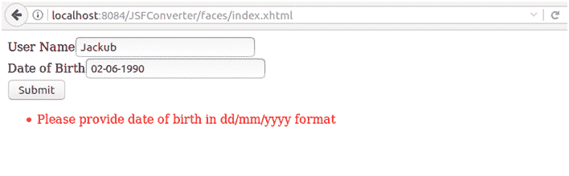
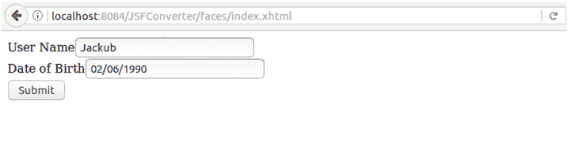
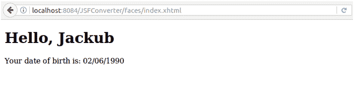
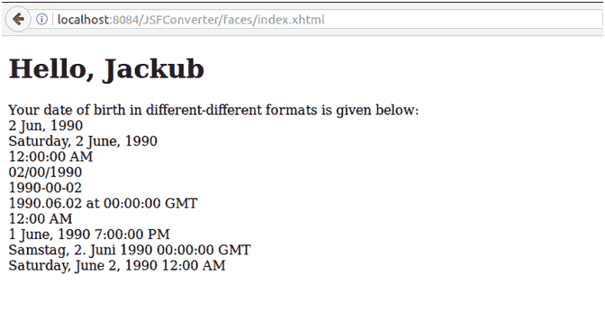

# JSF <convertdatetime>标签</convertdatetime>

> 原文:[https://www.javatpoint.com/jsf-convertdatetime](https://www.javatpoint.com/jsf-convertdatetime)

它用于将用户输入转换为指定的日期。通过在组件标记中嵌套 convertDateTime 标记，可以将组件的数据转换为 java.util.Date。convertDateTime 标记有几个属性，允许您指定数据的格式和类型。

### 标签属性

| 属性 | 类型 | 描述 |
| 有约束力的 | 日期时间转换器 | 它用于将转换器绑定到托管 bean 属性。 |
| 日期样式 | 线 | 它用于定义日期或日期字符串的日期部分的格式，如 java.text.DateFormat 所指定的。仅当类型为日期或两者都有且模式未定义时应用。有效值:默认、短、中、长和全。如果未指定值，则使用默认值。 |
| 为 | 线 | 它用于引用复合组件中嵌套了此标记的对象之一。 |
| 现场 | 字符串或区域设置 | 它是 Locale 的一个实例，其日期和时间的预定义样式在格式化或解析过程中使用。如果未指定，将使用 FacesContext.getLocale 返回的区域设置。 |
| 模式 | 线 | 它用于确定日期/时间字符串应该如何格式化和解析的自定义格式模式。如果指定了此属性，则忽略日期样式、时间样式和类型属性。 |
| 时间风格 | 线 | 它用于定义由 java.text.DateFormat 指定的时间格式或日期字符串的时间部分。仅当类型为时间且未定义模式时应用。有效值:默认、短、中、长和全。如果未指定值，则使用默认值。 |
| 时区 | 字符串或时区 | 它用于解释日期字符串中任何时间信息的时区。 |
| 类型 | 线 | 它用于指定字符串值是否包含日期和/或时间。有效值包括日期和/或时间。如果未指定值，则使用日期。 |

## JSF <converterdatetime>标签示例 1</converterdatetime>

// index.xhtml

```java
<h:form>
<h:outputLabel for="username">User Name</h:outputLabel>
<h:inputText id="user-id" value="#{user.name}"/><br/>
<h:outputLabel for="age">Date of Birth</h:outputLabel>
<h:inputText id="dob-id" value="#{user.dob}" converterMessage="Please provide date of birth in dd/mm/yyyy format">
<f:convertDateTime pattern="dd/mm/yyyy" />
</h:inputText><br/>
<h:commandButton action="response.xhtml" value="Submit"/>
</h:form>

```

//User.java

```java
import java.util.Date;
import javax.faces.bean.ManagedBean;
import javax.faces.bean.RequestScoped;
@ManagedBean
@RequestScoped
public class User {
String name;
Date dob;
public String getName() {
return name;
}
public void setName(String name) {
this.name = name;
}
public Date getDob() {
return dob;
}
public void setDob(Date dob) {
this.dob = dob;
}
}

```

// response.xhtml

```java
<h:body>
<h1> Hello, 
<h:outputText value="#{user.name}"/>
</h1>
<h:outputLabel>Your date of birth is: </h:outputLabel>
<h:outputText value="#{user.dob}">
<f:convertDateTime pattern="dd/mm/yyyy"/>
</h:outputText>
</h:body>

```

输出:

//索引页



//索引页



//响应页面



* * *

## JSF <converterdatetime>标签示例 2</converterdatetime>

// index.xhtml

```java
<h:form>
<h:outputLabel for="username">User Name</h:outputLabel>
<h:inputText id="user-id" value="#{user.name}"/><br/>
<h:outputLabel for="age">Date of Birth</h:outputLabel>
<h:inputText id="dob-id" value="#{user.dob}">
<f:convertDateTime pattern="dd/MM/yyyy"/>
</h:inputText>
<br/>
<h:commandButton action="response.xhtml" value="Submit"/>
</h:form>

```

//User.Java

```java
import java.util.Date;
import javax.faces.bean.ManagedBean;
import javax.faces.bean.RequestScoped;
@ManagedBean
@RequestScoped
public class User {
String name;
Date dob;
public String getName() {
return name;
}
public void setName(String name) {
this.name = name;
}
public Date getDob() {
return dob;
}
public void setDob(Date dob) {
this.dob = dob;
}
}

```

// response.xhtml

```java
<?xml version='1.0' encoding='UTF-8' ?>
<!DOCTYPE html PUBLIC "-//W3C//DTD XHTML 1.0 Transitional//EN""http://www.w3.org/TR/xhtml1/DTD/xhtml1-transitional.dtd">
<html 
xmlns:h="http://xmlns.jcp.org/jsf/html"
xmlns:f="http://java.sun.com/jsf/core">

<h:head>
<title>Response Page</title>
</h:head>
<h:body>
<h1> Hello, 
<h:outputText value="#{user.name}"/>
</h1>
<h:outputLabel value="Your date of birth in different-different formats is given below:"></h:outputLabel><br/>
<h:outputText value="#{user.dob}">
<f:convertDateTime type="date" dateStyle="medium"/>
</h:outputText>
<br/>
<h:outputText value="#{user.dob}">
<f:convertDateTime type="date" dateStyle="full"/>
</h:outputText>
<br/>
<h:outputText value="#{user.dob}">
<f:convertDateTime type="time" dateStyle="full"/>
</h:outputText>
<br/>
<h:outputText value="#{user.dob}">
<f:convertDateTime type="date" pattern="dd/mm/yyyy"/>
</h:outputText>
<br/>
<h:outputText value="#{user.dob}">
<f:convertDateTime dateStyle="full" pattern="yyyy-mm-dd"/>
</h:outputText>
<br/>
<h:outputText value="#{user.dob}">
<f:convertDateTime dateStyle="full" pattern="yyyy.MM.dd 'at' HH:mm:ss z"/>
</h:outputText>
<br/>
<h:outputText value="#{user.dob}">
<f:convertDateTime dateStyle="full" pattern="h:mm a"/>
</h:outputText>
<br/>
<h:outputText value="#{user.dob}">
<f:convertDateTime dateStyle="long" timeZone="EST" type="both"/>
</h:outputText>
<br/>
<h:outputText value="#{user.dob}">
<f:convertDateTime locale="de" timeStyle="long" type="both" dateStyle="full"/>
</h:outputText>
<br/>
<h:outputText value="#{user.dob}">
<f:convertDateTime locale="en" timeStyle="short" type="both" dateStyle="full"/>
</h:outputText>
</h:body>
</html>

```

输出:

//索引页


//响应页面



* * *