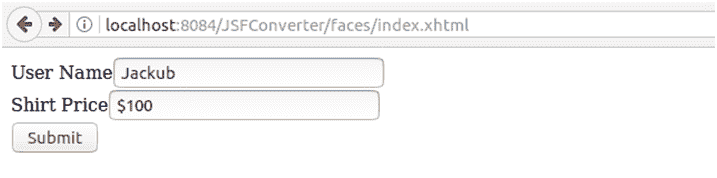
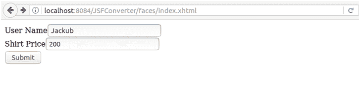

# JSF <convertnumber>标签</convertnumber>

> 原文：<https://www.javatpoint.com/jsf-convertnumber>

它用于将组件(用户输入)数据转换为 Java Number 类型。通过在组件标记中嵌套 convertNumber 标记，可以将组件的数据转换为 java.lang.Number。convertNumber 标记有几个属性，允许您指定数据的格式和类型。

下表包含数字转换器属性:

| 属性 | 类型 | 描述 |
| 有约束力的 | NumberConverter | 它用于将转换器绑定到托管 bean 属性。 |
| 货币代码 | 线 | 它表示仅在格式化货币时使用的 ISO 4217 货币代码。 |
| 货币符号 | 线 | 它代表货币符号，仅在格式化货币时应用。 |
| 为 | 线 | 它与复合组件一起使用。它指的是复合组件中的一个对象，该标签嵌套在该组件中。 |
| 分组使用 | 布尔代数学体系的 | 它指定格式化输出是否包含分组分隔符。 |
| 英特尔老年人 | 布尔代数学体系的 | 它指定是否只分析值的整数部分。 |
| 现场 | 字符串或区域设置 | 它的数字样式用于格式化或解析数据。 |
| maxfractionndigits | （同 Internationalorganizations）国际组织 | 它用于设置输出小数部分的最大位数。 |
| 最大整数位数 | （同 Internationalorganizations）国际组织 | 它用于设置输出整数部分的最大位数。 |
| minfractionndigits | （同 Internationalorganizations）国际组织 | 它用于设置输出小数部分的最小位数。 |
| minIntegerDigits | （同 Internationalorganizations）国际组织 | 它用于设置输出整数部分的最小位数。 |
| 模式 | 线 | 它用于确定如何格式化和解析数字字符串的自定义格式模式。 |
| 类型 | 线 | 它用于指定字符串值是否被解析并格式化为数字、货币或百分比。如果未指定，则使用数字。 |

## JSF 数字转换器示例:

// index.xhtml

```java
<h:form>
<h:outputLabel for="username">User Name</h:outputLabel>
<h:inputText id="user-id" value="#{user.name}"/><br/>
<h:outputLabel for="shirtPrice">Shirt Price</h:outputLabel>
<h:inputText id="shirtPrice-id" value="#{user.shirtCost}" autocomplete="off">
<f:convertNumber currencySymbol="$" type="currency"/>
</h:inputText>
<br/>
<h:commandButton action="response.xhtml" value="Submit"/>
</h:form>

```

//User.java

```java
import javax.faces.bean.ManagedBean;
import javax.faces.bean.RequestScoped;
@ManagedBean
@RequestScoped
public class User {
String name;
int shirtPrice;
public String getName() {
return name;
}
public void setName(String name) {
this.name = name;
}
public int getShirtCost() {
return shirtPrice;
}
public void setShirtCost(int shirtPrice) {
this.shirtPrice = shirtPrice;
}
}

```

输出:

//索引页



//响应页面


* * *

## JSF <converternumber>例 2</converternumber>

在下面的例子中，我们将模式应用于货币。这个图案可以定制。下表包含一些货币模式示例。

| 价值 | 模式 | 输出 | 说明 |
| Five hundred and twenty-six thousand eight hundred and ninety-four point nine eight nine | ###,###.### | Five hundred and twenty-six thousand eight hundred and ninety-four point nine eight nine | 井号(#)表示数字，逗号是分组分隔符的占位符，句点是十进制分隔符的占位符。 |
| Five hundred and twenty-six thousand eight hundred and ninety-four point nine eight nine | ###.## | Five hundred and twenty-six thousand eight hundred and ninety-four point nine nine | 这个值在小数点右边有三位数，但是模式只有两位。format 方法通过向上舍入来处理这个问题。 |
| Eight hundred and fifty-two point eight nine | 000000.000 | 000852.890 | 此模式指定前导零和尾随零，因为使用了 0 字符而不是井号(#)。 |
| Fifty-two thousand six hundred and eighty-nine point nine eight | $###,###.### | $52,689.98$200 | 模式中的第一个字符是美元符号($)。请注意，它紧接在格式化输出中最左边的数字之前。 |
| Fifty-two thousand six hundred and eighty-nine point nine eight | \u00A5###，###。### | ¥52,689.98 | 该模式使用 Unicode 值 00A5 指定日元( )的货币符号。 |

// index.xhtml

```java
<h:form>
<h:outputLabel for="username">User Name</h:outputLabel>
<h:inputText id="user-id" value="#{user.name}"/><br/>
<h:outputLabel for="shirtPrice">Shirt Price</h:outputLabel>
<h:inputText id="shirtPrice-id" value="#{user.shirtCost}" autocomplete="off">
</h:inputText>
<br/>
<h:commandButton action="response.xhtml" value="Submit"/>
</h:form>

```

//User.java

```java
import javax.faces.bean.ManagedBean;
import javax.faces.bean.RequestScoped;
@ManagedBean
@RequestScoped
public class User {
String name;
int shirtPrice;
public String getName() {
return name;
}
public void setName(String name) {
this.name = name;
}
public int getShirtCost() {
return shirtPrice;
}
public void setShirtCost(int shirtPrice) {
this.shirtPrice = shirtPrice;
}
}

```

// response.xhtml

```java
<h:body>
<h1> Hello, 
<h:outputText value="#{user.name}"/>
</h1>
<h:outputLabel value="Shirt's Price is: "></h:outputLabel>
<h:outputText value="#{user.shirtCost}">
<f:convertNumber pattern="$###" />
</h:outputText>
</h:body>

```

输出:

//索引页



//响应页面


* * *