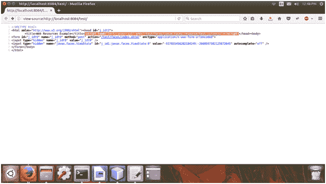

# JSF 可迁移资源

> 原文:[https://www.javatpoint.com/jsf-relocatable-resources](https://www.javatpoint.com/jsf-relocatable-resources)

JSF 提供了一种工具，可以将您的资源放在网页的任何部分，并将其呈现到另一个部分。。您可以通过指定目标属性来重新定位资源。

您可以通过以下属性在目标属性中重新定位。

**头:**用于渲染头段的资源。

**body:** 用于渲染 body 部分的资源，

**表单:**用于渲染表单部分的资源。

* * *

## JSF 可重定位资源示例

在下面的例子中，我们将 JavaScript 文件放在表单标签中，并将目标指定到标题部分。

// index.xhtml

```java
<!DOCTYPE html PUBLIC "-//W3C//DTD XHTML 1.0 Transitional//EN""http://www.w3.org/TR/xhtml1/DTD/xhtml1-transitional.dtd">
<html 
xmlns:h="http://xmlns.jcp.org/jsf/html">
<h:head>
<title>Web Resources Example</title>
</h:head>
<h:body>
<h:form>
<h:outputScript  library="js" name="test.js" target="head"/>
</h:form>
</h:body>
</html>

```

上述网页(索引)的源代码。

您可以看到 JavaScript 被重新定位到了头部。

