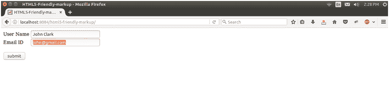

# HTML5 友好标记

> 原文:[https://www.javatpoint.com/jsf-html5-friendly-markup](https://www.javatpoint.com/jsf-html5-friendly-markup)

JavaServer Faces 支持 HTML5，允许您在网页中直接使用 HTML5 标记。它还允许您在 HTML5 元素中使用 JavaServer Faces 属性。对 HTML5 的 JavaServer Faces 支持分为两类:

*   直通元素
*   传递属性

HTML5 友好的标记功能提供了 Facelets 页面对呈现页面输出的完全控制，而不必将此控制传递给组件。您可以混合和匹配 JavaServer Faces 和 HTML5 组件和元素。

* * *

## 使用直通元素

它允许您在应用程序中使用 HTML5 标签和属性。JSF 将其视为等同于与服务器端 UIComponent 实例关联的 JavaServer Faces 组件。

您必须指定命名空间 http://xmlns.jcp.org/jsfTo，使不是 JavaServer Faces 元素的元素成为传递元素。在下面的示例中，代码用短名称 jsf 声明了命名空间:

// index.xhtml

在这里，我们使用 HTML5 电子邮件类型在 JSF 的形式，它是友好的工作。jsf 前缀放在 id 属性上，这样 HTML5 输入标签的属性就被视为 Facelets 页面的一部分。

```java
<!DOCTYPE html PUBLIC "-//W3C//DTD XHTML 1.0 Transitional//EN""http://www.w3.org/TR/xhtml1/DTD/xhtml1-transitional.dtd">
<html 
xmlns:h="http://xmlns.jcp.org/jsf/html"
xmlns:jsf="http://xmlns.jcp.org/jsf"
>
<h:head>
<title>HTML5-Friendly-markup</title>
</h:head>
<h:body>
<h:form>
<h:outputLabel for="username" value="User Name "/>
<h:inputText value="#{user.name}"/><br/>
<h:outputLabel for="email" value="Email ID "/>
<input type="email" jsf:id="email" name="email" value="#{user.email}"/><br/><br/>
<h:commandButton action="response.xhtml" value="submit"/>
</h:form>
</h:body>
</html>

```

//User.java

```java
import javax.faces.bean.ManagedBean;
import javax.faces.bean.RequestScoped;
@ManagedBean
@RequestScoped
public class User {
String name;
String email;
public String getName() {
return name;
}
public void setName(String name) {
this.name = name;
}
public String getEmail() {
return email;
}
public void setEmail(String email) {
this.email = email;
}
}

```

// response.xhtml

```java
<!DOCTYPE html PUBLIC "-//W3C//DTD XHTML 1.0 Transitional//EN""http://www.w3.org/TR/xhtml1/DTD/xhtml1-transitional.dtd">
<html 
xmlns:h="http://xmlns.jcp.org/jsf/html">
<h:head>
<title>Response Page</title>
</h:head>
<h:body>
<h1>
<h:outputText value="Hello #{user.name}"/>
</h1>
<h4><h:outputText value="Your email is: #{user.email}" /></h4>
</h:body>
</html>

```

输出:

//索引页



//响应页面


下表显示了如何将传递元素呈现为 Facelets 标记。

| HTML5 元素名称 | 识别属性 | Facelets 标记 |
| a | jsf:行动 | 命令链接 |
| a | jsf:actionListener | jsf:actionListener |
| a | jsf:值 | h：outputLink |
| a | jsf:结果 | 链接 |
| 身体 |  | h:身体 |
| 按钮 |  | 命令按钮 |
| 按钮 | jsf:结果 | 豪顿 |
| 形式 |  | h:表格 |
| 头 |  | 头 |
| 图片 |  | h:graphics image |
| 投入 | type="button " | 命令按钮 |
| 投入 | type= "复选框" | h:选取布林转角方块 |
| 投入 | type="color " | h:输入文本 |
| 投入 | type="date " | h:输入文本 |
| 投入 | 类型="日期时间" | h:输入文本 |
| 投入 | type="datetime-local " | h:输入文本 |
| 投入 | type="email " | h:输入文本 |
| 投入 | type= "月" | h:输入文本 |
| 投入 | type="number " | h:输入文本 |
| 投入 | type="range " | h:输入文本 |
| 投入 | type="search " | h:输入文本 |
| 投入 | type="time " | h:输入文本 |
| 投入 | type="url " | h:输入文本 |
| 投入 | type="week " | h:输入文本 |
| 投入 | type="file " | h：输入文件 |
| 投入 | type= "隐藏" | h:输入增加 |
| 投入 | type="password " | h:inputSecret |
| 投入 | type="reset " | 命令按钮 |
| 投入 | type="submit " | 命令按钮 |
| 投入 | type="* " | h:输入文本 |
| 标签 |  | h:输出标签 |
| 环 |  | h:输出样式表 |
| 脚本 |  | h:输出脚本 |
| 挑选 | multiple="* " | h：选择多个列表框 |
| 挑选 |  | h:selectionlistbox |
| 文本区域 |  | h:inputTextArea |

* * *

## 使用传递属性

传递属性允许您将不是服务器面属性的属性传递给浏览器。如果在 JavaServer Faces UIComponent 中指定了一个传递属性，属性名称和值将直接传递到浏览器，而不会被 JavaServer Faces 组件或渲染器解释。

您必须为传递属性使用 JavaServer Faces 命名空间，以便在 JavaServer Faces 组件中为属性名称加前缀。在下面的例子中，我们将属性传递给 HTML5 输入组件。

### 传递属性示例

// index.xhtml

```java
<?xml version='1.0' encoding='UTF-8' ?>
<!DOCTYPE html PUBLIC "-//W3C//DTD XHTML 1.0 Transitional//EN""http://www.w3.org/TR/xhtml1/DTD/xhtml1-transitional.dtd">
<html 
xmlns:h="http://xmlns.jcp.org/jsf/html"
xmlns:f="http://xmlns.jcp.org/jsf/core">
<h:head>
<title>Pass-Through Attributes</title>
</h:head>
<h:body>
<h:form>
<h:outputLabel for="username" value="User Name "/>
<h:inputText value="#{user.name}">
<f:passThroughAttribute name="type" value="text" />
</h:inputText><br/>
<h:outputLabel for="email" value="Email ID "/>
<h:inputText value="#{user.email}">
<f:passThroughAttribute name="type" value="email" />
</h:inputText><br/><br/>
<h:commandButton action="response.xhtml" value="submit"/>
</h:form>
</h:body>
</html>

```

//User.java

```java
import javax.faces.bean.ManagedBean;
import javax.faces.bean.RequestScoped;
@ManagedBean
@RequestScoped
public class User {
String name;
String email;
public String getName() {
return name;
}
public void setName(String name) {
this.name = name;
}
public String getEmail() {
return email;
}
public void setEmail(String email) {
this.email = email;
}
}

```

// response.xhtml

```java
<!DOCTYPE html PUBLIC "-//W3C//DTD XHTML 1.0 Transitional//EN""http://www.w3.org/TR/xhtml1/DTD/xhtml1-transitional.dtd">
<html 
xmlns:h="http://xmlns.jcp.org/jsf/html">
<h:head>
<title>Response Page</title>
</h:head>
<h:body>
<h1>
<h:outputText value="Hello #{user.name}"/>
</h1>
<h4><h:outputText value="Your email is: #{user.email}" /></h4>
</h:body>
</html>

```

输出:

索引页


响应页面

