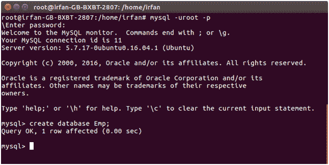
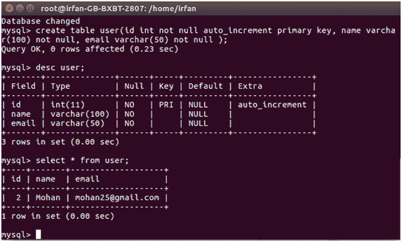

# JSF JDBC 连接

> 原文:[https://www.javatpoint.com/jsf-jdbc-connectivity](https://www.javatpoint.com/jsf-jdbc-connectivity)

您可以将 JSF 应用程序集成到 jdbc 中。JDBC 允许您将数据存储到数据库表中。

在本教程中，我们将创建一个应用程序，并创建 jdbc 连接来存储用户输入的数据。

这个应用程序包含一个用户输入表单、一个托管 bean、一个响应页面和以下步骤。

* * *

## 创建数据库和表

我们使用 mysql 数据库来创建数据库和表。

#### 创建数据库

```java
create database Emp;

```



#### 选择数据库

```java
use Emp

```

#### 创建表格

```java
create table user(id int not null auto_increment primary key, name varchar(100) not null, email varchar(50) not null );

```


#### 请参见表格结构

```java
desc user;

```


在创建数据库和表之后，现在创建一个用户表单来获取用户输入。

### 创建表单

// index.xhtml

```java
<!DOCTYPE html PUBLIC "-//W3C//DTD XHTML 1.0 Transitional//EN""http://www.w3.org/TR/xhtml1/DTD/xhtml1-transitional.dtd">
<html 
xmlns:h="http://xmlns.jcp.org/jsf/html">
<h:head>
<title>User Form</title>
</h:head>
<h:body>
<h:form>
<h:outputLabel for="username" value="User Name "/>
<h:inputText id="username" value="#{user.userName}">
</h:inputText><br/>
<h:outputLabel for="email" value="Email ID "/>
<h:inputText id="email" value="#{user.email}">
</h:inputText><br/><br/>
<h:commandButton action="#{user.submit()}" value="submit"/>
</h:form>
</h:body>
</html>

```

* * *

### 创建管理 Bean

该文件还包含属性、数据库连接和页面导航。

//User.java

```java
import java.sql.Connection;
import java.sql.DriverManager;
import java.sql.PreparedStatement;
import javax.faces.bean.ManagedBean;
import javax.faces.bean.ReferencedBean;

@ManagedBean
@ReferencedBean
public class User {
String userName;
String email;
public String getUserName() {
return userName;
}
public void setUserName(String userName) {
this.userName = userName;
}
public String getEmail() {
return email;
}
public void setEmail(String email) {
this.email = email;
}

public boolean save(){
int result = 0;
try{
Class.forName("com.mysql.jdbc.Driver");   
Connection con = DriverManager.getConnection( "jdbc:mysql://localhost:3306/Emp","root","mysql");
PreparedStatement stmt = con.prepareStatement("insert into user(name,email) values(?,?)");
stmt.setString(1, this.getUserName());
stmt.setString(2, this.getEmail());
result = stmt.executeUpdate();
}catch(Exception e){
System.out.println(e);
}
if(result == 1){
return true;
}else return false;
}

public String submit(){
if(this.save()){
return "response.xhtml";
}else return "index.xhtml";
}   
}

```

* * *

### 创建响应页面

// response.xhtml

```java
<?xml version='1.0' encoding='UTF-8' ?>
<!DOCTYPE html PUBLIC "-//W3C//DTD XHTML 1.0 Transitional//EN""http://www.w3.org/TR/xhtml1/DTD/xhtml1-transitional.dtd">
<html 
xmlns:h="http://xmlns.jcp.org/jsf/html">
<h:head>
<title>Response Page</title>
</h:head>
<h:body>
<h1><h:outputText value="Hello #{user.userName}"/></h1>
<h:outputText value="Your Record has been Saved Successfully!"/>
</h:body>
</html>

```

输出:

用户表单(索引页)


响应页面


现在，您可以看到表中的数据。

```java
select * from user

```



一切就绪！数据已插入。

* * *