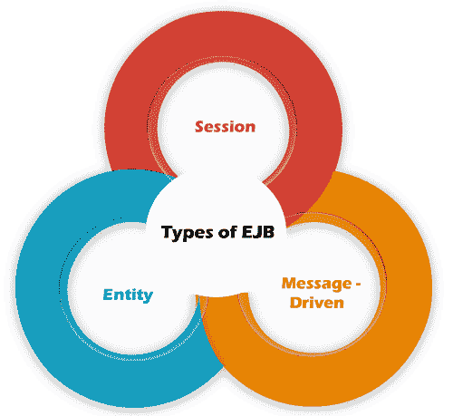
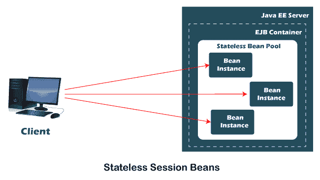
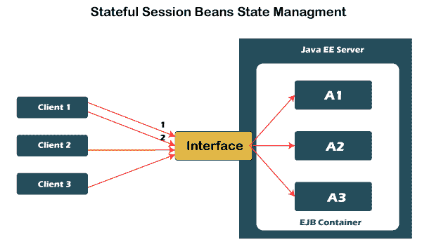
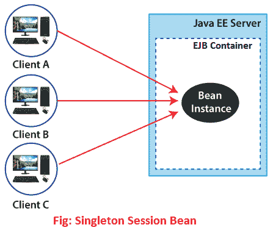
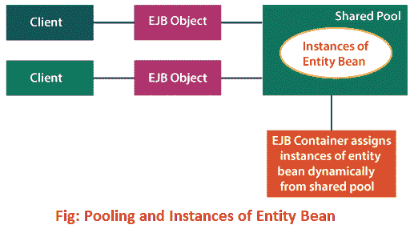
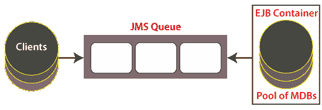

# EJB 的类型

> 原文:[https://www.javatpoint.com/types-of-ejb](https://www.javatpoint.com/types-of-ejb)

[EJB](https://www.javatpoint.com/ejb-tutorial) 是**企业 Java 豆**的首字母缩写。它是服务器端软件元素。它封装了应用程序的业务逻辑。它是在 Java 平台上开发分布式业务应用程序的规范。EJB 有三种**类型:** [**【会话 Bean】**](https://www.javatpoint.com/session-bean)[**实体 Bean**](https://www.javatpoint.com/entity-bean) 和 [**消息驱动 Bean**](https://www.javatpoint.com/message-driven-bean) 。在本节中，我们将详细讨论 EJB 的所有**类型。**

让我们一个一个详细讨论。

## 会话 Bean

可以被客户、远程和 web 服务系统地使用的豆芽商业理念。当客户端想要使用分布在服务器上的应用程序时，客户端使用会话 bean 方法。这个会话 bean 为客户提供服务，通过在服务器中执行业务操作来保护他们免受复杂问题的影响。

为了得到传达给工作人员的应用程序，客户端调用会议 bean 的策略。会议 bean 为其客户执行工作，通过在工作人员内部执行业务任务来保护客户免受复杂性的影响。请记住，会话 beans 不是持久性。

有两种类型的会话 beans:

*   无状态会话 Beans
*   有状态会话 Beans
*   单例会话 Beans

### 无状态会话 Beans

一个 [**无状态会话 bean**](https://www.javatpoint.com/stateless-session-bean) 不与客户或客户端保持会话状态。当客户端调用无状态 bean 的方法时，bean 的实例变量可能包含对该客户端显式的状态，但是只在调用期间包含。

当方法完成时，客户端显式状态不应保持。但是，客户端可能会更改池化无状态 bean 中呈现的实例变量的状态，并且该状态会保留到池化无状态 bean 的后续调用中。

除此之外，在方法调用期间，无状态 bean 的所有实例都是相同的，允许 EJB 容器将实例分配给任何客户端。因此，无状态会话 bean 的状态应该适用于所有客户端。它可以在 web 服务中实现。

由于无状态会话 beans 可以维护不同的客户，因此可以为需要大量客户端的应用程序提供更好的适应性。通常，应用程序需要比有状态会话 bean 更少的无状态会话 bean 来支持相同数量的客户端。

为了改进执行，我们可以选择一个无状态会话 bean，如果它具有任何这些特征的话。

*   bean 的状态没有特定客户端的信息或数据。
*   在私有方法调用中，bean 为所有客户端执行通用任务。
*   bean 实现了一个网络服务。

### 有状态会话 Beans

一个 [**有状态会话 bean**](https://www.javatpoint.com/stateful-session-bean) 和一个交互会话是一样的。对象的状态包括其实例变量的值。在有状态会话 bean 中，实例变量表示唯一客户端/bean 会话的状态。因为客户端与其 bean 交互。这种状态通常被称为**对话状态**。它跨多个请求维护客户端的状态。因此，我们不能在 web 服务中实现它，因为它不能被共享。当客户端终止会话时，它不再与客户端相关联。

该状态在客户端/bean 会话期间保持不变。如果客户端删除了 bean，会话将关闭，状态将被忽略。这种状态的短暂性不是问题，因为客户端和 beans 之间的交互结束了。所以，不要求持有状态。

如果下列任一条件有效，则应使用有状态会话 beans:

*   bean 的状态表示 bean 和特定客户端之间的联盟。
*   bean 需要跨方法调用保存关于客户的数据。
*   bean 在客户和应用程序的不同部分之间进行干涉，引入了对客户可见的改进。
*   在后台，bean 处理一些企业 bean 的工作流。

#### 注意:无状态和有状态会话 beans 都不是持久的。

### 单例会话 Beans

一个**单例会话 bean** 为每个应用程序维护一个实例，该实例存在于应用程序的生命周期中。它提供了与无状态会话 beans 相同的功能。但是唯一的区别是每个应用程序只有一个单独的会话 bean，而在无状态会话 bean 中使用了一个 bean 池。

从该池中，任何会话 beans 都可以响应客户端。我们可以在 web 服务端点中实现它。它负责状态，但如果发生意外崩溃或关机，它不会保持状态。如果我们想要在关闭应用程序时执行清理任务，或者关闭应用程序，那么可以使用它。这是因为它在应用程序的整个生命周期中运行。

单一会话 beans 适用于以下情况:

*   bean 的状态必须在应用程序中共享。
*   一个企业 bean 应该由多个线程同时访问。
*   应用程序需要一个企业 bean 来在应用程序启动和关闭时执行任务。
*   bean 实现了一个网络服务。

## 实体 Bean

实体 bean 是一种不可预测的业务实体。它对业务实体建模，或者对业务交互中的不同活动建模。它用于鼓励商业利益，包括数据和对该数据的计算。它可以处理各种各样的，需要的，勤奋的文章来完成它的基本任务。实体 bean 是一个很远的对象，它监督稳定的信息并执行复杂的业务逻辑。它可以用一把关键的钥匙来区分。

它是一个很远的对象，负责监管稳定的信息，执行复杂的业务逻辑，可能会使用一些沃德 Java 抗议，并且可以通过一个关键的键来显著区分。它通常是粗粒度确定的项目，因为它们使用放在几个细粒度无情的 Java 对象中的稳定信息。元素豆是勤奋的，因为他们确实忍受了工人的崩溃或组织的失望。

每个实体 bean 都有一个与之关联的持久性标识。这意味着它包含一个唯一的身份，如果我们有一个主键，就可以获取这个身份。唯一键的类型由 bean 提供程序定义。如果主实体被放错了位置，客户端可以检索实体 bean。如果 bean 不可用，EJB 容器首先实例化 bean，然后为客户端重新填充数据。

实体 bean 信息的注意既用于在 bean 被钝化时保存状态，也用于在检测到故障转移时改善状态。考虑到信息是由持有者在某种类型的信息储存框架(如数据集)中确定地存放起来的，这种方法可以持久。

实体 beans 通过使用以下两种方法来保存业务数据:

*   Bean 管理的持久性
*   容器管理持久性

### Bean 管理的持久性

与容器管理的持久性相比，Bean 管理的持久性更加复杂。因为它允许我们显式地将持久性逻辑写入 bean 类。为了将持久性处理代码写入 bean 类，我们必须知道正在使用的数据库类型，以及 bean 类的字段是如何映射到数据库的。因此，它在数据库和 bean 实例之间提供了更大的灵活性。

它可以作为化学机械抛光的替代品。如果部署工具不兼容，无法将 bean 实例的状态映射到数据库。BMP 的缺点是需要更多的工作来定义 bean，并且它将 bean 与特定的数据库类型和结构联系起来。

### 容器管理的持久性

在**容器管理的持久性中，**EJB 容器透明且隐式地处理 bean 和数据库之间的关系。Bean 开发人员专注于数据和业务流程。主要的限制是，EJB 隔间很可能无法像程序员那样熟练地产生信息库访问语句。

与 BMP 不同，CMP 不允许我们在实体 bean 类的方法中编写数据库访问调用。这是因为持久性是由容器在运行时处理的。支持《议定书》/《公约》缔约方会议需要以下两件事:

*   **映射:**表示如何将实体 bean 映射到资源。
*   **运行时环境:**CMP 运行时环境，使用映射信息对每个 bean 执行持久性操作。

#### 注意:实体 bean 已经被 Java 持久性 API 所取代。

## 消息驱动 Bean

**MDB** 是一个 **Java 消息服务**(消息监听器)。它使用来自队列或主题订阅的消息。它提供了一种使用 [JMS](https://www.javatpoint.com/jms-tutorial) 消息监听器创建或实现异步通信的简单方法。使用 MDB 的一个优点是，它允许我们使用 JMS 侦听器的异步特性。我们可以用甲骨文 JMS (Java 消息服务)实现消息驱动的 beans。

有一个处理 JMS 队列和主题的 EJB 容器(包含 MDBs 池)。每个传入的消息都由容器调用的 bean 处理。请注意，没有对象直接调用 MDB。对 MDB 的所有调用都源自容器。当容器调用 MDB 时，它可以调用其他 EJB 或 Java 对象来继续请求。

它与无状态会话 bean 非常相似。因为它不保存非正式状态，也用于处理多个传入请求。EJB 相对于 JMS 有以下好处:

*   它为听者创造了一个消费者。这意味着容器创建 **QueueReceiver** 或 **TopicSubscriber** 是由容器创建的。
*   MDB 是在消费者那里注册的。这意味着在部署时 QueueReceiver、TopicSubscriber 及其工厂由容器注册。
*   指定了消息确认模式。

MDB 的主要功能是读取(接收)或写入(发送)来自 JMS 目标(即队列或主题)的传入。使用 MDB 时，请确保其配置和安装正确。它与 JMS 和安装在 Oracle 数据库上的 JMS 进行交互。数据库保留队列或主题。下图描述了 MDB 如何与 JMS 目标交互。

多边开发银行的工作如下:

*   MDB 通过使用数据源(JMS 资源提供程序)创建并打开到数据库的 JMS 连接。JDBC 驱动程序用于促进 JMS 连接。
*   通过 JMS 连接的 JMS 会话由 MDB 打开。
*   如果 MDB 的任何消息从主题队列路由到 MDB 的 onMessage()方法。其他客户端也可以访问相同的队列和主题，为 MDB 放置消息。

请注意，它不处理客户端请求的请求，而是处理放入队列的请求。

MDB 实现了 javax.ejb.MessageDriverBean 接口，并继承了提供以下方法的 javax.jms.MessageListener 类:

| 方法 | 描述 |
| onMessage(msg) | 容器将消息从与此 MDB 关联的 JMS 队列中出列，并通过调用此方法将其提供给此实例。此方法必须有适当处理消息的实现。 |
| setMessageDrivenContext(ctx) | 创建 bean 后，调用 setMessageDrivenContext 方法。这个方法类似于 EJB 的 setSessionContext 和 setEntityContext 方法。 |
| ejbCreate() | 这个方法就像无状态会话 bean ejbCreate 方法一样使用。此方法中不应进行初始化。但是，您在此方法中分配的任何资源都将存在于此对象中。 |
| ejbRemove() | 删除 ejbCreate 方法中分配的任何资源。 |

## 会话和实体 Bean 之间的区别

下表描述了会话 bean 和实体 bean 之间的主要区别。

| 比较的基础 | 会话 Bean | 实体 Bean |
| **主键** | 它没有主键。它用于识别和检索特定的 bean 实例。 | 它有一个主键，允许我们查找实例，并且可以由多个客户端共享。 |
| **无状态/有状态** | 它可能是有状态的，也可能是无状态的。 | 它是有状态的。 |
| **跨度** | 它是相对短暂的。 | 它的寿命相对较长。 |
| **性能** | 它代表与客户的一次对话。 | 它封装了持久性业务数据。 |
| **可达性** | 它由单个客户端创建和使用。 | 它可能由多个客户端共享。 |
| **恢复** | 如果 EJB 服务器出现故障，则不可恢复。所以，它可能会被摧毁。 | 如果发生任何故障，它是可恢复的。 |
| **数据的持久性** | 它只在与客户端的对话期间保存数据。 | 客户端实例生命周期之外的持久性。持久性可以是容器管理的，也可以是 bean 管理的。 |
| **远程界面** | 它扩展了 javax . EJB . ejbbject。 | 它扩展了 javax . EJB . ejbbject。 |
| **首页界面** | 它扩展了 javax.ejb.EJBHome。 | 它扩展了 javax.ejb.EJBHome。 |
| **豆类** | 它扩展了 javax . EJB . ejbessionbean。 | 它扩展了 javax . EJB . ejbentytyBean。 |

* * *