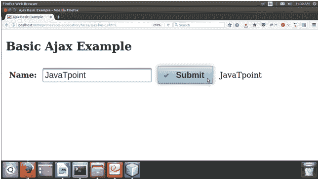

# Ajax 模板

> 原文:[https://www.javatpoint.com/primefaces-ajax](https://www.javatpoint.com/primefaces-ajax)

Primefaces 提供内置的 Ajax 支持。它提供各种属性，如更新、事件、监听器等。这里，我们正在创建一个解释 ajax 属性的示例。

### Ajax 属性

下表包含 Ajax 属性。

| 属性 | 缺省值 | 返回类型 | 描述 |
| 听众 | 空 | MethodExpr | 它用于处理部分请求。 |
| 马上 | 错误的 | 布尔 | 当在 apply_request_values 处理 true 操作时，当在 invoke_application 阶段处理 false 操作时，它返回一个确定 phaseId 的布尔值。 |
| 异步ˌ非同步(asynchronous) | 错误的 | 布尔 | 当设置为 true 时，ajax 请求不会排队。 |
| 过程 | 空 | 线 | 它用于处理部分请求。 |
| 更新 | 空 | 线 | 它是用来用 ajax 更新的。 |
| onstart | 空 | 线 | 它用于在 ajax 请求开始之前执行。 |
| 不完全的 | 空 | 线 | 它用于在 ajax 请求完成时执行。 |
| 我们成功了 | 空 | 线 | 它用于在 ajax 请求成功时执行。 |
| 耽搁 | 空 | 线 | 它用于设置延迟时间。如果调用 request()之间的延迟时间小于毫秒，则只发送最近的一个请求，而丢弃所有其他请求。如果未指定此选项，或者如果延迟值是不带引号的文字字符串“none ”,则不使用延迟。 |
| partialSubmit | 错误的 | 布尔 | 启用仅属于部分处理组件的值的序列化。 |
| partialSubmitFilter | 空 | 线 | 打开部分提交时使用的选择器，默认值为:“输入”以选择部分处理组件的所有后代输入。 |
| 事件 | 空 | 线 | 触发 ajax 请求的客户端事件。 |

* * *

## Ajax Basic

这个例子解释了应用程序中内置的 Ajax 用法。它使用 Ajax 更新后端值并显示输出。

这个例子包括一个 JSF 页面和一个管理页面。

**JSF 文件**

**// ajax-basic.xhtml**

```java

<?xml version='1.0' encoding='UTF-8' ?>
<!DOCTYPE html PUBLIC "-//W3C//DTD XHTML 1.0 Transitional//EN""http://www.w3.org/TR/xhtml1/DTD/xhtml1-transitional.dtd">
<html 
xmlns:h="http://xmlns.jcp.org/jsf/html"
xmlns:p="http://primefaces.org/ui">
<h:head>
<title>Ajax Basic Example</title>
</h:head>
<h:body>
<h2>Basic Ajax Example</h2>
<h:form>
<h:panelGrid columns="4" cellpadding="5">
<h:outputLabel for="name" value="Name:" style="font-weight:bold" />
<p:inputText id="name" value="#{user.name}" />
<p:commandButton value="Submit" update="display" icon="ui-icon-check" />
<h:outputText id="display" value="#{user.name}" />
</h:panelGrid>
</h:form>
</h:body>
</html>

```

### ManagedBean

**//User.java**

```java

package com.javatpoint;
import java.io.Serializable;
import javax.faces.bean.ManagedBean;
@ManagedBean
public class User implements Serializable{
String name;
String lastName;
public String getName() {
return name;
}
public void setName(String name) {
this.name = name;
}   

public String getLastName() {
return lastName;
}
public void setLastName(String lastName) {
this.lastName = lastName;
}
}

```

输出:


输入值并按提交后，它会产生以下输出。

