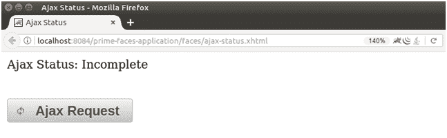

# PrimeFaces Ajax 状态

> 原文:[https://www.javatpoint.com/primefaces-ajax-status](https://www.javatpoint.com/primefaces-ajax-status)

它用于显示当前正在执行的 ajax 请求的状态。PrimeFaces 提供了**T2】p:AJaxstatus>**组件来显示进程的状态。这里，我们正在创建一个实现状态组件的示例。

这个例子只包含一个 JSF 文件。

### JSF 档案

**// ajax-status.xhtml**

```java

<?xml version='1.0' encoding='UTF-8' ?>
<!DOCTYPE html PUBLIC "-//W3C//DTD XHTML 1.0 Transitional//EN""http://www.w3.org/TR/xhtml1/DTD/xhtml1-transitional.dtd">
<html 
xmlns:h="http://xmlns.jcp.org/jsf/html"
xmlns:p="http://primefaces.org/ui"
xmlns:f="http://xmlns.jcp.org/jsf/core">
<h:head>
<title>Ajax Status</title>
</h:head>
<h:body>
<p:ajaxStatus style="display:block;margin-bottom:2em;height:24px;">
<f:facet name="default">
<h:outputText value="Ajax Status: Incomplete" />
</f:facet>
<f:facet name="start">
<p:graphicImage nameimg/ajaxstatus.gif" />
</f:facet>
<f:facet name="complete">
<h:outputText value="Status: Completed" />
</f:facet>
</p:ajaxStatus>
<p:ajaxStatus onstart="PF('statusDialog').show()" />
<p:dialog widgetVar="statusDialog" modal="true">
<p:graphicImage nameimg/ajaxstatus.gif" />
</p:dialog>
<h:form>
<p:commandButton value="Ajax Request" icon="ui-icon-refresh" />
</h:form>
</h:body>
</html>

```

输出:



它显示发送 ajax 请求后的状态。

