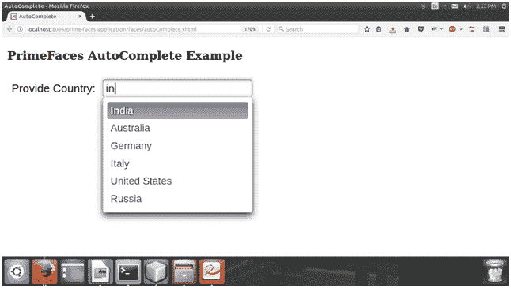

# PrimeFaces 自动完成

> 原文:[https://www.javatpoint.com/primefaces-autocomplete](https://www.javatpoint.com/primefaces-autocomplete)

它是一个输入组件，在输入时提供实时建议。

通过调用服务器端的 completeMethod 来加载建议，该方法采用单个字符串参数。

PrimeFaces 提供了 **< p:自动完成>** 组件，用于创建一个带有建议的文本框。它包括下面列出的各种属性。

## 自动完成属性

下表包含自动完成属性的属性。

| 属性 | 缺省值 | 返回类型 | 描述 |
| 编号 | 空 | 线 | 它是组件的唯一标识符。 |
| 提供 | 真实的 | 布尔代数学体系的 | 它返回布尔值来指定组件的呈现。 |
| 有约束力的 | 空 | 目标 | 它用于映射到支持 bean 中的服务器端 UIComponent 实例的 el 表达式。 |
| 价值 | 空 | 目标 | 它是组件的一个值，可以是文本的 EL 表达式。 |
| 转换器 | 空 | 目标 | 定义组件转换器的 el 表达式或文本。 |
| 马上 | 错误的 | 布尔代数学体系的 | 当设置为 true 时，它返回布尔值，在应用请求值阶段为此组件执行流程验证逻辑。 |
| 需要 | 错误的 | 布尔代数学体系的 | 它用于根据需要标记组件。 |
| 所需消息 | 空 | 线 | 它用于设置当必填字段验证失败时要显示的消息。 |
| 掉下 | 错误的 | 布尔代数学体系的 | 当设置为真时，它启用下拉模式。 |
| 访问密钥 | 空 | 线 | 它用于设置访问键，当按下该键时，将焦点转移到输入元素。 |
| 自动完成 | 空 | 线 | 它执行自动完成行为。 |
| 朗格 | 空 | 线 | 它用于设置此组件的生成标记中使用的语言。 |
| 单击事件 | 空 | 线 | 单击输入元素时要执行的客户端回调。 |
| 活跃的 | 真实的 | 布尔代数学体系的 | 定义是否启用自动完成功能。 |

* * *

## 例子

这里，在下面的例子中，我们正在实现 **< p:自动完成>** 组件。本示例包含以下文件。

### JSF 档案

**// autoComplete.xhtml**

```java

<?xml version='1.0' encoding='UTF-8' ?>
<!DOCTYPE html PUBLIC "-//W3C//DTD XHTML 1.0 Transitional//EN""http://www.w3.org/TR/xhtml1/DTD/xhtml1-transitional.dtd">
<html 
xmlns:h="http://xmlns.jcp.org/jsf/html"
xmlns:p="http://primefaces.org/ui"
xmlns:f="http://xmlns.jcp.org/jsf/core">
<h:head>
<title>AutoComplete</title>
</h:head>
<h:body>
<h3>PrimeFaces AutoComplete Example</h3>
<h:form>
<p:growl id="msgs" showDetail="true" />
<h:panelGrid columns="2" cellpadding="5">
<p:outputLabel value="Provide Country: " />
<p:autoComplete value="#{autoComplete.countryName}" completeMethod="#{autoComplete.countryList()}" />
</h:panelGrid>
</h:form>
</h:body>
</html>

```

### ManagedBean

**//AutoComplete.java**

```java

package com.javatpoint;
import java.util.ArrayList;
import java.util.List;
import javax.faces.bean.ManagedBean;
@ManagedBean
public class AutoComplete {
String countryName;
public List<String> countryList() {
ArrayList<String> list = new ArrayList<>();
list.add("India");
list.add("Australia");
list.add("Germany");
list.add("Italy");
list.add("United States");
list.add("Russia");
return list;
}
public String getCountryName() {
return countryName;
}
public void setCountryName(String CountryName) {
this.countryName = CountryName;
}
}

```

输出:

