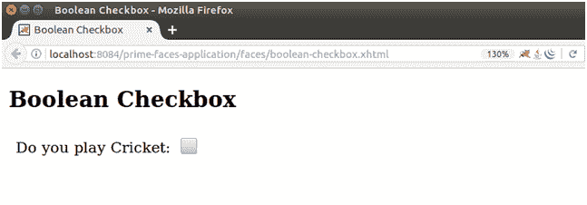
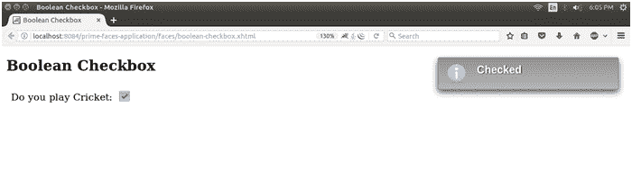

# selectbooleancheckbox 选取布林方块

> 原文:[https://www.javatpoint.com/primefaces-booleancheckbox](https://www.javatpoint.com/primefaces-booleancheckbox)

PrimeFaces 提供**<p:selectBooleanCheckbox>**组件创建布尔复选框。它用于从用户处获取布尔值。这是带有主题集成的标准复选框的扩展版本。

## 选择布尔值复选框属性

下表包含 SelectBooleanCheckbox 组件的属性。

| 属性 | 缺省值 | 返回类型 | 描述 |
| 编号 | 空 | 线 | 它是组件的唯一标识符。 |
| 提供 | 真实的 | 布尔代数学体系的 | 它用于渲染组件。它需要布尔值。 |
| 有约束力的 | 空 | 目标 | 它用于设置映射到支持 bean 中的服务器端 UIComponent 实例的表达式 |
| 价值 | 空 | 目标 | 它用于设置引用列表的组件的值。 |
| 转换器 | 空 | 转换器/字符串 | 它用于设置定义组件转换器的文本。 |
| 需要 | 错误的 | 布尔代数学体系的 | 它用于根据需要制作组件。 |
| widgetVar | 空 | 线 | 这是客户端小部件的名称。 |
| 有缺陷的 | 错误的 | 布尔代数学体系的 | 它用于禁用组件。 |
| 标签 | 空 | 线 | 它用于设置用户可表示的名称。 |
| 昂哥 | 空 | 线 | 它用于在值更改时调用脚本。 |
| 风格 | 空 | 线 | 用于设置组件的 CSS。 |
| styleClass(样式类) | 空 | 线 | 它用于设置容器的样式类。 |
| itemLabel | 空 | 线 | 它用于设置复选框旁边显示的标签。 |
| tab 键索引 | 空 | 线 | 它用于指定 tab 键导航的 tab 顺序。 |
| 得到焦点时 | 空 | 线 | 它用于在 checkbox 获得焦点时执行脚本。 |
| onblur(声音) | 空 | 线 | 它用于在 checkbox 失去焦点时执行脚本。 |
| 标题 | 空 | 线 | 用于设置工具提示信息。 |

## 选择布尔值复选框蒙皮属性

| 样式类 | 适用 |
| 。ui 检查盒 | 它是一个主要的容器元素。 |
| 。ui 自动取款机 | 它是复选框图标的容器。 |
| 。ui 检查框图标 | 它用于复选框图标。 |

* * *

## 例子

这里，在下面的例子中，我们正在实现**<p:selectBooleanCheckbox>**组件。本示例包含以下文件。

### JSF 档案

**// boolean-checkbox.xhtml**

```java

<?xml version='1.0' encoding='UTF-8' ?>
<!DOCTYPE html PUBLIC "-//W3C//DTD XHTML 1.0 Transitional//EN""http://www.w3.org/TR/xhtml1/DTD/xhtml1-transitional.dtd">
<html 
xmlns:h="http://xmlns.jcp.org/jsf/html"
xmlns:p="http://primefaces.org/ui">
<h:head>
<title>Boolean Checkbox</title>
</h:head>
<h:body>
<h2>Boolean Checkbox</h2>
<h:form>
<p:growl id="check-msg" />
<h:panelGrid columns="2" style="margin-bottom:10px" cellpadding="5">
<h:outputText value="Do you play Cricket: " />
<p:selectBooleanCheckbox value="#{booleanCheckbox.value}">
<p:ajax update="check-msg" listener="#{booleanCheckbox.addMessage}" />
</p:selectBooleanCheckbox>
</h:panelGrid>
</h:form>
</h:body>
</html>

```

### ManagedBean

**//boolean box . Java**

```java

package com.javatpoint;
import javax.faces.application.FacesMessage;
import javax.faces.bean.ManagedBean;
import javax.faces.context.FacesContext;
@ManagedBean
public class BooleanCheckbox {
private boolean value;
public boolean isValue() {
return value;
}
public void setValue(boolean value) {
this.value = value;
}
public void addMessage() {
String summary = value ? "Checked" : "Unchecked";
FacesContext.getCurrentInstance().addMessage(null, new FacesMessage(summary));
}
}

```

输出:



它显示信息，当我们检查它时，如下所示。

