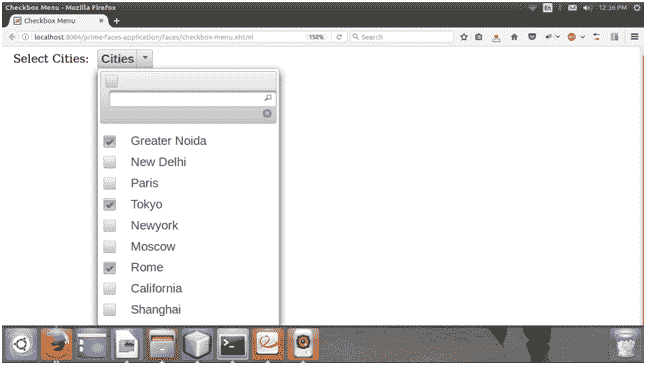

# selectcheckboxmenu 选取检查方块功能表

> 噻:[https://www . javatppoint . com/primitives-selectcheckbox menu](https://www.javatpoint.com/primefaces-selectcheckboxmenu)

它用于选择叠加显示的多个项目。我们可以使用**<p:selectcheckbox menu>**组件来创建它。它在覆盖图中显示选项。它提供了下面列出的属性。

## 选择复选框菜单属性

| 属性 | 缺省值 | 返回类型 | 描述 |
| 编号 | 空 | 线 | 它是组件的唯一标识符。 |
| 提供 | 真实的 | 布尔代数学体系的 | 它用于呈现指定的组件。 |
| 有约束力的 | 空 | 目标 | 它绑定一个表达式，该表达式映射到支持 bean 中的服务器端 UIComponent 实例。 |
| 价值 | 空 | 目标 | 它用于设置组件的值。 |
| 转换器 | 空 | 转换器/字符串 | 它用于定义组件的转换器。 |
| 需要 | 错误的 | 布尔代数学体系的 | 它用于根据需要标记组件。 |
| 所需消息 | 空 | 线 | 它用于设置当必填字段验证失败时显示的消息。 |
| 风格 | 空 | 线 | 它用于设置组件的内联样式。 |
| 昂什 | 空 | 线 | 这是一个在显示覆盖时执行的方法。 |
| 昂 Hide | 空 | 线 | 这是一个隐藏覆盖时执行的方法。 |
| 多个的 | 错误的 | 布尔代数学体系的 | 它用于将选定的项目设置为多个标签。 |

## Ajax 行为事件

SelectCeckboxMenu 除了像 change、selectCheckboxMenu 这样的常见 dom 事件之外，还提供了一个 Ajax 事件。

| 事件 | 侦听器参数 | 履行 |
| toggleSelect | org . primitives . event . togleselectevent | 切换所有复选框更改时。 |

* * *

## 例子

这里，在下面的例子中，我们正在实现**<p:selectcheckbox menu>**组件。本示例包含以下文件。

### JSF 档案

**// calendar.xhtml**

```java

<?xml version='1.0' encoding='UTF-8' ?>
<!DOCTYPE html PUBLIC "-//W3C//DTD XHTML 1.0 Transitional//EN""http://www.w3.org/TR/xhtml1/DTD/xhtml1-transitional.dtd">
<html 
xmlns:h="http://xmlns.jcp.org/jsf/html"
xmlns:p="http://primefaces.org/ui"
xmlns:f="http://xmlns.jcp.org/jsf/core">
<h:head>
<title>Checkbox Menu</title>
</h:head>
<h:body>
<h:form>
<h:panelGrid columns="2" cellpadding="5">
<h:outputLabel for="menu" value="Select Cities: " />
<p:selectCheckboxMenu id="menu" value="#{checkboxMenu.selectedCities}" label="Cities"
filter="true" filterMatchMode="startsWith" panelStyle="width:250px">
<f:selectItems value="#{checkboxMenu.cities}" />
</p:selectCheckboxMenu>
</h:panelGrid>
</h:form>
</h:body>
</html>

```

### ManagedBean

**// CheckboxMenu.java**

```java

package com.javatpoint;
import java.util.ArrayList;
import java.util.List;
import javax.annotation.PostConstruct;
import javax.faces.bean.ManagedBean;
@ManagedBean
public class CheckboxMenu {
private String[] selectedCities;
private List<String> cities;
@PostConstruct
public void init() {
cities = new ArrayList<>();
cities.add("Greater Noida");
cities.add("New Delhi");
cities.add("Paris");
cities.add("Tokyo");
cities.add("Newyork");
cities.add("Moscow");
cities.add("Rome");
cities.add("California");
cities.add("Shanghai");
}
public String[] getSelectedCities() {
return selectedCities;
}
public void setSelectedCities(String[] selectedCities) {
this.selectedCities = selectedCities;
}
public List<String> getCities() {
return cities;
}
}

```

这个 JSF 应用程序产生以下输出。

输出:



我们可以看到，它允许我们从菜单中选择多个项目。