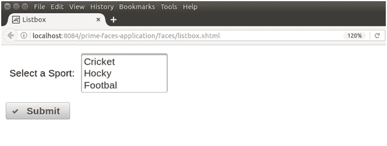

# SelectOneListbox 范本

> 原文:[https://www.javatpoint.com/primefaces-selectonelistbox](https://www.javatpoint.com/primefaces-selectonelistbox)

它是标准选择列表框组件的扩展版本。它用于从列表中选择一个值。PrimeFaces 提供**T2【p】:selectone Listbox>**组件创建 listbox。当我们希望从多个选项中获得用户选择时，它非常有用。下面列出了它的各种属性。

## 选择列表框属性

| 属性 | 缺省值 | 返回类型 | 描述 |
| 编号 | 空 | 线 | 它是组件的唯一标识符。 |
| 提供 | 真实的 | 布尔代数学体系的 | 它用于渲染组件。它需要布尔值。 |
| 有约束力的 | 空 | 目标 | 它用于设置映射到支持 bean 中的服务器端 UIComponent 实例的表达式 |
| 价值 | 空 | 目标 | 它用于设置引用列表的组件的值。 |
| 转换器 | 空 | 转换器/字符串 | 它用于设置定义组件转换器的文本。 |
| 需要 | 错误的 | 布尔代数学体系的 | 它用于根据需要制造组件 |
| widgetVar | 空 | 线 | 这是客户端小部件的名称。 |
| 有缺陷的 | 错误的 | 布尔代数学体系的 | 它用于禁用组件。 |
| 标签 | 空 | 线 | 它用于设置用户可表示的名称。 |
| 定义变量 | 空 | 线 | 自定义内容显示中使用的迭代器的名称。 |
| 过滤器 | 错误的 | 布尔 | 显示列表的输入过滤器。 |
| filterMatchMode | 空 | 线 | 筛选的匹配模式，有效值为开始(默认)、包含、结束和自定义。 |
| filterFunction | 空 | 线 | 要在自定义 filterMatchMode 中使用的客户端函数。 |
| 区分大小写 | 错误的 | 布尔代数学体系的 | 定义过滤是否区分大小写。 |
| 滚动高度 | 空 | 整数 | 定义可滚动区域的高度。 |

* * *

## 例子

在下面的例子中，我们实现了**<p:selectOneListbox>**组件。本示例包含以下文件。

### JSF 档案

**// listbox .. .XHTML㎡t1㎡**

```java

<?xml version='1.0' encoding='UTF-8' ?>
<!DOCTYPE html PUBLIC "-//W3C//DTD XHTML 1.0 Transitional//EN""http://www.w3.org/TR/xhtml1/DTD/xhtml1-transitional.dtd">
<html 
xmlns:h="http://xmlns.jcp.org/jsf/html"
xmlns:p="http://primefaces.org/ui"
xmlns:f="http://xmlns.jcp.org/jsf/core">
<h:head>
<title>Listbox</title>
</h:head>
<h:body>
<h:form>
<h:panelGrid columns="2" style="margin-bottom:10px" cellpadding="5" columnClasses="label, value">
<p:outputLabel for="sports" value="Select a Sport:" />
<p:selectOneListbox id="sports" value="#{listBox.option}">
<f:selectItem itemLabel="Cricket" itemValue="Cricket" />
<f:selectItem itemLabel="Hocky" itemValue="Hocky" />
<f:selectItem itemLabel="Footbal" itemValue="Footbal" />
</p:selectOneListbox>
</h:panelGrid>

<p:commandButton value="Submit" update="display" oncomplete="PF('dlg').show()" icon="ui-icon-check" />
<p:dialog header="Selected Sport" modal="true" showEffect="fade" widgetVar="dlg" resizable="false">
<p:panelGrid columns="2" id="display" columnClasses="label,output">
<h:outputText value="#{listBox.option}" />
</p:panelGrid>
</p:dialog>
</h:form>
</h:body>
</html>

```

### ManagedBean

**// 列表框.java**

```java

package com.javatpoint;
import javax.faces.bean.ManagedBean;
@ManagedBean
public class ListBox {
private String option;   
public String getOption() {
return option;
}
public void setOption(String option) {
this.option = option;
}
}

```

输出:


