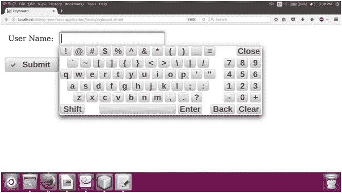

# 素数面键盘

> 原文:[https://www.javatpoint.com/primefaces-keyboard](https://www.javatpoint.com/primefaces-keyboard)

它是一个显示虚拟键盘输入数据的输入文本框。它用于通过使用指针设备获取用户输入。因此，用户可以不用键盘输入。 **< p:键盘>** 组件用于创建虚拟键盘。键盘属性如下表所示。

## 密码属性

| 属性 | 缺省值 | 类型 | 描述 |
| 密码 | 错误的 | 布尔代数学体系的 | 它用于使输入成为密码字段。 |
| showmore | 集中 | 线 | 它指定了显示模式。 |
| 按钮图像 | 空 | 线 | 它用于设置按钮的图像。 |
| 仅按钮图像 | 错误的 | 布尔代数学体系的 | 当设置为 true 时，将只显示按钮的图像。 |
| 影响 | 法登 | 线 | 用于设置显示动画的效果。 |
| 效果持续时间 | 空 | 线 | 它用于设置显示动画的长度。 |
| 布局 | 标准英语打字键盘的 | 线 | 设置键盘布局。 |
| 布局模板 | 空 | 线 | 用于设置自定义布局的模板。 |
| keypardonly | 集中 | 布尔代数学体系的 | 它指定显示小键盘而不是键盘。 |
| promptLabel | 空 | 线 | 用于设置提示文本的标签。 |
| closeLabel | 空 | 线 | 用于设置关闭键的标签。 |
| 清除标签 | 空 | 线 | 用于设置清除键的标签。 |
| backsparcelabel | 空 | 线 | 它用于设置退格键的标签。 |
| 中高音 | 空 | 线 | 它用于设置输入字段的替代文本描述。 |
| 最大长度 | 空 | 整数 | 它用于设置该字段中可以输入的最大字符数。 |
| 标题 | 空 | 线 | 用于设置咨询工具提示信息。 |

## 例子

这里，在下面的例子中，我们正在实现 **< p:键盘>** 组件。本示例包含以下文件。

### JSF 档案

**// keyboard.xhtml**

```java

<?xml version='1.0' encoding='UTF-8' ?>
<!DOCTYPE html PUBLIC "-//W3C//DTD XHTML 1.0 Transitional//EN""http://www.w3.org/TR/xhtml1/DTD/xhtml1-transitional.dtd">
<html 
xmlns:h="http://xmlns.jcp.org/jsf/html"
xmlns:p="http://primefaces.org/ui">
<h:head>
<title>keyboard</title>
</h:head>
<h:body>
<h:form>
<h:panelGrid columns="2" cellpadding="5">
<h:outputText value="User Name: " />
<p:keyboard id="keyboard" value="#{keyboard.value}" />
</h:panelGrid>
<br/>
<p:commandButton value="Submit" icon="ui-icon-check" />
</h:form>
</h:body>
</html>

```

### ManagedBean

**//Keyboard.java**

```java

package com.javatpoint;
import javax.faces.bean.ManagedBean;
@ManagedBean
public class Keyboard {
private String value;
public String getValue() {
return value;
}
public void setValue(String value) {
this.value = value;
}
}

```

输出:


