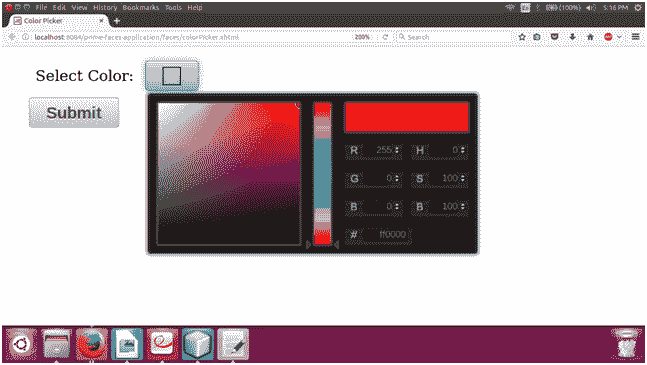

# ColorPicker 范本

> 原文:[https://www.javatpoint.com/primefaces-colorpicker](https://www.javatpoint.com/primefaces-colorpicker)

它是一个带有调色板的输入组件。它允许我们在 web 应用程序中选择和重新选择颜色。我们可以在我们的 JSF 应用程序中使用它来获取颜色作为用户输入。

PrimeFaces 提供**T2【p】:colorPicker>**组件在 web 应用中创建 color picker。下面列出了它的各种属性。

## 颜色选择器属性

| 属性 | 缺省值 | 类型 | 描述 |
| 编号 | 空 | 线 | 它是组件的唯一标识符 |
| 价值 | 空 | 目标 | 它用于设置组件的值。 |
| 需要 | 错误的 | 布尔代数学体系的 | 它用于根据需要标记组件。 |
| valueChangeListener | 空 | ValueChangeListener | 它是一个方法绑定表达式，引用一个用于处理 valuchangeevent 的方法。 |
| 所需消息 | 空 | 线 | 它用于设置当必填字段验证失败时要显示的消息。 |
| validastormessage | 空 | 线 | 它用于设置验证字段时要显示的消息。 |
| 方式 | 弹出 | 线 | 用于设置显示模式。 |
| 风格 | 空 | 线 | 用于设置组件的内嵌 CSS 样式。 |

## 纺纱

以下是适用于颜色选择器的结构样式类。

| 样式类 | 适用 |
| 。ui color picker | 容器元素。 |
| . ui-colorpicker_color | 渐变背景。 |
| 。ui-colorpicker_hue | 色调元素。 |
| 。ui-颜色选择器 _ 新建 _ 颜色 | 新的彩色显示器。 |
| 。ui-颜色选择器 _ 当前颜色 | 当前颜色显示。 |
| 。ui color picker RGB-r | 红色输入。 |
| 。ui color picker RGB-g | 贪婪输入。 |

## 例子

这里，在下面的例子中，我们正在实现 **< p:colorPicker >** 组件。本示例包含以下文件。

### JSF 档案

**// colorPicker.xhtml**

```java

<?xml version='1.0' encoding='UTF-8' ?>
<!DOCTYPE html PUBLIC "-//W3C//DTD XHTML 1.0 Transitional//EN""http://www.w3.org/TR/xhtml1/DTD/xhtml1-transitional.dtd">
<html 
xmlns:h="http://xmlns.jcp.org/jsf/html"
xmlns:p="http://primefaces.org/ui">
<h:head>
<title>Color Picker</title>
</h:head>
<h:body>
<h:form>
<h:panelGrid columns="2" cellpadding="5" style="margin-left: 20px">
<h:outputText value="Select Color: " />
<p:colorPicker value="#{colorPicker.color}" />
</h:panelGrid>
<p:commandButton value="Submit" style="margin-left: 20px" />
</h:form>
</h:body>
</html>

```

### ManagedBean

**// ColorPicker.java**

```java

package com.javatpoint;
import javax.faces.bean.ManagedBean;
@ManagedBean
public class ColorPicker {
private String color;
public String getColor() {
return color;
}
public void setColor(String color) {
this.color = color;
}
}

```

输出:


