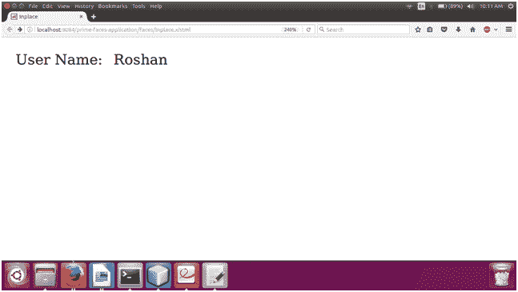

# 位置中的 PrimeFaces

> 原文:[https://www.javatpoint.com/primefaces-inplace](https://www.javatpoint.com/primefaces-inplace)

这是一个输入文本框，可以在浏览器中轻松编辑值。它由两个成员组成，显示元素是初始的可点击标签，内联元素是切换显示元素时显示的隐藏内容。

PrimeFaces 提供了**T2 p:inplace>**组件，用于在 JSF 应用程序中创建 in place。下面列出了它的各种属性。

## 就地属性

| 属性 | 缺省值 | 类型 | 描述 |
| 标签 | 空 | 线 | 用于设置标签以显示模式显示。 |
| emptyLabel | 空 | 线 | 用于设置值为空时显示模式下显示的标签。 |
| 影响 | 乏味的 | 线 | 它用于设置切换时使用的效果。 |
| 效果速度 | 标准 | 线 | 这是一种速度效应。 |
| 有缺陷的 | 错误的 | 布尔代数学体系的 | 它阻止显示隐藏的内容。 |
| 风格 | 空 | 线 | 它用于设置主容器元素的内联样式。 |
| 编辑 | 错误的 | 布尔代数学体系的 | 它指定编辑器模式。 |
| 保存标签 | 救援 | 线 | 用于在编辑器模式下设置保存按钮的工具提示文本。 |
| cancelLabel | 取消 | 线 | 用于在编辑器模式下设置取消按钮的工具提示文本。 |
| 事件 | 点击 | 线 | 它用于设置客户端事件的名称以显示内联内容。 |
| 可折叠的 | 真实的 | 布尔代数学体系的 | 它定义了一个地方是否可移植。 |

## 例子

在下面的例子中，我们实现了 **< p:inplace >** 组件。本示例包含以下文件。

### JSF 档案

**// inplace.xhtml**

```java

<?xml version='1.0' encoding='UTF-8' ?>
<!DOCTYPE html PUBLIC "-//W3C//DTD XHTML 1.0 Transitional//EN""http://www.w3.org/TR/xhtml1/DTD/xhtml1-transitional.dtd">
<html 
xmlns:h="http://xmlns.jcp.org/jsf/html"
xmlns:p="http://primefaces.org/ui"
xmlns:f="http://xmlns.jcp.org/jsf/core">
<h:head>
<title>Inplace</title>
</h:head>
<h:body>
<h:form>
<h:panelGrid columns="2" columnClasses="column" cellpadding="5">
<h:outputLabel value="User Name:" />
<p:inplace>
<p:inputText value="Roshan" />
</p:inplace>
</h:panelGrid>
</h:form>
</h:body>
</html>

```

输出:


